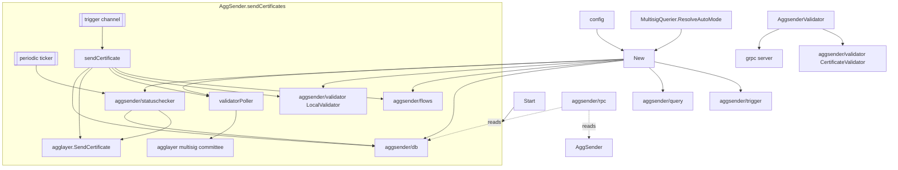

# ARCH: aggsender

## Overview

The top-level package hosts three concrete types and one helper: `AggSender` (the proposer in `aggsender.go`), `AggsenderValidator` (the remote-validator server shell in `aggsender_validator.go`), `validatorPoller` (committee signature aggregation in `validator_poller.go`), and the exported `RateLimiter` interface used by external transports. Everything else is composition — the package is the wiring point for the fifteen subsystems under `aggsender/*`.

`AggSender.New` resolves the mode via the injected `MultisigQuerier` (delegating to `aggsender/query/SPEC.md#51`), builds the `CertificateSendTrigger` first (because its setup can fail synchronously and cheaply), then calls `newAggsender` which assembles the rest: SQL storage (`aggsender/db`), `AggchainFEPQuerier` (`aggsender/query`), `CertificateQuerier` (`aggsender/query`), `SetInitialBlockToClaimSyncer` (`aggsender/query`), `BuilderFlow` (`aggsender/flows`), a storage-compat checker (shared `compatibility`), the local verifier flow (`aggsender/flows`), `L1InfoTreeDataQuerier` (`aggsender/query`), `LocalValidator` wrapping `AggsenderValidator` (`aggsender/validator`), `CertStatusChecker` (`aggsender/statuschecker`), and `validatorPoller` (this package). The overall shape upholds SPEC #1–#4, #24, and #29 by construction.

`AggSender.Start` is the startup pipeline (upholds SPEC #5): status transitions through `StatusCheckingDBCompatibility` → `StartingClaimSyncerStage` → `StatusCheckingInitialStage` → `StatusFlowCheckingInitialStage` → trigger `Setup` → `sendCertificates` (the steady-state loop). Steady-state is a three-branch `select` over the status-check ticker, the trigger channel, and `ctx.Done()` (upholds SPEC #6). The trigger branch calls `sendCertificateWithRetries` which runs the configured retry handler over `sendCertificate`; the latter is the build-and-send pipeline of SPEC #11. Submission failure routes through `saveNonAcceptedCert` (upholds SPEC #18); success routes through `saveCertificateToStorage` with its own retry loop (upholds SPEC #19). The `ErrComplete` sentinel from `aggsender/flows` is the only condition that can trigger a deliberate panic under `StopOnFinishedSendingAllCertificates` (upholds SPEC #14, #32, #33).

`validatorPoller.PollValidators` upholds SPEC #15, #16, #30. It fetches the committee (`aggsender/query/SPEC.md#47`), instantiates one `RemoteValidator` per signer via `aggsender/validator`, enforces that `validators[0].Address() == proposerSigner.PublicAddress()` (the anchor invariant), then fans out concurrently; results are processed under a cancellable context so reaching threshold short-circuits the remaining in-flight calls. Self-signing bypasses the remote path by calling `validator.HashCertificateToSign` and signing the digest locally — the same hash that `aggsender/validator/SPEC.md#14` defines.

`AggsenderValidator` is the validator-role shell. Its `Start` primes the claim syncer once (single-attempt retry, panic on failure) then starts the gRPC server hosting `validator.NewValidatorService` (upholds SPEC #24–#26). Its in-process `ValidateCertificate` delegates to the same `CertificateValidator` instance the service uses.

<!-- human-reasoning aid, not contract -->

## Patterns

- **1.** New subsystems that the proposer needs to compose SHOULD be constructed inside `newAggsender` (not inside `Start`), so the constructor is the single point where wiring failures become returned errors rather than panics.
- **2.** New steady-state concerns (tickers, channels, signals) SHOULD extend the `select` in `sendCertificates` rather than introducing a second goroutine; the single-goroutine loop is load-bearing for simple reasoning about mutual exclusion between status-check and build-send paths (they never race against the same storage row concurrently).
- **3.** Errors between the proposer and a child subsystem MUST be wrapped with `fmt.Errorf("error <action>: %w", err)` using a verb that names the failing step — the pattern used in `New`, `newAggsender`, and `sendCertificate` (upholds SPEC #31).
- **4.** Retry decisions that should stop retrying MUST be signalled by wrapping the error with `aggkitcommon.ErrAbort` (as done for `flows.ErrComplete` inside `sendCertificateWithRetries`) rather than by special-casing error strings — the generic retry handler in `aggkitcommon` checks for that sentinel.
- **5.** The validator poller's concurrency model (one goroutine per committee member, results funneled through a buffered channel, shared cancel to short-circuit on threshold) SHOULD be preserved. Replacing it with a sequential implementation would regress the "reach threshold fast" property the agglayer latency budget relies on.

## Notable decisions

- **6.** Mode resolution happens outside the core constructor: `New` calls `committeeQuerier.ResolveAutoMode(cfg.Mode)` and overwrites `cfg.Mode` before any subsystem sees the config. Every downstream subsystem reads the resolved mode from `cfg.Mode`. Any refactor that lets a subsystem read an unresolved `Auto` value breaks `aggsender/trigger/SPEC.md#3` and similar resolved-mode preconditions scattered across children.
- **7.** The `CertificateSendTrigger` is constructed by the public `New` but passed into the unexported `newAggsender`. The split exists so the prover tool and test harnesses can inject a pre-built trigger while production code takes the default path. A refactor that collapses the two constructors would force trigger substitution via interface shape change.
- **8.** `sendCertificate` calls `localValidator.ValidateAndSignCertificate` but logs `Warnf` on failure and proceeds. This is intentional (upholds SPEC #12): the committee poll is the authoritative validation, and blocking on a local mismatch would stall certificate emission even when the committee would have accepted. The warn signal is the operator's cue to investigate.
- **9.** `saveNonAcceptedCert` is a best-effort side-effect on the failure path; its error is logged but not returned. The primary failure signal is the submission error, and the non-accepted slot exists for post-mortem forensics (see `aggsender/db/SPEC.md#20`). Rewriting it to fail the whole call would hide the real cause behind a secondary error.
- **10.** `saveCertificateToStorage` has its own retry loop with `time.Sleep` rather than using the generic `aggkitcommon.Execute` retry handler. Rationale in the code: a local DB write that fails indicates an out-of-sync DB that will lead to settling an unknown certificate — the loop is tuned to retry indefinitely when `maxRetries == 0`, which the generic handler does not express as naturally. The TODO in `sendCertificate` about the "TODO: Improve this case" flags this as an acknowledged rough edge.
- **11.** `AggSender.Start` uses `Panicf` on storage compat failure and on the claim-syncer-prime failure rather than returning an error. The comment above `checkSendCertificateStopCondition` explains why: the server process starts subsystems in goroutines without checking return values, so panicking is the only available "fatal" exit. A cleaner lifecycle would let `Start` return an error; this is the current pragmatic shape.
- **12.** Storage compatibility is checked via `compatibility.NewKeyValueToCompatibilityStorage` keyed on `aggkitcommon.AGGSENDER`; the stored runtime data carries `NetworkID`. Reusing the same DB across networks is therefore a fatal startup error rather than a silent data-corruption hazard. Tied to SPEC #23 and `aggsender/db/SPEC.md#23`.
- **13.** The validator poller requires the first committee member's address to equal the proposer's public address. This is a contract with `aggsender/query/SPEC.md#47` ordering: changing the committee-query implementation to return an unordered set would silently break this invariant. The anchor lets the poller self-sign locally (avoiding a remote RPC to itself) while still producing a signature attributable to a committee slot.
- **14.** `AggsenderValidator.Start` uses a retry handler with `NumRetries=1`: the validator is expected to be deployed into an environment where claim-sync priming either works immediately or a human investigates. The proposer, by contrast, primes via an indefinite-retry handler (infinite attempts) because it must keep running while an L2 lags.
- **15.** The proposer polls certificate status on a ticker *and* consumes trigger events, rather than folding status polling into the trigger. This split means a slow status check cannot delay a trigger event and vice versa. The cost is that a tick landing during a build-send cycle waits behind the single-goroutine loop — acceptable because agglayer submission dominates cycle time.
- **16.** RPC services are registered only when `cfg.EnableRPC` is true; `GetRPCServices` returns an empty slice otherwise. This keeps the aggsender-as-a-daemon and aggsender-embedded-in-another-process shapes uniform (one hook, one registration path) and upholds SPEC #22 without a conditional in the caller.

## Dependencies

- `github.com/0xPolygon/cdk-rpc/rpc` provides the `jRPC.Service` shape used by `GetRPCServices`; the aggsender RPC handlers (`aggsender/rpc`) are written against the same package.
- `github.com/agglayer/aggkit/grpc` provides the server bootstrap used by `AggsenderValidator` and the client config used by `validatorPoller`; both sides depend on it implementing `ClientConfig.WithURL` for the committee URL remap.
- `github.com/agglayer/aggkit/db/compatibility` provides the shared runtime-compat checker used at startup; its behaviour mirrors the same pattern used by other aggkit components (bridge sync, claim sync), so operator expectations transfer.
