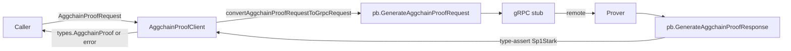

# ARCH: aggsender/aggchainproofclient

## Overview

The package is a thin gRPC adapter around the aggkit prover's `AggchainProofService`. `AggchainProofClient` holds the generated gRPC stub (`aggkitProverV1Grpc.AggchainProofServiceClient`) and the `*aggkitgrpc.ClientConfig` used to construct it; the config is retained so per-call timeouts can be derived from `cfg.RequestTimeout`. `NewAggchainProofClient` delegates connection setup to `aggkitgrpc.NewClient` (upholds SPEC #13).

The two public methods — `GenerateAggchainProof` and `GenerateOptimisticAggchainProof` — share the same shape: (1) derive a timeout-scoped context, (2) translate the aggsender-domain request into the protobuf request via `convertAggchainProofRequestToGrpcRequest`, (3) invoke the gRPC stub, (4) repack any transport error through `aggkitgrpc.RepackGRPCErrorWithDetails`, (5) assert the returned proof is the `AggchainProof_Sp1Stark` variant, (6) rebuild a `types.AggchainProof` from the response fields. The optimistic variant additionally wraps the request with `OptimisticModeSignature` and sources its returned `LastProvenBlock` / `EndBlock` from the outgoing request rather than the response (upholds SPEC #6).

`convertAggchainProofRequestToGrpcRequest` performs pure struct reshaping: fixed-size byte arrays become `FixedBytes32` wrappers; Merkle-proof sibling arrays are truncated/sized to `treetypes.DefaultHeight`; global indices are serialised via `bridgesync.GenerateGlobalIndex` + `common.BigToHash`; imported bridge exits use `BridgeExit.Hash()` for their content hash; GER-leaf map keys are stringified with `common.Hash.String()`. Upholds SPEC #5, #7–#12.

<!-- human-reasoning aid, not contract -->

## Patterns

- **1.** All outbound calls SHOULD derive their context via `context.WithTimeout(..., grpcClientCfg.RequestTimeout.Duration)` with a deferred cancel, so that per-request deadlines stay consistent across methods.
- **2.** gRPC errors crossing the package boundary SHOULD be routed through `aggkitgrpc.RepackGRPCErrorWithDetails` so that server-side status details survive, rather than being returned raw.
- **3.** Protobuf-to-domain translation SHOULD stay confined to `convertAggchainProofRequestToGrpcRequest` and the inline response-mapping blocks in each method; no other package should reach into the `buf.build/gen/...` types for aggchain-proof messages.

## Notable decisions

- **4.** Only the `AggchainProof_Sp1Stark` proof variant is accepted; any other oneof branch returns the sentinel `errProofNotSP1Stark`. This is intentional: the aggsender's downstream pipeline is SP1-STARK-specific, so accepting other variants would silently propagate an unusable proof shape.
- **5.** `GenerateOptimisticAggchainProof` returns `LastProvenBlock` / `EndBlock` from the *request* rather than the response. Rationale: in optimistic mode these bounds are authoritative from the caller's side (the caller signs the range); echoing the response would let a misbehaving prover shift the accepted range. Upholds SPEC #6.
- **6.** `GenerateOptimisticAggchainProof` ignores its parent context and calls `context.WithTimeout(context.Background(), ...)` instead of wrapping `ctx`. The method signature omits a `context.Context` parameter to match the `types.AggchainProofClient` interface; callers cannot propagate cancellation into this call. This is a load-bearing quirk — any change to the interface that adds a context parameter must also be threaded here.
- **7.** Merkle-proof siblings are sized against `treetypes.DefaultHeight` rather than the caller-supplied slice length. The request type uses a fixed-size `[common.HashLength]common.Hash` array, so this coupling is by construction; changing tree height requires coordinated updates to both the domain type and this translator.
- **8.** `grpcClientCfg` is retained on the struct (not just the derived stub) specifically so per-call `RequestTimeout` remains reachable. A refactor that drops the field must relocate timeout sourcing.

## Dependencies

- `buf.build/gen/go/agglayer/provers/...` and `buf.build/gen/go/agglayer/interop/...` — generated protobuf/gRPC stubs; source of truth for wire types.
- `github.com/agglayer/aggkit/grpc` — shared gRPC client bootstrap and error repacking.
- `github.com/agglayer/aggkit/bridgesync` — used solely for `GenerateGlobalIndex`; the dependency exists only because global-index encoding lives there.
