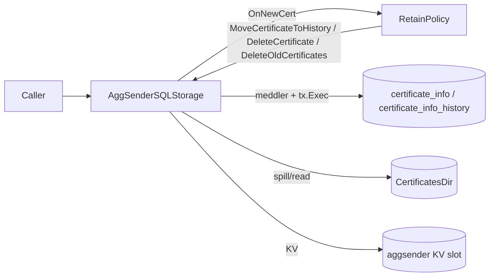

# ARCH: aggsender/db

## Overview

The package has three layers. At the top, `AggSenderSQLStorage` (in `aggsender_db_storage.go`) exposes the `AggSenderStorage` interface and owns the `*sql.DB` handle plus the configured `StorageRetainCertificatesPolicier`. It opens the DB via the shared `github.com/agglayer/aggkit/db` helper (SQLite under the hood) and invokes the embedded migration list from the `migrations/` child at construction, upholding SPEC #1.

The middle layer is row persistence. `types.go` defines the unexported `certificateInfo` struct whose `meddler:"..."` tags drive all column I/O; `helpers.go` reflectively derives the column list for `CertificateHeader` reads so header-only queries stay in lockstep with the struct; `meddler.go` registers an `AggchainProofMeddler` that JSON-encodes/decodes the proof column. All writes go through `github.com/russross/meddler` — either `meddler.Insert` or hand-rolled `tx.Exec` statements. Every multi-statement write path opens a transaction via `db.NewTx` (aliased through the package-level `newTxer` so tests can stub it), with a `shouldRollback` guard/`defer` pattern for atomicity (SPEC #22).

The retention layer (`retain_certificates_policy.go`) is consulted by `SaveLastSentCertificate` before the insert. `OnNewCert` branches on `CertificateKey.IsRetry()`: retries dispatch to `MoveCertificateToHistory` (copy then delete on current) or to `DeleteCertificate(MaybeDelete)`; first attempts past the retain window dispatch to `DeleteOldCertificates`. This branching is the single source of truth for SPEC #3–#7.

Large signed-certificate payloads never live in the DB. `handleCertificateFile` writes them under `cfg.CertificatesDir` with filename `signed_cert_{height}_{certID}_{retry}.json` and rewrites the struct's `SignedCertificate` field to `PrefixFilename + path` (the `@` sigil) before the row is inserted. On read, `certificateInfo.toCertificate()` calls `SignedCertificateData()`, which detects the sigil and substitutes file contents, upholding SPEC #18, #19. Deletes walk `getCertificatesByHeight` first to collect filenames, then delete the rows and best-effort `os.Remove` the files (#17).

The non-accepted certificate slot is stored out-of-band in the shared key-value storage (via the embedded `KeyValueStorager`) under key `non_accepted_cert` as a JSON blob carrying the file sigil and a Keccak256 hash of the original content, so stale-file tampering is detectable (SPEC #20, #21).

Upholds SPEC #1 (constructor + migrations), #2–#7 (retain policy dispatch), #8–#9 (`updateCertStatus` / `SaveOrUpdateCertificate`), #10–#12 (last/settled/by-status queries), #13–#16 (`DeleteCertificate` / `DeleteOldCertificates`), #17–#19 (file spill/read), #20–#21 (non-accepted slot), #22 (tx pattern), #23 (`RuntimeData.IsCompatible`), #24–#27 (schema-enforced via migrations).

<!-- human-reasoning aid, not contract -->

## Patterns

- **1.** Every write path SHOULD follow the `newTxer` + `shouldRollback` + deferred `tx.Rollback` + explicit `tx.Commit` + `shouldRollback = false` pattern used throughout `aggsender_db_storage.go`. Deviations risk leaving connections with open transactions on error paths.
- **2.** New columns on `certificate_info` / `certificate_info_history` MUST be added as `meddler:"..."` tagged fields on `certificateInfo` in `types.go`, and MUST also appear on `types.CertificateHeader` or `types.Certificate` as applicable so that `TestCertificateFieldsMatchCertificateInfo` in `types_test.go` continues to pass. That reflective test is the load-bearing check that struct and schema stay aligned.
- **3.** Header-only queries SHOULD compose `selectQueryCertificateHeader` (built in `helpers.go::init` via `SelectQuery("certificate_info")`) rather than hand-writing `SELECT * FROM certificate_info`. This keeps the column list driven by the reflection scan of `CertificateHeader`'s `meddler` tags.
- **4.** New non-primitive DB-column types (like `AggchainProof`) SHOULD register a `meddler.Meddler` in a package-level `init()` — see `meddler.go` — rather than serialising ad hoc at call sites, so that column reads and writes go through one conversion.
- **5.** New public methods that delete rows carrying a signed-certificate file reference MUST walk the rows first (via `getCertificatesByHeight` or equivalent) and call `deleteCertificateFile` for each, before executing the `DELETE`. Skipping this leaks files on disk and breaks SPEC #17.
- **6.** Tests that need to swap the transaction factory SHOULD reassign the package-level `newTxer` var; the internal path deliberately routes through it for this reason.

## Notable decisions

- **7.** Signed certificates are spilled to disk and referenced by an `@`-prefixed sigil in the column, not stored as BLOB. Rationale: these payloads can reach hundreds of KB and bloat both SQLite page cache and on-disk size; filesystem storage keeps the DB file small enough to snapshot cheaply, and gives operators direct access for debugging. The sigil convention also keeps schema unchanged between "inline" and "filed" eras.
- **8.** The retention policy is a runtime interface (`StorageRetainCertificatesPolicier`), not a compile-time branch, so test code and future alternate policies (e.g., size-bounded) can be injected without changing the storage. The default constructor returns "retain all, keep history" — the safest shape.
- **9.** `SaveOrUpdateCertificate` uses a `SELECT COUNT(*)` probe followed by either `meddler.Insert` or an `UPDATE status/updated_at` rather than a single upsert. The comment in code makes the reason explicit: meddler does not support upsert. A refactor that collapses to `INSERT ... ON CONFLICT` would silently broaden what fields get overwritten, which SPEC #9 deliberately forbids.
- **10.** `GetLastSentCertificateHeaderWithProofIfInError` opens a transaction purely to pin the header read and the proof read to the same DB snapshot, even though only one path issues a second query. It rolls back unconditionally in `defer` because no writes happen — using a read-only tx as a cheap snapshot.
- **11.** `deleteCertificatesOlderThanHeight` emits two `DELETE` statements in a single `tx.Exec` call. This relies on the driver accepting multi-statement exec; if the driver or DB changes this must be split.
- **12.** Non-accepted certificates live in the shared key-value storage (one slot), not in a dedicated SQL table. The whole feature is a single "what was the last thing rejected" record for operator forensics; a full table would invite unbounded growth, and the Keccak256 hash in the KV entry detects tampering with the file since the certificate column is a sigil.
- **13.** The `getSelectQueryError` helper deliberately returns `(nil, nil)` for `sql.ErrNoRows` at `height == 0`, because height 0 is never sent to the agglayer and is used as a sentinel in callers. Any caller that passes 0 expects an empty answer rather than an error.

## Dependencies

- `github.com/russross/meddler` — reflection-based row mapper used for all typed I/O. Swapping it would require re-implementing the column-tag convention that `types.go` and `helpers.go` rely on.
- `github.com/agglayer/aggkit/db` — provides `NewSQLiteDB`, `NewTx`, `NewKeyValueStorage`, `ErrNotFound`, and the `Querier` interface. The key-value storage embedding (`KeyValueStorager`) backs the non-accepted-cert slot.
- `github.com/ethereum/go-ethereum/crypto` — Keccak256 for the non-accepted file tamper check.
