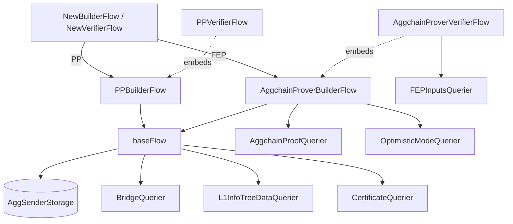

# ARCH: aggsender/flows

## Overview

The package is organized around a shared `baseFlow` plus two pairs of mode-specific wrappers. `baseFlow` owns the block-range math, bridge/claim fetching, GER validation, size/retry adjustments, and certificate assembly — it upholds SPEC #3, #4, #5, #6, #7, #8, #9, #10, #11, #12, #13, #14, #15, #16, #17, #18, #19, #20, #21, #32, #33, #34, #35. Two builder wrappers (`PPBuilderFlow`, `AggchainProverBuilderFlow`) add mode-specific policy on top (SPEC #22–#29). Verifier wrappers embed the builder and add `VerifyCertificate` (SPEC #30, #31). `NewBuilderFlow` and `NewVerifierFlow` are the mode-keyed factories (SPEC #1).

Data flow for a single "what's the next cert?" call: the builder wrapper asks `baseFlow.GetCertificateBuildParamsInternal` → `GeneratePreBuildParams` (reads last sent header from `AggSenderStorage`, derives block range via `NextCertificateBlockRange`, gets finalized L1 info root from `L1InfoTreeDataQuerier`) → `GenerateBuildParams` (fetches bridges, claims, unclaims from `BridgeQuerier`). The wrapper then calls `AdjustBlockRange` to apply mode-specific options, `VerifyBuildParams` to re-check invariants, and (FEP only) the aggchain prover. `BuildCertificate` finally assembles the `agglayertypes.Certificate` by computing bridge exits, imported bridge exits, height, previous LER, and new LER.

<!-- human-reasoning aid, not contract -->

## Patterns

- **1.** Mode-specific flows SHOULD delegate to `baseFlow` for any shared logic and layer only mode-unique rules on top. A new mode should appear as a new pair of builder/verifier wrappers plus two factory branches — not as changes to `baseFlow`.
- **2.** Verifier flows SHOULD be declared by embedding the corresponding builder flow, so build-side and verify-side agree on `GenerateBuildParams` by construction.
- **3.** Block-range changes MUST go through `cloneCertificateBuildParamsWithRange` (or its `trimCertificateToBlock` wrapper); directly mutating `FromBlock` / `ToBlock` on a `CertificateBuildParams` bypasses the re-filtering of bridges/claims/unclaims and breaks SPEC #33.
- **4.** New range-adjustment steps SHOULD be added to the sequence in `AdjustBlockRange` and guarded by a flag on `BlockRangeAdjustmentOptions` rather than branching inside the step; the current steps run in this fixed order: max-L2-block cap, root-finalization check (optional), prune-unprovable-claims, size cap (optional), trim-on-missing-GER-without-posterior-unclaim.
- **5.** The GER-existence-on-L1 lookup is memoized per `AdjustBlockRange` call via `gerValidationCache`. New passes that check GERs SHOULD thread the same cache to avoid repeated L1 reads.

## Notable decisions

- **6.** `baseFlow.GetLastCertificate` reads from local storage only, but `NextCertificateBlockRange` re-derives the settled `ToBlock` from agglayer via `CertificateQuerier` when the stored header is settled. This exists because the local `ToBlock` can be stale (e.g. reset by a debug endpoint) and a proposer/validator disagreement on `FromBlock` would produce unverifiable certificates. Keeps SPEC #6 satisfied.
- **7.** The max-L2-block cap distinguishes three outcomes with three different sentinel errors (`ErrMaxL2BlockNumberExceededInARetryCert`, `ErrComplete`, and "cert has exceeded the maximum block"). Callers rely on these to decide "stop retrying" vs "stop entirely" — do not collapse them.
- **8.** `cloneCertificateBuildParamsWithRange` returns the *same* pointer when the range is unchanged, as a fast path. Callers therefore cannot assume the returned value is a fresh object; they must not mutate it.
- **9.** The aggchain/FEP retry path reuses a cached `AggchainProof` only after a strict three-way check on range, `LastProvenBlock`, and `EndBlock`. This is conservative because an incorrect reuse would produce a proof that does not cover the certificate's actual range — a silent integrity violation. A looser check was explicitly rejected.
- **10.** After the prover returns, `checkBlockRangeAdjustmentAfterProof` re-runs `AdjustBlockRange` and fails if it would change anything. This catches the case where the prover picked an `EndBlock` that violates size or GER constraints — if so we prefer to surface the inconsistency rather than silently re-trim (which would invalidate the proof's end block).
- **11.** The aggchain/FEP flow's `BuildCertificate` calls `baseFlow.BuildCertificate` with `allowEmptyCert=true` whereas the PP flow passes `false`. FEP certificates may legitimately be empty (they carry a proof over a range even with no bridges); PP certificates must have content to justify being sent.
- **12.** `getNextHeightAndPreviousLER` has a dedicated branch for "last cert in error, height 0": it resets to the initial LER and height 0 rather than looking up a non-existent previous cert. This mirrors first-certificate behaviour and avoids a spurious storage lookup.
- **13.** `adjustInvalidClaimsAreNotUnclaimed` scans claims in order and matches each unclaim exactly once (tracked by a `usedUnclaims` bitmap). This deterministic first-match ordering is load-bearing for SPEC #16 — changing it changes which claims survive into the certificate.
- **14.** The `CommonFlowComponents` bundle is returned from `CreateCommonFlowComponents` so that the validator factory can hand the same component set back to its caller for wiring into other subsystems; the builder factory discards it. This avoids building the queriers twice in validator mode.

## Dependencies

- `aggchain-multisig/aggchainfep` (from `cdk-contracts-tooling`) is the only source for `StartingBlockNumber` — the FEP flow's configured starting L2 block is read from this contract at factory time, not from local config, so redeploying the sovereign rollup with a new starting block transparently retargets the flow.
- `go_signer` provides the signer abstraction; flows do not know whether the signer is a local key, KMS, or remote.
