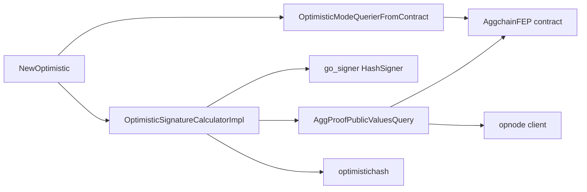

# ARCH: aggsender/optimistic

## Overview

Three cooperating parts plus a shared config. A top-level constructor wires an AggchainFEP contract binding (from `cdk-contracts-tooling`) against the supplied L1 client, then builds the two exported objects: `OptimisticSignatureCalculatorImpl` (upholds SPEC #1, #4–#7, #10–#15) and `OptimisticModeQuerierFromContract` (upholds SPEC #1, #8, #9). `Config.Validate` upholds SPEC #2, #3.

`OptimisticSignatureCalculatorImpl` composes a `go_signer` hash-signer, an `AggProofPublicValuesQuerier` built from `aggsender/query.NewAggProofPublicValuesQuery` (which itself talks to the AggchainFEP contract and an `opnode.OpNodeClient`), and the two hash primitives from `optimistichash/` (see `optimistichash/SPEC.md#1`, `#3`). `Sign` first fetches aggregation-proof public values, hashes them, derives the imported-bridge-exits commitment via `optimistichash.CalculateCommitImportedBrdigeExitsHashFromClaims`, assembles an `optimistichash.OptimisticSignatureData`, computes its digest, and hands that digest to the signer; it returns the raw signature bytes plus a diagnostic string (SPEC #13).

`OptimisticModeQuerierFromContract` is a thin per-call passthrough that reads the `optimisticMode` view on the AggchainFEP contract (SPEC #8).

<!-- human-reasoning aid, not contract -->

## Patterns

- **1.** Errors crossing the package boundary SHOULD be wrapped with `%w` and tagged with a short origin marker (e.g. `[OPTIMISTIC]` or `optimisticModeQuerierFromContract:`) so log consumers can attribute failures without string-matching.
- **2.** Contract access in this package SHOULD go through the `aggsender/types.FEPContractQuerier` interface (and the package-level factory for the binding), not via a hand-rolled ABI call, so the mocks in `aggsender/mocks` remain the single test seam.
- **3.** The signature calculator MUST keep its three collaborators (signer, public-values querier, logger) as the only fields; additional state (caches, last-seen digests, counters) would break the "stateless per-call" assumption that SPEC #14 relies on.

## Notable decisions

- **4.** Signer-vs-contract validation is opt-in (`RequireKeyMatchTrustedSequencer`). With the flag off, both a read failure and a mismatch are demoted to warnings so a mis-wired or temporarily unreachable AggchainFEP does not prevent start-up; with the flag on, both are hard failures. The two branches are intentionally symmetric — any refactor that treats a read failure differently from a mismatch would regress SPEC #6/#7.
- **5.** The digest layout is imported from `optimistichash/` rather than inlined. A local implementation would duplicate the interop contract and risk drift from the Rust reference; see `optimistichash/ARCH.md` decisions #1–#3.
- **6.** `OptimisticModeQuerierFromContract` deliberately does not cache the `optimisticMode` flag. Optimistic mode is a governance switch whose value feeds a per-certificate branching decision; a stale cached `true` would cause the aggsender to produce signatures after the chain has left optimistic mode, which is a safety regression. Any PR adding caching here must also define an invalidation story.
- **7.** The constructor builds two independent bindings to the same AggchainFEP address (one typed `Caller`, one full binding) rather than sharing a single instance. The `Caller` form is passed to the signature calculator through the `FEPContractQuerier` interface; the full binding is retained by the mode querier for its `OptimisticMode` view. Consolidating these would require widening `FEPContractQuerier`, which would leak read-only/read-write distinctions into every mock.
