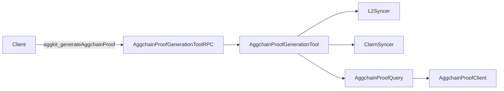

# ARCH: aggsender/prover

## Overview

Two files implement the directory. `proof_generation_tool.go` defines `AggchainProofGenerationTool`, which wires together the L1 info-tree querier, the L2 GER reader, the L2 sovereign-bridge reader, the Aggchain proof client, and a `BaseFlow`, composing them into an `AggchainProofQuery` stored as the tool's `flow` field. `proof_generation_rpc.go` defines `AggchainProofGenerationToolRPC`, a thin JSON-RPC adapter that translates the RPC call into a `context.Background()`-scoped invocation of the tool's `GenerateAggchainProof` and maps Go errors to `rpc.Error` with the default code.

Control flow for a proof request: RPC adapter receives `(lastProvenBlock, requestedEndBlock)` → tool reads `GetLastProcessedBlock` from the L2 syncer and validates against `lastProvenBlock` → tool reads claims for `[lastProvenBlock+1, requestedEndBlock]` from the L2 claim syncer → tool calls `flow.GenerateAggchainProof` with a `CertificateBuildParams{Claims: ...}` → returns `aggchainProof.SP1StarkProof` to the caller. `GetRPCServices` exposes the adapter under service name `aggkit`, so the generated method is `aggkit_generateAggchainProof`.

Upholds SPEC #1 (RPC service + method name), #2–#3 (validation against L2 syncer's last processed block), #4 (`fromBlock = lastProvenBlock + 1`), #5 (claims forwarded via `CertificateBuildParams`), #6 (returns only `SP1StarkProof`), #7–#8 (constructor error paths), #9 (`OptimisticModeQuerierAlwaysOff`), #10–#11 (error wrapping with stage prefix, default RPC code).

<!-- human-reasoning aid, not contract -->

## Notable decisions

- **1.** The RPC adapter always invokes the tool with `context.Background()` rather than propagating an RPC-scoped context. This is deliberate: the underlying `cdk-rpc` handler signature used here does not supply one, and cancelling an in-flight proof generation mid-call is not desired because the prover's work is expensive and not safely cancellable.
- **2.** The tool constructs `BaseFlow` with `nil` storage and `nil` certQuerier, and passes `nil` as the optimistic signer into `AggchainProofQuery`. These are wired off because the tool path never builds or submits a certificate and never needs to sign optimistically; the proof generation query only uses the flow for its bridge/L1-info-tree lookups. A future refactor that makes those parameters non-nullable must either provide stubs or split the query interface so this tool can still opt out.
- **3.** `OptimisticModeQuerierAlwaysOff` is exposed as a public type rather than an anonymous struct. The expectation is that other entry points reusing the same proof query machinery (outside the full aggsender) share this stub instead of each redefining it, keeping SPEC #9 enforceable in one place.
- **4.** The tool's `l2BridgeQuerier` is constructed twice — once standalone and once inside the `AggchainProofQuery` — with a 1-second retry delay both times. The duplication is intentional today because `BaseFlow` and the aggchain proof query each hold their own querier dependency; consolidating them would require changes upstream in `flows`/`query`.

## Patterns

- **5.** Any new stage added to `GenerateAggchainProof` SHOULD wrap its error with a substring that names the stage (matching the style of "error getting last processed block from l2", "error getting claims (imported bridge exits)", "error generating Aggchain proof") so callers and tests can discriminate failures by substring (upholds SPEC #10).
- **6.** New RPC methods exposed by this tool SHOULD be added under the same `aggkit` service name rather than introducing a second service, so the tool keeps a single stable RPC namespace.
