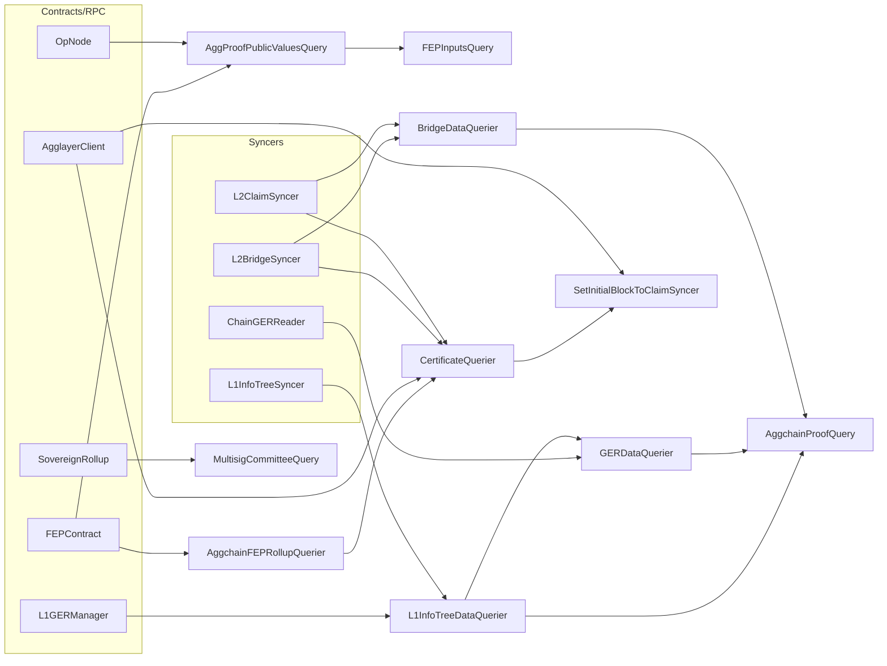

# ARCH: aggsender/query

## Overview

The package is a flat collection of focused queriers, each in its own file and each implementing one interface from `aggsender/types`. There is no shared runtime state — queriers compose by dependency injection, not by package-level singletons. The aggchain-proof query is the only fan-out point: it pulls from the L1 info tree querier, the GER querier, the LER querier, the bridge querier, and the optimistic signer to assemble a prover request (upholds SPEC #6–#14). The certificate querier is the only other composite: it combines the L2 bridge syncer, the L2 claim syncer, the agglayer client, and the aggchain-FEP querier to materialise `SettledBlocks` across three sources (upholds SPEC #52–#63).

Responsibility split by file:

- `aggchain_fep_rollup_query.go` — FEP contract reader plus a no-op twin for pessimistic-proof networks (upholds #1–#5, #72).
- `aggchain_proof_query.go` — assembles and dispatches standard/optimistic prover requests (upholds #6–#14, exports `ErrNoProofBuiltYet`).
- `agg_proof_fep_inputs_query.go` — thin composer over the public-values querier plus FEP optimistic-mode (upholds #15).
- `agg_proof_public_values_query.go` — builds `AggregationProofPublicValues` by combining op-node outputs and op-succinct config (upholds #16–#20).
- `bridge_query.go` — bridge/claim syncer façade plus `WaitForSyncerToCatchUp` polling loop (upholds #21–#27).
- `certificate_query.go` — three-source settlement resolver and PP/FEP classifier (upholds #52–#63).
- `ger_query.go` — injected/removed GERs with merkle proofs (upholds #28–#32).
- `l1info_tree_data_query.go` — L1 info tree navigation and finality cross-check (upholds #33–#43, exports `ErrGERNotProvableAgainstRoot`).
- `ler_query.go` — initial LER bootstrap from the rollup manager contract (upholds #44–#46).
- `multisig_committee_query.go` — sovereign rollup contract reader for committee composition and mode (upholds #47–#51).
- `initial_block_to_claimsync_setter.go` — one-shot priming of the claim syncer's starting block via the certificate querier and an RPC fallback (upholds #64–#67).

Control and data flow at the composite level:

<!-- human-reasoning aid, not contract -->

## Patterns

- **1.** Every querier is an interface-implementing struct constructed via a `New…` function. New queriers SHOULD follow the same shape: an interface defined in `aggsender/types`, a struct here that satisfies it, and a compile-time `var _ IFace = (*impl)(nil)` assertion at the top of the file.
- **2.** Every error crossing a querier boundary SHOULD be wrapped with a short operation tag using `fmt.Errorf("… %w", err)`. `aggchainProverFlow -` prefixes mark errors originating in the prover-dispatch flow; new code on that path SHOULD keep the prefix for log greppability.
- **3.** External-mode switches ("is FEP?", "is optimistic?", "auto mode → which mode") SHOULD be expressed as explicit branches on the typed enum (e.g., `AggsenderMode`, `CertificateType`, `AggchainData` variants) rather than on addresses or booleans — the exhaustive `switch` in `CalculateCertificateType` is the reference pattern.
- **4.** When a dependency is naturally optional (e.g. no claim syncer on a PP network), the querier SHOULD accept nil and treat it as "always ready / nothing to report" rather than requiring a no-op stub at the call site. The no-op FEP querier is the inverse pattern: where callers always dereference, inject a typed no-op.

## Notable decisions

- **5.** The aggchain FEP rollup querier has a dedicated `noOpAggchainFEPRollupQuerier` instead of accepting nil. Rationale: `CalculateCertificateTypeFromToBlock` and `getLastSettledFEPBlock` both unconditionally call `IsFEP()` and `StartL2Block()`; a no-op that returns `(false, 0)` makes PP networks behave identically to FEP-with-start-zero without adding nil checks in callers. Upholds SPEC #72.
- **6.** `SettledBlocks` carries per-source errors rather than returning early on the first failure. Rationale: the claim-syncer initial-block setter (`initial_block_to_claimsync_setter.go`) deliberately tolerates a failure in the imported-bridge-exit source and falls back to the RPC-based global-index lookup. A short-circuit design would force that fallback to re-query the other two sources. Upholds SPEC #52 and #67.
- **7.** `L1InfoTreeDataQuerier` construction cross-checks the configured target block finality against the L1 info tree syncer's finality and refuses a misconfiguration that would never be satisfiable. The compare uses `BlockNumberFinality.LessFinalThan` rather than a string compare. Upholds SPEC #33.
- **8.** `getTargetL1BlockNumber` treats a zero hash from the L1 info tree syncer as "pre-hash-tracking, trust the syncer" rather than as an error. This keeps older deployments (before hash tracking was added) forward-compatible; the non-zero-mismatch branch is still a hard error to surface reorgs. Upholds SPEC #37.
- **9.** Removed GERs synthesise a dummy L1 info tree leaf with `L1InfoTreeIndex = MaxUint32` rather than omitting the entry, so that downstream request payloads have a uniform shape. The prover side must recognise the sentinel. Upholds SPEC #29.
- **10.** The optimistic-proof path mutates `certBuildParams.ExtraData` in-place after signing. This coupling is load-bearing: the caller relies on the side effect to carry signer-returned metadata forward into the certificate. Upholds SPEC #12; changing to a return-value style would require threading the extra data through every caller.
- **11.** `WaitForSyncerToCatchUp` guards against a zero/negative `delayBetweenRetries` by falling back to one second at first use rather than at construction, so a caller that passes zero does not silently spin. Upholds SPEC #24.
- **12.** `CommitteeOverride.ReplaceURL` preserves signer address and only remaps the URL. It is intentionally keyed on old URL, not on address, because the override is an operational remap (e.g. behind a proxy) rather than an identity change. Upholds SPEC #47.
- **13.** `GetLastProcessedBlock` returns the minimum of bridge and claim syncers so callers can treat "processed up to X" as "both syncers have observed X". A max would surface data the claim side has not yet indexed. Upholds SPEC #22.

## Dependencies

- `github.com/0xPolygon/cdk-contracts-tooling/contracts/aggchain-multisig/*` — generated contract bindings. Swapping these requires regenerating against the same ABIs; the interface abstractions (`FEPContractQuerier`, `MultisigContract`) in `aggsender/types` exist specifically to keep tests independent of the generated code.
- `google.golang.org/grpc/codes` — only for `ErrNoProofBuiltYet`; no other gRPC surface is exposed from this package.
