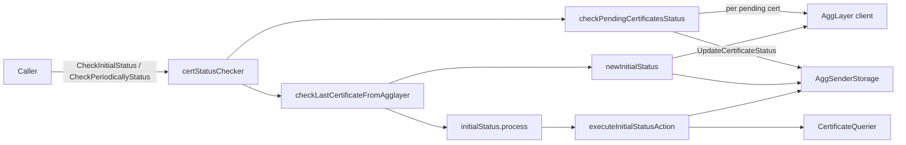

# ARCH: aggsender/statuschecker

## Overview

Two files implement the package. `cert_status_checker.go` defines `certStatusChecker`, the `types.CertificateStatusChecker` implementation, and orchestrates the two public flows: `CheckInitialStatus` loops a reconciliation pass until success or cancellation (upholds SPEC #2–#4), `CheckPeriodicallyStatus` runs one pass (upholds #5). Both flows compose the same two internals: `checkPendingCertificatesStatus` (upholds #6–#13, #29, #30) walks non-settled locals and diffs each against the AggLayer via `updateCertificateStatus`; `checkLastCertificateFromAgglayer` (upholds #14, #31) builds an `initialStatus` and executes the actions it yields.

`initial_state.go` holds the decision core. `initialStatus` bundles the four observations (two AggLayer headers, two local headers) collected in `newInitialStatus`. Its `process()` method first runs `checkAgglayerConsistenceCerts` (upholds #15–#17), then `processLastLocalCert` (upholds #18–#20, #22–#25), then `processLastSettledCert` (upholds #21, #26), producing up to two `initialStatusResult` values. The results are dispatched in `executeInitialStatusAction` (upholds #23 open/InError branches, #26–#28 via `updateLocalStorageWithSettledAggLayerCert` and `newSettledCertificateInfoFromAgglayerCertHeader`).

<!-- human-reasoning aid, not contract -->

## Patterns

- **1.** All outbound storage writes go through `AggSenderStorage`; direct DB access from this package SHOULD NOT be added. This keeps the update-atomicity contract localized to one interface.
- **2.** Every error that leaves a method is wrapped with a prefix describing the phase (`recovery: ...` for the AggLayer-recovery path, plain messages for the pending scan). Preserve this — callers rely on the prefix to route errors and the tests assert on it.
- **3.** New consistency checks on the AggLayer inputs SHOULD be added inside `checkAgglayerConsistenceCerts` and wrap `ErrAgglayerInconsistence`. New per-pair reconciliation rules SHOULD extend the switch-like ladder in `processLastLocalCert` / `processLastSettledCert`, not live in the caller.
- **4.** `newInitialStatusFn` is a package-level function variable (not a direct call to `newInitialStatus`) specifically so tests can stub the observation step without mocking four dependencies individually. Keep this seam.

## Notable decisions

- **5.** Non-settled certificates received from the AggLayer during startup recovery are deliberately NOT persisted (SPEC #23): InError ones because the AggSender will rebuild and resubmit, open (pending) ones because the block range can't be reconstructed from the AggLayer header. The open-pending case returns an error rather than a no-op so the outer retry loop keeps waiting for settlement.
- **6.** The fallback InError sweep in `checkPendingCertificatesStatus` (SPEC #12) exists because three independent paths can drop a new-InError signal: a failed retry send, a transient error in the per-cert diff, or a failed storage update. The sweep is intentionally a best-effort query whose failure is swallowed (SPEC #13) — the primary signal is the per-cert transition, and the sweep is insurance.
- **7.** `CheckInitialStatus` does NOT propagate errors back to the caller; instead it writes them into `AggsenderStatus` via `SetLastError` and retries internally. The loop's termination is driven solely by either a successful pass or context cancellation. Callers that need non-blocking startup should therefore impose their own timeout via the context.
- **8.** Settled-from-AggLayer certificates are persisted with `FromBlock=0`, `CreatedAt=0`, `UpdatedAt=0`, and `SignedCertificate` set to the package-level sentinel `"na/agglayer header"`. This is a conscious lossy reconstruction: the AggLayer header does not carry these fields and the metadata that used to carry them is no longer trusted. Any future change that starts reading these fields for AggLayer-sourced records MUST first solve that missing-data problem, not silently fabricate values.
