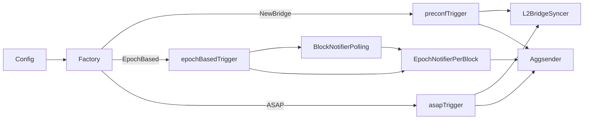

# ARCH: aggsender/trigger

## Overview

Five files implement three trigger strategies plus shared epoch machinery. `factory.go` (`NewCertificateSendTrigger`) dispatches on `cfg.TriggerCertMode`, resolving `AutoTriggerMode` via `defaultTriggerForAggsenderMode` before the switch — upholds SPEC #1–#5. `trigger_by_bridge.go` (`preconfTrigger`) forwards every L2 bridge sync notification as-is; the event is the `sync.Block` itself, which satisfies `CertificateTriggerEvent` — upholds SPEC #9–#12. `trigger_by_epoch.go` (`epochBasedTrigger`) owns a `BlockNotifierPolling` and an `EpochNotifierPerBlock`, starting both in goroutines from `Setup` — upholds SPEC #13–#17. `trigger_asap.go` (`asapTrigger`) is the most stateful: a single mutex guards `triggerRunning`, `ch`, `eventID`, and `lastEventTime`; three independent goroutines may schedule an emission (idle delay, new-bridge, minimum-interval) and all funnel through `trigger()` which flips `triggerRunning` back to false under the lock before sending — upholds SPEC #19–#24. `epoch_notifier_per_block.go` implements `triggertypes.EpochNotifier` (cites `aggsender/trigger/types/SPEC.md#5`, `#6`, `#7`, `#8`, `#9`); its `step` function is a pure reducer over `(internalStatus, EventNewBlock)` → `(internalStatus, *EpochEvent?)`, which is how SPEC #25 (monotone epochs) is preserved.

<!-- human-reasoning aid, not contract -->

## Patterns

- **1.** New trigger implementations SHOULD live in a sibling `trigger_by_*.go` file and be wired in the `switch mode` block of `NewCertificateSendTrigger`; the interface surface (`Setup`, `Status`, `TriggerCh`, `ForceTriggerEvent`, `OnIdle`) is pinned in `aggsender/types` and SHOULD NOT be widened here.
- **2.** Any function that reads or writes `asapTrigger` fields other than `log`, `cfg`, or `l2BridgeSync` MUST take `asapTrigger.mut` first; the mutex is the sole concurrency gate for that type and ad-hoc atomic flags would reintroduce the "double scheduled event" bug the `triggerRunning` flag exists to prevent.
- **3.** Epoch arithmetic (block → epoch, percent-within-epoch, starting-block-of-epoch) SHOULD remain concentrated in `EpochNotifierPerBlock`'s helper methods. Duplicating the formulas in a new notifier risks drift with SPEC #13.
- **4.** `EpochNotifierPerBlock.step` SHOULD remain pure (no I/O, no channel sends, returning the event rather than publishing it); `startInternal` owns the `Publish` call. Keeping the split preserves unit-testability of epoch-boundary logic.

## Notable decisions

- **5.** The `asapTrigger` has *two* parallel paths that can fire an event — `OnIdle` (consumer-driven) and `subscribeNewBridge` (producer-driven) — plus a third timer (`fulfillMinimumInterval`) that guarantees liveness. The `triggerRunning` flag collapses races between them so the consumer sees at most one event in flight. A simpler single-goroutine design was rejected because it would couple the liveness timer to consumer readiness and violate SPEC #23.
- **6.** The notification threshold is clamped to `(NumBlockPerEpoch-1)/NumBlockPerEpoch` in `isNotificationRequired`. Without the clamp, a percentage like 99 with a short epoch could round past the last block and skip the epoch entirely. This is why SPEC #14 forbids 100 and SPEC #18 pins the clamp behaviour.
- **7.** The epoch-based trigger chooses `LatestBlock` finality for its L1 block notifier, not `FinalizedBlock`. Epoch boundaries are a timing signal, not a source of truth — waiting for finality would add minutes of latency to every certificate emission. Certificate correctness is enforced downstream, not by the trigger.
- **8.** `preconfTrigger.TriggerCh` forwards `sync.Block` values unchanged rather than wrapping them in a trigger-specific event struct. This is intentional: every certificate build needs the block number, and `sync.Block` already satisfies `CertificateTriggerEvent` (`fmt.Stringer`). Adding a wrapper would allocate and deep-copy on every notification with no information gain.
- **9.** `ForcePublishEpochEvent` re-publishes *the current* epoch rather than advancing `waitingForEpoch`. The operator-triggered emission is idempotent with respect to the normal epoch loop, so a subsequent natural boundary crossing still fires. A design that bumped `waitingForEpoch` would silently skip one real epoch.
- **10.** The factory returns an error when `AggsenderMode == AutoMode` reaches `defaultTriggerForAggsenderMode`. The aggsender is expected to resolve `AutoMode` upstream via `ContractMode()`/`ResolveAutoMode`; reaching this branch indicates a wiring bug and failing loudly is preferred to silently defaulting.
