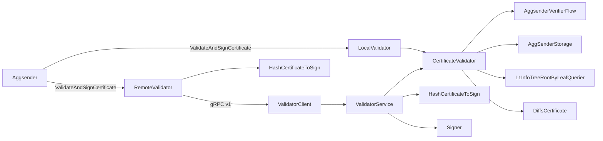

# ARCH: aggsender/validator

## Overview

Two validator shells implement the same `CertificateValidateAndSigner` contract: `LocalValidator` (upholds SPEC #1–#13, #15, #24) runs the core `CertificateValidator` in-process and returns the package-wide empty-signature sentinel; `RemoteValidator` (upholds SPEC #1, #14, #16, #17) hashes the certificate locally, ships `(previous_certificate_id, certificate, last_L2_block)` over gRPC via `ValidatorClient`, and ECDSA-recovers the returned 65-byte signature against the configured address. Both look up the chaining reference via the shared `getPreviousCertificate` helper against `db.AggSenderStorage` (upholds #3, #6).

`CertificateValidator` is the behavioural core (upholds #2–#13). It orchestrates in a fixed order: nil guard → load last-settled-to-block → L2-block bounds (#8–#9) → contiguity / first-cert seed (#4–#6) → previous-settled status (#7) → build pre-params → `flow.GenerateBuildParams` → `flow.BuildCertificate` → `compareCertificates` which delegates to `DiffsCertificate`/`DiffsBridgeExits`/`DiffsImportedBridgeExits` (#11, #23) → per-imported-bridge-exit `VerifyProofs` against the pipeline-selected L1 info root (#12) → `flow.VerifyCertificate` for flow-specific semantics (#13). Server-side, `ValidatorService` sits in front of the same `CertificateValidator` and upholds #18–#20 by translating gRPC request shape, resolving the previous header through the agglayer client, invoking the validator, and only then asking the injected signer for a signature over `HashCertificateToSign` (#14, #19). `HashCertificateToSign` is the single source of truth for the canonical hash (#14, #22, #27): both the remote client (to check the returned signature) and the service (to produce it) call it, so a divergence in hashing between the two sides is structurally impossible.

<!-- human-reasoning aid, not contract -->

## Patterns

- **1.** Every new check added to `CertificateValidator.ValidateCertificate` MUST wrap its underlying error with an operation-identifying prefix (`"failed to ..."`, `"certificate not equal to expected: ..."`, etc.) so that a caller reading the error chain can attribute the failure to a specific SPEC claim; this is how SPEC #25 is met in practice.
- **2.** Field-level equality between the proposer's and the rebuilt certificate MUST go through `DiffsCertificate` rather than direct struct comparison, so that adding a new certificate field requires extending the diff helper and keeps SPEC #11/#23 complete; a direct `reflect.DeepEqual` would silently pass fields the diff doesn't know about.
- **3.** Both sides of the remote path MUST call `HashCertificateToSign` to produce the bytes they sign or recover against. Introducing a second hashing path (e.g., hashing the proto bytes directly) would break SPEC #16 immediately the next time the certificate struct evolves.
- **4.** New validator shells (local, remote, future kinds) SHOULD be added as separate types that each implement `types.CertificateValidateAndSigner` end-to-end rather than as flags on an existing shell; the aggsender picks the shell once, so branching logic inside a single shell accretes rather than decays.

## Notable decisions

- **5.** `LocalValidator` returns `aggkitcommon.EmptySignature` on success rather than nil or a zero byte slice. This gives the aggsender a canonical sentinel (SPEC #15, #24) to detect "locally validated, not remote-signed" without adding a boolean in the return type; callers can change behaviour based on the sentinel while keeping the interface shape identical to the remote path.
- **6.** The canonical hash (SPEC #14) uses `keccak256(nler || keccak256(concat ibe(gi_le || be_hash)) || height_le || aggchain_params || cert_id)` rather than a naive serialize-and-hash of the certificate. The nested hash over imported bridge exits makes the outer payload fixed-length regardless of how many claims the cert carries, and little-endian encoding matches the on-chain rollup-manager contract's expectation. Switching any of these (ordering, endianness, fold vs flat concat) silently breaks signature recovery on the aggsender side.
- **7.** `RemoteValidator.ValidateAndSignCertificate` hashes the certificate up front, before the RPC, so a client-side malformed certificate fails fast with an `internal error getting certificate hash` rather than after a round trip; the hash is also needed post-RPC for `SigToPub`, so reusing the pre-computed value avoids double work.
- **8.** `ValidatorService.ValidateCertificate` maps error categories coarsely — `NotFound` for missing request fields or unreachable previous headers, `InvalidArgument` for proto-to-domain conversion failures, `Internal` for everything from validator errors to signer errors (SPEC #26). This intentionally hides internal structure of validation failures from the client; the detail is in the message string, not the code, so new checks added to `CertificateValidator` do not churn the status-code contract.
- **9.** `mocks/` is skipped from contracts — it is `mockery`-generated from the interfaces in this package and sibling `aggsender/types`, and `testData/` carries JSON fixtures. Both regenerate deterministically; the hand-written surface that constrains them lives in this directory and in `aggsender/types`.
