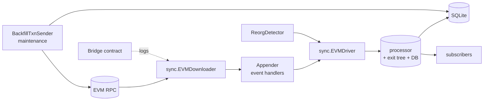

# ARCH: bridgesync

## Overview

The package wires the generic `sync` framework to a bridge-contract log source. `newBridgeSync` (called by `NewL1` / `NewL2`) constructs four collaborating components and hands them to `sync.NewEVMDriver`:

- An **appender** (`buildAppender` in `downloader.go`) — a map from event-topic hash to log-decoding handlers. The L1 variant wires only the two non-sovereign events (bridge deposit, wrapped-token creation); the sovereign variant additionally wires sovereign-token-set, legacy-token migration/removal, and Backward/Forward LET. The deposit handler calls `ExtractTxnAddresses`, which is the decision point for the `txn_sender` / `from_address` / `to_address` triple and the only place `debug_traceTransaction` is used (and only for indirect asset-kind deposits when FromAddress extraction is enabled).
- An **EVM downloader** from the `sync` package, configured with the bridge address as its single log filter and the reorg detector's finalized block type as its finality boundary.
- A **processor** (`processor.go`) — the database writer. It owns the `*sql.DB`, the append-only exit tree (`tree.NewAppendOnlyTree`), the halted flag, and a generic pub-sub for new-bridge block numbers. `ProcessBlock` wraps every block's effects in a single SQL transaction; `Reorg` wraps the block-delete + exit-tree rewind + archive-restore sequence in one transaction; `insertBackwardLET` and `handleForwardLETEvent` do LER sanity checks before and after every LET transition so a divergence aborts the whole transaction. A process-level halt is set only for `tree.ErrInvalidIndex` — the one condition that indicates real DB-vs-tree divergence a reorg can clear.
- A **compatibility checker** — combines the driver's runtime data (chain ID, addresses) with `CurrentDBVersion` and the resolved `SyncFromInBridges` flag into a `BridgeSyncRuntimeData`. Its `IsCompatible` implements the legacy-DB fallback for `SyncFromInBridges`, the false↔true warnings, and the hard-fail on DB-version mismatch.

`bridgesync.go` holds the construction plumbing plus the thin read methods that gate on `isHalted()` and forward to the processor. `backfill_tx_sender.go` is a standalone maintenance tool that re-runs `ExtractTxnAddresses` over rows whose `txn_sender`/`from_address`/`to_address` are empty; it uses a fixed 5-worker pool and a per-batch prepared-statement bulk update. `leaf_data.go` defines the ABI layout for decoding `ForwardLET.NewLeaves`. `config.go` is the mapstructure config with a custom `TrueFalseAutoMode` for `SyncFromInBridges` whose `Resolved *bool` is set by the caller (not from config) after resolving `auto`.

Upholds SPEC #1–#5, #42 (`newBridgeSync` early-return chain), #6–#7 (`initialLER` on processor), #8–#13 (`BridgeSyncRuntimeData.IsCompatible`), #14–#15 (`buildAppender` per-kind wiring), #16–#20 (`ExtractTxnAddresses`, `ExtractFromAddrFromCalls`), #21 (`findCall` skips reverted calls), #22 (`ProcessBlock` transaction), #23–#24 (bridge subscriber + sync subscription), #25 (`PutLeaf` on every insert), #26–#29 (`sanityCheckLatestLER`, `archiveAndDeleteBridgesAbove`, `handleForwardLETEvent` archive-lookup branch), #30 (`Reorg` + `restoreBackwardLETBridges`), #31–#32 (`halt`/`isHalted`/`unhalt`, halt on `tree.ErrInvalidIndex`), #33–#36 (`BridgeSync.Get*` methods), #37–#40 (`BackfillTxnSender`), #43 (handler-returned errors propagate through `sync.EVMDriver`).

<!-- human-reasoning aid, not contract -->

## Patterns

- **1.** Every exported read method on `BridgeSync` MUST check `s.processor.isHalted()` and return `sync.ErrInconsistentState` before touching the database. New read methods that skip this gate silently leak potentially-inconsistent data and violate SPEC #33.
- **2.** Every state-mutating operation that spans more than one row (block ingest, reorg, BackwardLET, ForwardLET) MUST run inside a single `db.NewTx` with a deferred rollback flag, and MUST NOT commit until every sanity check has passed. LET transitions in particular MUST call `sanityCheckLatestLER` against `PreviousRoot` before mutating and against `NewRoot` after mutating — removing either check means a contract-vs-DB divergence would be silently accepted.
- **3.** A new LET-derived event kind (additions to `Event`, additions under `handleForwardLETEvent`, etc.) MUST set `Bridge.Source` to a corresponding `BridgeSource` constant so that the backfill in `backfill_tx_sender.go` can exclude those rows (SPEC #38). Writing such rows with an empty `source` will cause the backfill to attempt to re-trace a transaction whose hash is synthetic.
- **4.** Dynamic SQL for reads MUST use numbered placeholders (`$1`, `$2`, …) and the `*WithParams` helpers; `tableName` must be validated via `tableNameRegex` before interpolation. No user-controlled string MAY be concatenated into a SQL query.
- **5.** New bridge-syncer flavors (beyond L1/L2) SHOULD be added by extending `BridgeDeployment` plus a branch in `buildAppender`, and MUST go through `resolveBridgeDeployment` rather than a config flag — the live-contract probe is the authoritative signal and keeps the config surface narrow.

## Notable decisions

- **6.** `resolveBridgeDeployment` distinguishes sovereign from non-sovereign by calling a method that only exists on one contract and treating `execution reverted` as "not this kind". Any other RPC error is surfaced rather than silently falling through, so a transport failure cannot be misidentified as a non-sovereign bridge. This trades one extra eth_call at startup for not needing operators to set a flag and not needing the two deployments to share a discriminator function.
- **7.** `ExtractTxnAddresses` short-circuits `debug_traceTransaction` when the outer transaction is directly addressed to the bridge, because the trace call is expensive and requires an archive node. The fallback `syncFromInBridges=false` path skips tracing entirely and stores `from_address` as NULL for indirect asset deposits — this is why the backfill's SQL distinguishes the `syncFromInBridges` cases (`missingFieldsCondition`) rather than always requiring `from_address`.
- **8.** ForwardLET ingestion tries to reattach identifying fields (`tx_hash`, `txn_sender`, `from_address`) from the archive when exactly one archived row matches the new leaf's content. Zero-match and multi-match cases intentionally leave those fields empty rather than guessing, because a wrong attribution would corrupt downstream indices keyed by `txn_sender`/`from_address`. The ordinary path (BackwardLET immediately followed by a ForwardLET that restores the same leaves) produces single matches; the exceptional paths are logged at warn level and left to operator review.
- **9.** The halted state is cleared only inside `Reorg`, and only when at least one row was deleted. An invalid-index divergence that persists through a reorg that touched no rows is *not* auto-cleared — we want the operator to see that a reorg was attempted but did not materially change state. Adding an unconditional `unhalt` in `Reorg` would let a benign no-op reorg mask a genuine corruption.
- **10.** `BridgeSync.GetBridgeByDepositCount` and `GetBridgesByContent` do not gate on `isHalted()`. They are used by bridge-resubmission tooling that needs to read a deposit even after a mid-chain divergence to decide whether a claim is still serviceable. This is a deliberate exception to pattern #1; do not extend it to other read methods without matching tooling justification.
- **11.** The tracer call in `extractRootCall` sets `rootCall.To = contractAddr` before making the RPC. The JSON response's `to` field is authoritative once unmarshalled, but pre-seeding the value means that if the trace response is missing `to` (observed on some client versions for the topmost call) the search still anchors correctly to the bridge.
- **12.** `GetLastRoot` is read directly from `processor.exitTree.GetLastRoot(processor.db)` rather than through a transaction, because the exit tree's invariant is that its root can only advance or be rewound inside a transaction that also commits the corresponding bridge rows. A snapshot read is safe even under concurrent ingest.
- **13.** `CurrentDBVersion` is stored *inside* `BridgeSyncRuntimeData` (alongside chain ID and address set) rather than as a dedicated migrations row. The compatibility check is therefore the single place where a hard-incompatible schema change is surfaced to operators; bumping `CurrentDBVersion` is how you force a resync without writing a destructive SQL migration.

## Dependencies

- `github.com/russross/meddler` provides struct-tag-based SQL scanning and inserts for every persisted row type. Replacing it would require rewriting the tag set on `Bridge`, `TokenMapping`, `LegacyTokenMigration`, `BackwardLET`, `ForwardLET`, and `RecordToBackfill`.
- `github.com/golang-collections/collections/stack` backs the iterative DFS in `findCall`. The iterative form is deliberate — call traces can be deep enough to blow the goroutine stack on a recursive walk.
