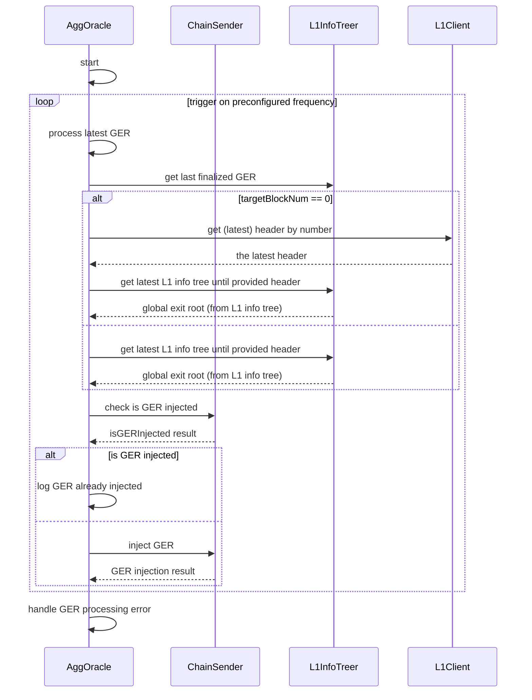

# AggOracle Component

## Overview

The **AggOracle** component ensures the **Global Exit Root (GER)** is propagated from L1 to the L2 sovereign chain smart contract. This is critical for enabling asset and message bridging between chains.

The GER is picked up from the smart contract by **LastGERSyncer** for local storage.

### Key Components:

- `ChainSender`: Interface for submitting GERs to the smart contract.
- `EVMChainGERSender`: An implementation of `ChainSender` interface.

---

## Workflow

### What is Global Exit Root (GER)?

The **Global Exit Root** consolidates:

- **Mainnet Exit Root (MER)**: Updated during bridge transactions from L1.
- **Rollup Exit Root (RER)**: Updated when verified rollup batches are submitted via ZKP.

        GER = hash(MER, RER)

### Process

1. **Fetch Finalized GER**:
    - AggOracle retrieves the latest GER finalized on L1.
2. **Check GER Injection**:
    - Confirms whether the GER is already stored in the smart contract.
3. **Inject GER**:
    - If missing, AggOracle submits the GER via the `insertGlobalExitRoot` function.
4. **Sync Locally**:
    - LastGERSyncer fetches and stores the GER locally for downstream use.

The sequence diagram below depicts the interaction in the AggOracle.



---

## Key Components

### 1. AggOracle

The `AggOracle` fetches the finalized GER and ensures its injection into the L2 smart contract.

### Functions:

- **`Start`**: Periodically processes GER updates using a ticker.
- **`processLatestGER`**: Checks if the GER exists and injects it if necessary.
- **`getLastFinalizedGER`**: Retrieves the latest finalized GER based on block finality.

---

### 2. ChainSender Interface

Defines the interface for submitting GERs.

```
IsGERInjected(ger common.Hash) (bool, error)
InjectGER(ctx context.Context, ger common.Hash) error
```

---

### 3. EVMChainGERSender

Implements `ChainSender` using Ethereum clients and transaction management.

### Functions:

- **`IsGERInjected`**: Verifies GER presence in the smart contract.
- **`InjectGER`**: Submits the GER using the `insertGlobalExitRoot` method and monitors transaction status.

---

## Smart Contract Integration

- **Contract**: `GlobalExitRootManagerL2SovereignChain.sol`
- **Function**: `insertGlobalExitRoot`
    - [Source Code](https://github.com/0xPolygonHermez/zkevm-contracts/blob/feature/audit-remediations/contracts/v2/sovereignChains/GlobalExitRootManagerL2SovereignChain.sol#L89-L103)
- **Bindings**: Available in [cdk-contracts-tooling](https://github.com/0xPolygon/cdk-contracts-tooling/tree/main/contracts/pp/l2-sovereign-chain).

---

## Configuration

| Name                                | Type               | Description                                                                                                     |
|-------------------------------------|--------------------|-----------------------------------------------------------------------------------------------------------------|
| TargetChainType                     | TargetChainType    | The type of target chain (e.g., `EVM`).                                                                         |
| URLRPCL1                            | string             | RPC URL for Layer 1.                                                                                            |
| BlockFinality                       | string             | The status of blocks to query for syncing. <br> Possible values: `LatestBlock`, `SafeBlock`, `PendingBlock`, `FinalizedBlock`, `EarliestBlock`. |
| WaitPeriodNextGER                   | Duration           | Time interval to wait before checking the next Global Exit Root (GER).                                          |
| EVMSender.GlobalExitRootL2          | string             | Address of the Global Exit Root on Layer 2.                                                                     |
| EVMSender.URLRPCL2                  | string             | RPC URL for Layer 2.                                                                                            |
| EVMSender.GasOffset                 | int                | Offset for gas calculations in Layer 2 transactions.                                                            |
| EVMSender.WaitPeriodMonitorTx       | Duration           | Time interval to wait before monitoring Layer 2 transactions.                                                   |
| EVMSender.EthTxManager              | EthTxManagerConfig | Configuration for the Ethereum Transaction Manager used to send Layer 2 transactions.                           |

---

For detailed configuration of the Ethereum Transaction Manager (`EthTxManager`), refer to [EthTxManager Configuration](./ethtxmanager.md).

For detailed configuration of `Etherman`, refer to [Etherman Configuration](./etherman.md).

> **Note:** A sample configuration file is available in [default.go](./../config/default.go).

```go
 EthTxManager.Etherman.L1ChainID
```
Set the `L1ChainID` field to the Layer 2 chain ID. If this value is set to `0`, the `EthTxManager` will automatically retrieve and assign the appropriate chain ID at runtime using the `getChainID` RPC method.

## Summary

The **AggOracle** component automates the propagation of GERs from L1 to L2, enabling bridging across networks.

Refer to the EVM implementation in [evm.go](https://github.com/agglayer/aggkit/blob/main/aggoracle/chaingersender/evm.go) for guidance on building new chain senders.
