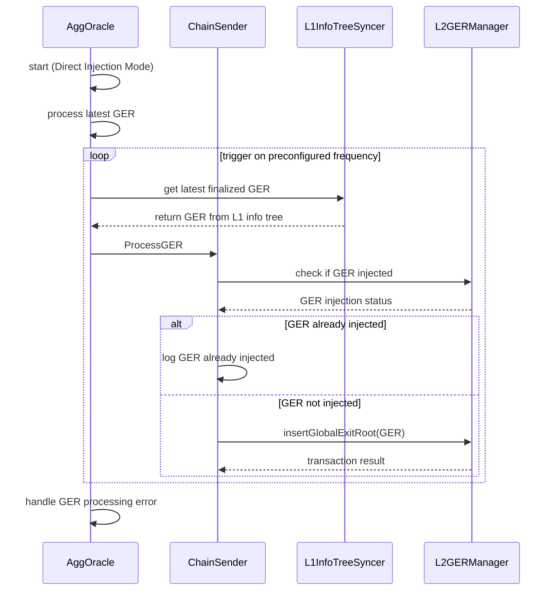
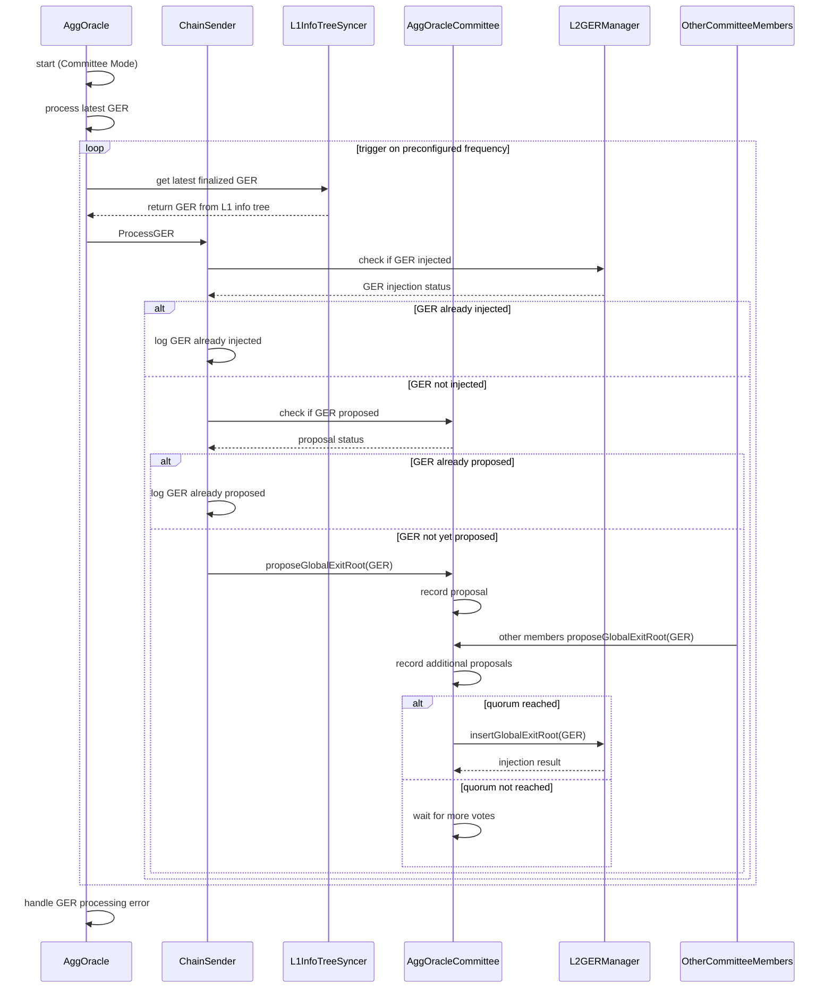

# AggOracle Component

## Overview

The **AggOracle** component ensures the **Global Exit Root (GER)** is propagated from L1 to the L2 sovereign chain smart contract. This is critical for enabling asset and message bridging between chains.

The GER is indexed from the L2 smart contract by **L2GERSyncer** component and persisted in local storage.

The AggOracle supports two operational modes:

1. **Direct Injection Mode**: Direct injection of GERs into the L2 GER Manager contract
2. **AggOracle Committee Mode**: Consensus-based GER injection through a committee of oracle members

### Key Components:

- `ChainSender`: Interface for submitting GERs to the smart contract.
- `EVMChainGERSender`: An implementation of `ChainSender` interface supporting both operational modes.

---

## Workflow

### What is Global Exit Root (GER)?

The **Global Exit Root** consolidates:

- **Mainnet Exit Root (MER)**: Updated during bridge transactions from L1.
- **Rollup Exit Root (RER)**: Updated when verified rollup batches are submitted via ZKP.

        GER = hash(MER, RER)

### Operational Modes

#### 1. Direct Injection Mode

In this mode, the AggOracle directly injects GERs into the L2 GER Manager contract:

1. **Fetch Finalized GER**: AggOracle retrieves the latest GER finalized on L1.
2. **Check GER Injection**: Confirms whether the GER is already stored in the smart contract.
3. **Direct Injection**: If missing, AggOracle directly submits the GER via the `insertGlobalExitRoot` function.
4. **Sync Locally**: L2GERSyncer fetches and stores the GER locally for downstream use.

#### 2. AggOracle Committee Mode

In this mode, GER injection requires consensus from a committee of oracle members:

1. **Fetch Finalized GER**: AggOracle retrieves the latest GER finalized on L1.
2. **Check GER Status**: Confirms whether the GER is already injected or proposed.
3. **Propose GER**: If not yet proposed, committee member submits the GER via `proposeGlobalExitRoot` function to the `AggOracleCommittee` contract.
4. **Committee Proposals**: Other committee members submit the same GER via `proposeGlobalExitRoot` to signal agreement.
5. **Automatic Injection**: Once quorum is reached, the GER is automatically injected into the L2 GER Manager contract.
6. **Sync Locally**: L2GERSyncer fetches and stores the GER locally for downstream use.

### Committee Consensus Mechanism

- **Committee Members**: A predefined set of authorized oracle addresses
- **Quorum**: Minimum number of votes required for GER injection
- **Proposal Tracking**: Each member's latest proposed GER is tracked; members cannot re-propose the same GER
- **Proposal Counting**: The committee contract track proposals for each GER
- **Automatic Execution**: GER injection happens automatically when quorum is reached

The sequence diagrams below depict the interactions in both operational modes.

#### Direct Injection Mode:


```mermaid
sequenceDiagram
    participant AggOracle
    participant ChainSender
    participant L1InfoTreeSyncer
    participant L2GERManager

    AggOracle->>AggOracle: start (Direct Injection Mode)
    AggOracle->>AggOracle: process latest GER
    loop trigger on preconfigured frequency
        AggOracle->>L1InfoTreeSyncer: get latest finalized GER
        L1InfoTreeSyncer-->>AggOracle: return GER from L1 info tree
        AggOracle->>ChainSender: ProcessGER
        ChainSender->>L2GERManager: check if GER injected
        L2GERManager-->>ChainSender: GER injection status
        alt GER already injected
            ChainSender->>ChainSender: log GER already injected
        else GER not injected
            ChainSender->>L2GERManager: insertGlobalExitRoot(GER)
            L2GERManager-->>ChainSender: transaction result
        end
    end
    AggOracle->>AggOracle: handle GER processing error
```

#### AggOracle Committee Mode:


```mermaid
sequenceDiagram
    participant AggOracle
    participant ChainSender
    participant L1InfoTreeSyncer
    participant AggOracleCommittee
    participant L2GERManager
    participant OtherCommitteeMembers

    AggOracle->>AggOracle: start (Committee Mode)
    AggOracle->>AggOracle: process latest GER
    loop trigger on preconfigured frequency
        AggOracle->>L1InfoTreeSyncer: get latest finalized GER
        L1InfoTreeSyncer-->>AggOracle: return GER from L1 info tree
        AggOracle->>ChainSender: ProcessGER
        ChainSender->>L2GERManager: check if GER injected
        L2GERManager-->>ChainSender: GER injection status
        alt GER already injected
            ChainSender->>ChainSender: log GER already injected
        else GER not injected
            ChainSender->>AggOracleCommittee: check if GER proposed
            AggOracleCommittee-->>ChainSender: proposal status
            alt GER already proposed
                ChainSender->>ChainSender: log GER already proposed
            else GER not yet proposed
                ChainSender->>AggOracleCommittee: proposeGlobalExitRoot(GER)
                AggOracleCommittee->>AggOracleCommittee: record proposal
                OtherCommitteeMembers->>AggOracleCommittee: other members proposeGlobalExitRoot(GER)
                AggOracleCommittee->>AggOracleCommittee: record additional proposals
                alt quorum reached
                    AggOracleCommittee->>L2GERManager: insertGlobalExitRoot(GER)
                    L2GERManager-->>AggOracleCommittee: injection result
                else quorum not reached
                    AggOracleCommittee->>AggOracleCommittee: wait for more votes
                end
            end
        end
    end
    AggOracle->>AggOracle: handle GER processing error
```

---

## Key Components

### 1. AggOracle

The `AggOracle` fetches the finalized GER and ensures its injection into the L2 smart contract using the configured operational mode.

#### Functions:

- **`Start`**: Periodically processes GER updates using a ticker.
- **`processLatestGER`**: Fetches the latest GER and delegates processing to the ChainSender.

---

### 2. ChainSender Interface

Defines the unified interface for submitting GERs in both operational modes.

```go
// Common methods for both modes
IsGERInjected(ger common.Hash) (bool, error)
ProcessGER(ctx context.Context, ger common.Hash) error

// Direct injection mode
InjectGER(ctx context.Context, ger common.Hash) error

// Committee mode specific
ProposeGER(ctx context.Context, ger common.Hash) error
IsGERProposed(ger common.Hash) (bool, error)
```

---

### 3. EVMChainGERSender

Implements `ChainSender` using Ethereum clients and transaction management, supporting both operational modes.

#### Mode Selection:
- **Direct Injection Mode**: When `EnableAggOracleCommittee = false`
- **Committee Mode**: When `EnableAggOracleCommittee = true` and `AggOracleCommitteeAddr` is configured

#### Functions:

**Common Functions:**
- **`IsGERInjected`**: Verifies GER presence in the L2 GER Manager contract.
- **`ProcessGER`**: Routes to either `InjectGER` or `ProposeGER` based on operational mode.

**Direct Injection Mode:**
- **`InjectGER`**: Directly submits the GER using `insertGlobalExitRoot` and monitors transaction status.

**Committee Mode:**
- **`ProposeGER`**: Proposes the GER to the AggOracleCommittee using `proposeGlobalExitRoot`.
- **`IsGERProposed`**: Checks if the current committee member has already proposed the GER.

#### Validation:
- **Direct Mode**: Validates that the sender address is authorized as `GlobalExitRootUpdater`
- **Committee Mode**: Validates that the sender is a registered committee member

---

## Smart Contract Integration

### 1. L2 GER Manager Contract

Used in both operational modes for final GER storage and status checking.

- **Contract**: `GlobalExitRootManagerL2SovereignChain.sol`
- **Function**: `insertGlobalExitRoot`
    - [Source Code](https://github.com/0xPolygonHermez/zkevm-contracts/blob/feature/audit-remediations/contracts/v2/sovereignChains/GlobalExitRootManagerL2SovereignChain.sol#L89-L103)
- **Bindings**: Available in [cdk-contracts-tooling](https://github.com/0xPolygon/cdk-contracts-tooling/tree/main/contracts/pp/l2-sovereign-chain).

---

## Configuration

### Direct Injection Mode Configuration

```yaml
AggOracle:
  TargetChainType: "EVM"
  URLRPCL1: "https://eth-mainnet.g.alchemy.com/v2/your-api-key"
  WaitPeriodNextGER: "5s"
  EnableAggOracleCommittee: false
  EVMSender:
    GlobalExitRootL2: "0x123...abc"  # L2 GER Manager contract address
    AggOracleCommitteeAddr: "0x000...000"  # Not used in direct mode
    GasOffset: 80000
    WaitPeriodMonitorTx: "1s"
    EthTxManager:
      FrequencyToMonitorTxs: "1s"
      WaitTxToBeMined: "2m"
      # ... other EthTxManager config
```

### Committee Mode Configuration

```yaml
AggOracle:
  TargetChainType: "EVM"
  URLRPCL1: "https://eth-mainnet.g.alchemy.com/v2/your-api-key"
  WaitPeriodNextGER: "5s"
  EnableAggOracleCommittee: true
  EVMSender:
    GlobalExitRootL2: "0x123...abc"  # L2 GER Manager contract address
    AggOracleCommitteeAddr: "0x456...def"  # AggOracleCommittee contract address
    GasOffset: 80000
    WaitPeriodMonitorTx: "1s"
    EthTxManager:
      FrequencyToMonitorTxs: "1s"
      WaitTxToBeMined: "2m"
      # Ensure the From address is a committee member
      # ... other EthTxManager config
```

### Key Configuration Differences

| Configuration | Direct Injection Mode | Committee Mode |
|---------------|---------------------|----------------|
| `EnableAggOracleCommittee` | `false` | `true` |
| `AggOracleCommitteeAddr` | Not required | Required (valid contract address) |
| `EthTxManager.From` | Must be authorized as `GlobalExitRootUpdater` | Must be a registered committee member |
| **GER Submission** | Direct via `insertGlobalExitRoot` | Proposal via `proposeGlobalExitRoot` |

---

## 📊 Aggoracle Metrics

The **Aggoracle** service exposes Prometheus metrics to track Global Exit Root (GER) processing activity, latency, and error rates.
All metrics are registered under the namespace: `aggoracle`

| Metric | Type | Description | Unit |
|---------|------|--------------|------|
| `aggoracle_ger_processing_trigger_total` | Counter | Total number of GER processing triggers. | count |
| `aggoracle_ger_processing_errors_total` | Counter | Total number of GER processing errors. | count |
| `aggoracle_ger_processing_duration_seconds` | Histogram | Time taken to process a single Global Exit Root from start to finish. | seconds |

## Summary

The **AggOracle** component automates the propagation of GERs from L1 to L2, enabling bridging across networks. It supports two operational modes:

- **Direct Injection Mode**: Simple, single-authority GER injection
- **Committee Mode**: Consensus-based GER injection providing enhanced security through multiple oracle validation

Refer to the EVM implementation in [evm.go](https://github.com/agglayer/aggkit/blob/develop/aggoracle/chaingersender/evm.go) for guidance on building chain senders for non-EVM chains.
