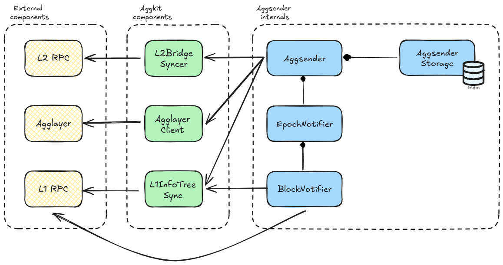
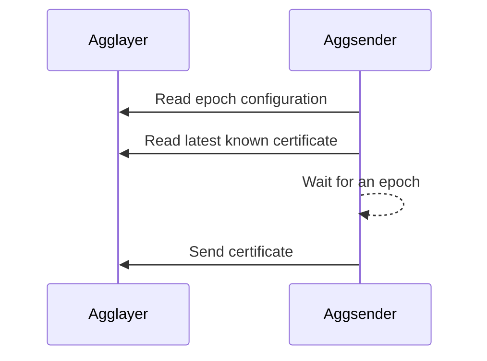
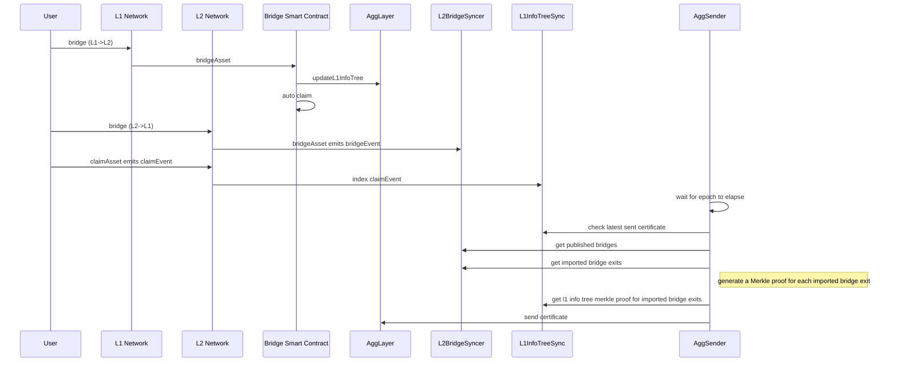
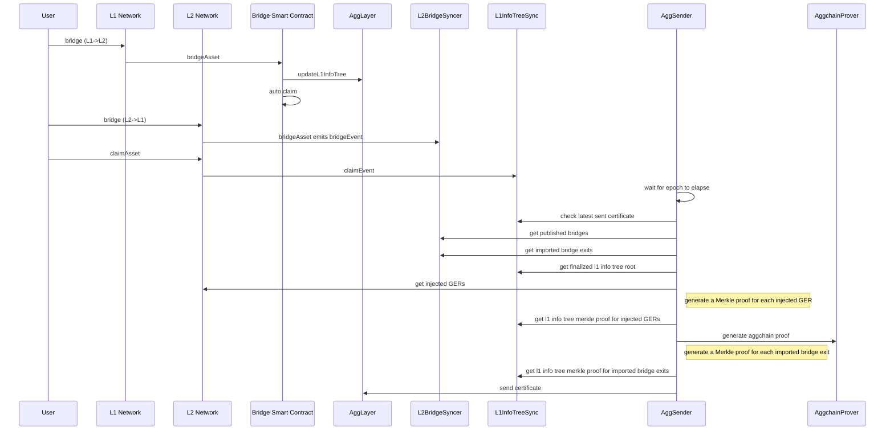

# AggSender component

`AggSender` is in charge to build and pack the information required to prove a target chain's bridge state into a certificate. This certificate provides the inputs needed to build a pessimistic proof.

## Component Diagram

The image below, depicts the `Aggsender` components (the editable link of the diagram is found [here](https://excalidraw.com/#room=d3c9f86992bc6ef07529,UwmF_vvcS6hApBljm_B2EQ)).



## Flow

### Starting the AggSender

`Aggsender` gets the epoch configuration from the `Agglayer`.
It checks the last certificate in DB (if exists) against the `Agglayer`, to be sure that both are on the same page:
    - If the DB is empty then get, as starting point, the last certificate `Agglayer` has.
    - If it is a fresh start, and there are no certificates before this, it will set its starting block to 1 and start polling bridges and claims from the syncer from that block.
    - If `Aggsender` is not on the same page as `Agglayer` it will log error and not proceed with the process of building new certificates, because this case means that there was another player involved that sent a certificate in place of the `Aggsender` which is an invalid case since `Aggsender` is a single instance per L2 network. It can also happen if we put a different `Aggsender` db (from a different network).
    - If both `Aggsender` and `Agglayer` have the same certificate, then `Aggsender` will start the certificate monitoring and build process since this is a valid use case.



### PessimisticProof Mode

`Aggsender` will wait until the epoch event is triggered and ask the `L2BridgeSyncer` if there are new bridges and claims to be sent to `Agglayer`. Once we reach the moment in epoch when we need to send a certificate, the `Aggsender` will poll all the bridges and claims from the bridge syncer, based on the last sent L2 block to the `Agglayer`, until the block that the syncer has.

It is important to mention that no certificate will be sent to the `Agglayer` if the syncer has no bridges, since bridges change the Local Exit Root (`LER`).

If we have bridges, certificate will be built, signed, and sent to the `Agglayer` using the provided `Agglayer` RPC URL.

Currently, `Agglayer` only supports one certificate per L1 epoch, per network, so we can not send more than one certificate. After the certificate is sent, we wait until the next epoch, either to resend it if its status is `InError`, or to build a new one if its status `Settled`. Also, we have no limit yet in how many bridges and claims can be sent in a single certificate. This might be something to test and check, because certificates carry a lot of data through RPC, so we might hit the rpc layer limit at some point. For this reason, we introduced the `MaxCertSize` configuration parameter on the `Aggsender`, where the user can define the maximum size of the certificate (based on the rpc communication layer limit) in bytes, and the `Aggsender` will limit the number of bridges and claims it will send to the `Agglayer` based on this parameter. Since both bridges and claims carry fixed size of data (each field is a fixed size field), we can we great precision calculate the size of a certificate.

`InError` status on a certificate can mean a number of things. It can be an error that happened on the `Agglayer`. It can be an error in the data `Aggsender` sent, or the certificate was sent in between two epochs, which `Agglayer` considers invalid. Either way, the given certificate needs to be re-sent in the next epoch (or immediately after we notice its status change based on the `RetryCertAfterInError` config parameter), with all the previously sent bridges and claims, plus the new ones that happened after them, that the syncer saw and saved.

It is important to mention that, in the case of resending the certificate, the certificate height must be reused. If we are sending a new certificate, its height must be incremented based on the previously sent certificate.

Suppose the previously sent certificate was not marked as `InError`, or `Settled` on the `Agglayer`. In that case, we can not send/resend the certificate, even though a new epoch event is handled since it was not processed yet by the `Agglayer` (neither `Settled` nor marked as `InError`).

The image below, depicts the interaction between different components when building and sending a certificate to the `Agglayer` in the `PessimisticProof` mode.



### AggchainProof mode

In essence, the `AggchainProof` mode follows the same logic and flow as `PessimisticProof` mode. Only difference is in two points:
- calling the `aggchain prover` to generate an `aggchain proof` that will be sent in the certfiicate to the `Agglayer`.
- resending an `InError` certficate does not expand it with new bridges and events that the syncer might have gotten in the meantime. This is done because `aggchain prover` already generated a proof for a given block range, and since proof generation can be a long process, this is a small optimization. Note that 
this might change in the future.

Calling the `aggchain prover` is done right before signing and sending the certificate to the `Agglayer`. To generate an `aggchain proof` prover needs couple of things:
- block range on L2 for which we are trying to generate a certificate.
- finalized L1 info tree root, leaf, and proof on the L1 info tree. Basically, this is the latest finalized l1 info tree root needed by the prover to generate the proof. This root is also use to generate merkle proof for every imported bridge exit (claim) in certificate.
- injected GlobalExitRoot's on L2 and their leaves and proofs. Merkle proofs of the injected GERs are calculated based on the finalized L1 info tree root.
- imported bridge exits (claims) we intend to include in the certificate for the given block range.

The image below, depicts the interaction between different components when building and sending a certificate to the `Agglayer` in the `AggchainProof` mode.



## Certificate data

The certificate is the data submitted to `Agglayer`. Must be signed to be accepted by `Agglayer`. `Agglayer` responds with a `certificateID` (hash)

| Field Name               | Description                                                                 |
|--------------------------|-----------------------------------------------------------------------------|
| `network_id`               | This is the id of the rollup (>0)                                                       |
| `height`                   | Order of certificates. First one is 0                                                   |
| `prev_local_exit_root`     | The first one must be the one in smart contract (currently is a 0x000…00)                          |
| `new_local_exit_root`      | It's the root after bridge_exits                                                        |
| `bridge_exits`             | These are the leaves of the LER tree included in this certificate. (bridgeAssert calls) |
| `imported_bridge_exits`    | These are the claims done in this network                                               |
| `aggchain_params`          | Aggchain params returned by the aggchain prover                                         |
| `aggchain_proof`           | Aggchain proof generated by the aggchain prover                                         |
| `custom_chain_data`        | Custom chain data returned by the aggchain prover                                       |

## Configuration

| Name                              | Type                      | Description                                                                                                     |
|-----------------------------------|---------------------------|-----------------------------------------------------------------------------------------------------------------|
| StoragePath                       | string                    | Full file path (with file name) where to store Aggsender DB                                                     |
| AgglayerClient                    | *aggkitgrpc.ClientConfig  | Agglayer gRPC client configuration. See [ClientConfig](./common_config.md#clientconfig) for details.                             |
| AggsenderPrivateKey               | [SignerConfig](./common_config.md#signerconfig)             | Configuration of the signer used to sign the certificate on the Aggsender before sending it to the Agglayer. It can be a local private key, or an external one. |
| URLRPCL2                          | string                    | L2 RPC                                                                                                          |
| BlockFinality                     | string                    | Indicates which finality the AggLayer follows (FinalizedBlock, SafeBlock, LatestBlock, PendingBlock, EarliestBlock) |
| EpochNotificationPercentage       | uint                      | Indicates the percentage of the epoch on which the AggSender should send the certificate. 0 = begin, 50 = middle |
| MaxRetriesStoreCertificate        | int                       | Number of retries if Aggsender fails to store certificates on DB. 0 = infinite retries                           |
| DelayBeetweenRetries              | Duration                  | Delay between retries for storing certificate and initial status check                                           |
| KeepCertificatesHistory           | bool                      | If true, discarded certificates are moved to the `certificate_info_history` table instead of being deleted       |
| MaxCertSize                       | uint                      | The maximum size of the certificate. 0 means infinite size                                                      |
| DryRun                            | bool                      | If true, AggSender will not send certificates to Agglayer (for debugging)                                       |
| EnableRPC                         | bool                      | Enable the Aggsender's RPC layer                                                                                |
| AggkitProverClient                | *aggkitgrpc.ClientConfig  | Configuration for the AggkitProver gRPC client                                                                  |
| Mode                              | string                    | Defines the mode of the AggSender (PessimisticProof or AggchainProof)                                           |
| CheckStatusCertificateInterval    | Duration                  | Interval at which the AggSender will check the certificate status in Agglayer                                   |
| RetryCertAfterInError             | bool                      | If true, Aggsender will re-send InError certificates immediately after status change                            |
| MaxSubmitCertificateRate          | RateLimitConfig           | Maximum allowed rate of submission of certificates in a given time. See [RateLimitConfig](./common_config.md#ratelimitconfig) for details. |
| GlobalExitRootL2Addr              | Address                   | Address of the GlobalExitRootManager contract on L2 sovereign chain (needed for AggchainProof mode)             |
| SovereignRollupAddr               | Address                   | Address of the sovereign rollup contract on L1                                                                  |
| RequireStorageContentCompatibility| bool                      | If true, data stored in the database must be compatible with the running environment                            |
| RequireNoFEPBlockGap              | bool                      | If true, AggSender should not accept a gap between lastBlock from lastCertificate and first block of FEP        |
| OptimisticModeConfig              | optimistic.Config         | Configuration for optimistic mode (required by FEP mode). See [OptimisticConfig](./common_config.md#optimisticconfig) for details. |
| RequireOneBridgeInPPCertificate   | bool                      | If true, AggSender requires at least one bridge exit for Pessimistic Proof certificates                         |
                                                                                              |

## Use Cases

This paragraph explains different use cases with outcomes.

- No bridges from L2 -> L1 means no certificate will be built.
- Having bridges without claims, means a certificate will be built and sent.
- Having bridges and claims, means a certificate will be built and sent.
- If the previous certificate we sent is `InError`, we need to resend that certificate with all the previous sent data, plus new bridges and claims we saw after that.
- If the previously sent certificate is not `InError` or `Settled`, no new certificate will be sent/resent. The `AggSender` waits for one of these two statuses on the `Agglayer`.

## Debugging in local with bats e2e tests

1. Start kurtosis with pessimistic proof yml file (`kurtosis run --enclave aggkit --args-file .github/tests/fork12-pessimistic.yml .`) Change `gas_token_enabled` to true.
2. After kurtosis is started, stop the `cdk-node-001` service (`kurtosis service stop aggkit cdk-node-001`).
3. Open the repo in an IDE (like Visual Studio), and run `./scripts/local_config` from the main repo folder. This will generate a `./tmp` folder in which `Aggsender` storage will be saved, and other aggkit node data, and will print a `launch.json`:

```json
{
   // Use IntelliSense to learn about possible attributes.
   // Hover to view descriptions of existing attributes.
   // For more information, visit: https://go.microsoft.com/fwlink/?linkid=830387
   "version": "0.2.0",
   "configurations": [
       {
           "name": "Debug aggsender",
           "type": "go",
           "request": "launch",
           "mode": "auto",
           "program": "cmd/",
           "cwd": "${workspaceFolder}",
           "args":[
               "run",
               "-cfg", "tmp/aggkit/local_config/test.kurtosis.toml",
               "-components", "aggsender",
           ]
       },
   ]
}
```

4. Copy this to your `launch.json` and start debugging.
5. This will start the `aggkit` with the `aggsender` running.
6. Navigate to the `test/bats/pp` folder (`cd test/bats/pp`).
7. Run a test in `bridge-e2e.bats` file: `bats -f "Native gas token deposit to WETH" bridge-e2e.bats`. This will build a new certificate after it is done, and you can debug the whole process.

## Prometheus Endpoint

If enabled in the configuration, Aggsender exposes the following Prometheus metrics:

- Total number of certificates sent  
- Number of sending errors  
- Number of successful sends  
- Certificate build time  
- Prover execution time  

### Configuration Example

To enable Prometheus metrics, configure Aggsender as follows:

```ini
[Prometheus]
Enabled = true
Host = "localhost"
Port = 9091
```

With this configuration, the metrics will be available at:
http://localhost:9091/metrics

## Additional Documentation

[1] https://potential-couscous-4gw6qyo.pages.github.io/protocol/workflow_centralized.html 
[2] initial PR: https://github.com/0xPolygon/cdk/pull/22 
[3] https://agglayer.github.io/agglayer/pessimistic_proof/index.html
