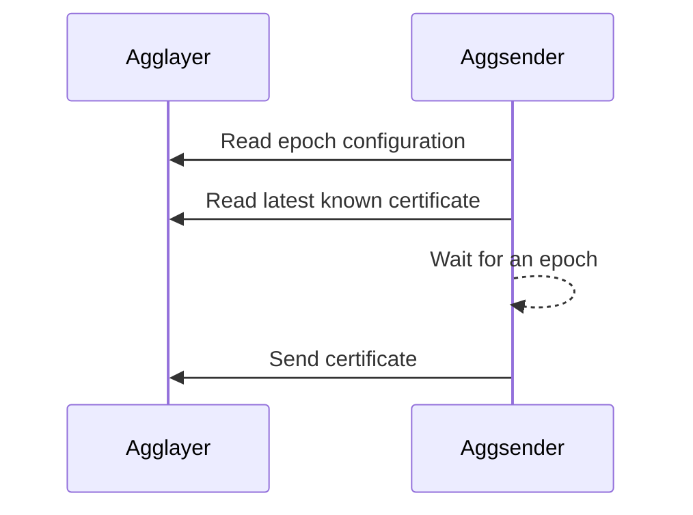
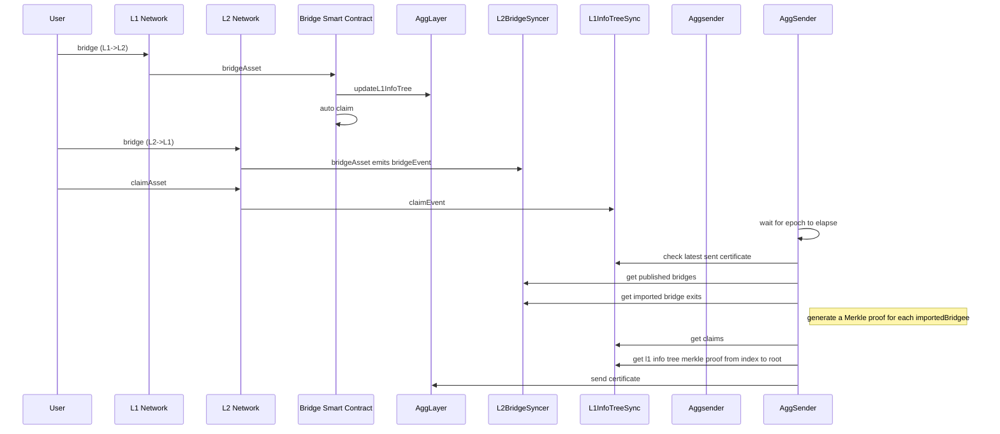

# AggSender component

`AggSender` is in charge to build and pack the information required to prove a target chain’s bridge state into a certificate. This certificate provides the inputs needed to build a pessimistic proof.

## Component Diagram

The image below, depicts the `Aggsender` components (the editable link of the diagram is found [here](https://excalidraw.com/#room=d3c9f86992bc6ef07529,UwmF_vvcS6hApBljm_B2EQ)).


## Flow

### Starting the AggSender

`Aggsender` gets the epoch configuration from the `Agglayer`.
It checks the last certificate in DB (if exists) against the `Agglayer`, to be sure that both are on the same page:
    - If the DB is empty then get, as starting point, the last certificate `Agglayer` has.
    - If it is a fresh start, and there are no certificates before this, it will set its starting block to 1 and start polling bridges and claims from the syncer from that block.



### Build a certificate

`Aggsender` will wait until the epoch event is triggered and ask the `L2BridgeSyncer` if there are new bridge to be sent to `Agglayer`. Once we reach the moment in epoch when we need to send a certificate, the `Aggsender` will poll all the bridges and claims from the bridge syncer, based on the last sent L2 block to the `Agglayer`, until the block that the syncer has.

It is important to mention that no certificate will be sent to the `Agglayer` if the syncer has no bridges, since bridges change the Local Exit Root (`LER`).

If we have bridges, certificate will be built, signed, and sent to the `Agglayer` using the provided `Agglayer` RPC URL.

Currently, `Agglayer` only supports one certificate per L1 epoch, per network, so we can not send more than one certificate. After the certificate is sent, we wait until the next epoch, either to resend it if its status is `InError`, or to build a new one if its status `Settled`. Also, we have no limit yet in how many bridges and claims can be sent in a single certificate. This might be something to test and check, because certificates carry a lot of data through RPC, so we might hit a limit at some point.

`InError` status can mean a number of things. It can be an error that happened on the `Agglayer`. It can be an error in the data `Aggsender` sent, or the certificate was sent in between two epochs, which `Agglayer` considers invalid. Either way, the given certificate needs to be re-sent in the next epoch, with all the previously sent bridges and claims, plus the new ones that happened after them, that the syncer saw and saved.

It is important to mention that, in the case of resending the certificate, the certificate height must be reused. If we are sending a new certificate, its height must be incremented based on the previously sent certificate.

Suppose the previously sent certificate was not marked as `InError`, or `Settled` on the `Agglayer`. In that case, we can not send/resend the certificate, even though a new epoch event is handled.

The image below, depicts the interaction between different components when building and sending a certificate to the `Agglayer`.



## Certificate data

The certificate is the data submitted to `Agglayer`. Must be signed to be accepted by `Agglayer`. `Agglayer` responds with a `certificateID` (hash)

| Field Name               | Description                                                                 |
|--------------------------|-----------------------------------------------------------------------------|
| `network_id`               | This is the id of the rollup (>0)                                          |
| `height`                   | Order of certificates. First one is 0                                      |
| `prev_local_exit_root`     | The first one must be the one in SMC (currently is a 0x000…00)             |
| `new_local_exit_root`      | It’s the root after bridge_exits                                           |
| `bridge_exits`             | These are the leaves of the LER tree included in this certificate. (bridgeAssert calls) |
| `imported_bridge_exits` (claims) | These are the claims done in this network                                |

## Configuration

| Name                          | Type               | Description                                                                                                     |
|-------------------------------|--------------------|-----------------------------------------------------------------------------------------------------------------|
| StoragePath                   | string             | Path where to store Aggsender DB                                                                                |
| AggLayerURL                   | string             | URL to Agglayer                                                                                                |
| AggsenderPrivateKey           | KeystoreFileConfig | Private key used to sign the certificate on the Aggsender before sending it to the Agglayer. Must be configured the same as on Agglayer. |
| URLRPCL2                      | string             | L2 RPC                                                                                                         |
| BlockFinality                 | string             | Block type to calculate epochs on L1.                                                                          |
| EpochNotificationPercentage   | uint               | `0` -> at beginning of epoch <br> `100` -> at end of the epoch <br> *(default: 50)*                             |
| MaxRetriesStoreCertificate    | int                | Number of retries if Aggsender fails to store certificates on DB                                               |
| DelayBeetweenRetries          | Duration           | Initial status check delay <br> Store certificate on DB delay                                                  |
| KeepCertificatesHistory       | bool               | Instead of deleting them, discarded certificates are moved to the `certificate_info_history` table             |
| MaxCertSize                   | uint               | The maximum size of the certificate. <br> `0` means infinite size.                                             |
| BridgeMetadataAsHash          | bool               | Flag indicating to import the bridge metadata as a hash                                                        |
| DryRun                        | bool               | Flag to enable the dry-run mode. <br> In this mode, the AggSender will not send certificates to the Agglayer.   |
| EnableRPC                     | bool               | Flag to enable the Aggsender's RPC layer                                                                       |
| AggchainProofURL              | string             | URL to the Aggchain Prover                                                                                     |
| Mode                          | string             | Defines the mode of the AggSender (regular pessimistic proof mode or the aggchain proof mode)                  |
| CheckStatusCertificateInterval| Duration           | Interval at which the AggSender will check the certificate status in Agglayer                                  |
| RetryCertAfterInError         | bool               | Indicates if Aggsender should re-send InError certificates immediatelly after it notices their status change   |
| MaxEpochPercentageAllowedToSendCertificate | uint  | Percentage of the epoch after which Aggsender is forbidden to send certificates to the Agglayer               |
| MaxSubmitCertificateRate      | RateLimitConfig    | Maximum allowed rate of submission of certificates in a given time                                            |

## Use Cases

This paragraph explains different use cases with outcomes.

- No bridges from L2 -> L1 means no certificate will be built.
- Having bridges without claims, means a certificate will be built and sent.
- Having bridges and claims, means a certificate will be built and sent.
- If the previous certificate we sent is `InError`, we need to resend that certificate with all the previous sent data, plus new bridges and claims we saw after that.
- If the previously sent certificate is not `InError` or `Settled`, no new certificate will be sent/resent. The `AggSender` waits for one of these two statuses on the `Agglayer`.

## Debugging in local with bats e2e tests

1. Start kurtosis with pessimistic proof yml file (`kurtosis run --enclave aggkit --args-file .github/tests/fork12-pessimistic.yml .`) Change `gas_token_enabled` to true.
2. After kurtosis is started, stop the `cdk-node-001` service (`kurtosis service stop aggkit cdk-node-001`).
3. Open the repo in an IDE (like Visual Studio), and run `./scripts/local_config` from the main repo folder. This will generate a `./tmp` folder in which `Aggsender` storage will be saved, and other aggkit node data, and will print a `launch.json`:

```json
{
   // Use IntelliSense to learn about possible attributes.
   // Hover to view descriptions of existing attributes.
   // For more information, visit: https://go.microsoft.com/fwlink/?linkid=830387
   "version": "0.2.0",
   "configurations": [
       {
           "name": "Debug aggsender",
           "type": "go",
           "request": "launch",
           "mode": "auto",
           "program": "cmd/",
           "cwd": "${workspaceFolder}",
           "args":[
               "run",
               "-cfg", "tmp/aggkit/local_config/test.kurtosis.toml",
               "-components", "aggsender",
           ]
       },
   ]
}
```

4. Copy this to your `launch.json` and start debugging.
5. This will start the `aggkit` with the `aggsender` running.
6. Navigate to the `test/bats/pp` folder (`cd test/bats/pp`).
7. Run a test in `bridge-e2e.bats` file: `bats -f "Native gas token deposit to WETH" bridge-e2e.bats`. This will build a new certificate after it is done, and you can debug the whole process.

## Additional Documentation

[1] https://potential-couscous-4gw6qyo.pages.github.io/protocol/workflow_centralized.html 
[2] https://agglayer.github.io/agglayer/pessimistic_proof/index.html	
