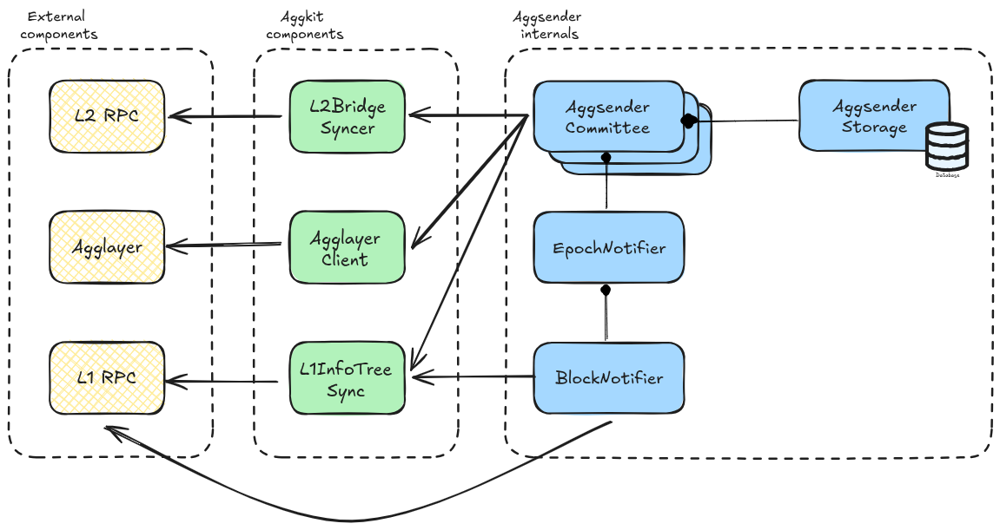
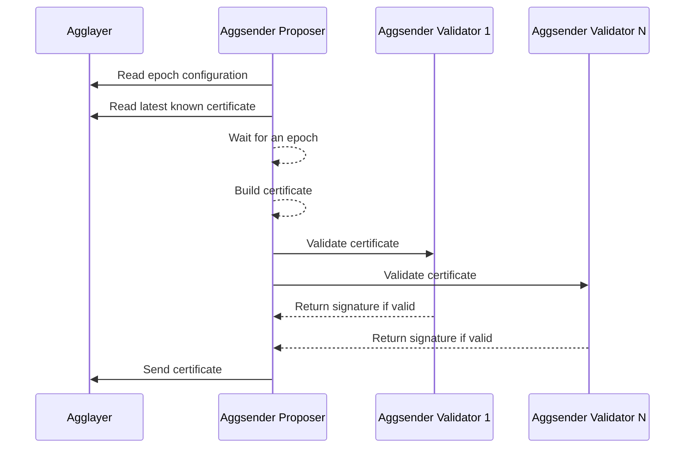
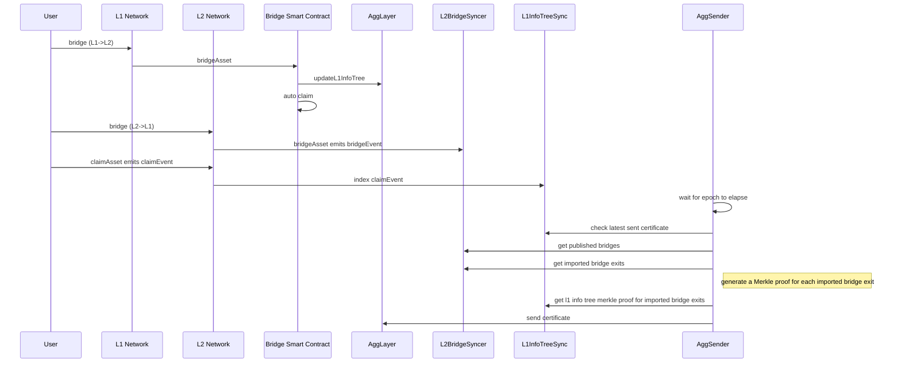
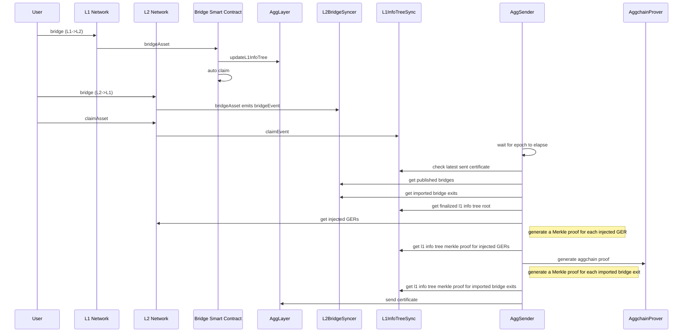

# AggSender Component

`AggSender` is responsible for building and packing the information required to prove a target chain's bridge state into a certificate. This certificate provides the inputs needed to build a proof that is eventually going to be settled on L1 via the agglayer.

The `AggSender` consists of a multisig committee, where one participant acts as the proposer, and the remaining members act as validators.
The proposer is responsible for building and signing the certificate, and propagating it to the validators for verification via gRPC. Each validator independently validates the proposed certificate and returns a signature to the proposer if the validation is successful.
Proposer will pack each signature (including its own) in the certificate, and send it to `agglayer` for settlement.

The multisig committee is registered on the [rollup](https://github.com/agglayer/agglayer-contracts/blob/d1a1b7e33d03ad162b6019fbbb1b23110ed8fa95/contracts/lib/AggchainBase.sol#L73-L77) contract on L1. It contains a list of signers, each represented by an Ethereum address and a URL.
It is important that when initializing the rollup contract:
- the first signer in the list corresponds to the `AggSender proposer`. For the proposer, the url parameter may be omitted (as it is not used for validation requests).
- the remaining signers represent `AggSender validators`, and their url fields must be properly set, as these endpoints are used to send certificate validation requests via gRPC.

## Component Diagram

The image below depicts the `Aggsender` components (the editable link of the diagram is found [here](https://excalidraw.com/#room=d3c9f86992bc6ef07529,UwmF_vvcS6hApBljm_B2EQ)).



## Flow

### Starting the AggSender

`Aggsender` gets the epoch configuration from the `Agglayer`. It checks the last certificate in DB (if exists) against the `Agglayer`, to be sure that both are on the same page:

- If the DB is empty then get, as starting point, the last certificate `Agglayer` has.
- If it is a fresh start, and there are no certificates before this, it will set its starting block to 1 and start polling bridges and claims from the syncer from that block.
- If `Aggsender` is not on the same page as `Agglayer` it will log error and not proceed with the process of building new certificates, because this case means that there was another player involved that sent a certificate in place of the `Aggsender` which is an invalid case since `Aggsender` is a single instance per L2 network. It can also happen if we put a different `Aggsender` db (from a different network).
- If both `Aggsender` and `Agglayer` have the same certificate, then `Aggsender` will start the certificate monitoring and build process since this is a valid use case.


```mermaid
sequenceDiagram
    participant Agglayer
    participant Aggsender Proposer
    participant Aggsender Validator 1
    participant Aggsender Validator N

    Aggsender Proposer->>Agglayer: Read epoch configuration
    Aggsender Proposer->>Agglayer: Read latest known certificate
    Aggsender Proposer-->>Aggsender Proposer: Wait for an epoch
    Aggsender Proposer-->>Aggsender Proposer: Build certificate
    Aggsender Proposer->>Aggsender Validator 1: Validate certificate
    Aggsender Proposer->>Aggsender Validator N: Validate certificate
    Aggsender Validator 1-->>Aggsender Proposer: Return signature if valid
    Aggsender Validator N-->>Aggsender Proposer: Return signature if valid
    Aggsender Proposer->>Agglayer: Send certificate
```

### PessimisticProof Mode

`Aggsender` will wait until the epoch event is triggered and ask the `L2BridgeSyncer` if there are new bridges and claims to be sent to `Agglayer`. Once we reach the moment in epoch when we need to send a certificate, the `Aggsender` will poll all the bridges and claims from the bridge syncer, based on the last sent L2 block to the `Agglayer`, until the block that the syncer has.

It is important to mention that no certificate will be sent to the `Agglayer` if the syncer has no bridges, since bridges change the Local Exit Root (`LER`).

If we have bridges, certificate will be built, signed, and sent to the `Agglayer` using the provided `Agglayer` RPC URL.

Currently, `Agglayer` only supports one certificate per L1 epoch, per network, so we can not send more than one certificate. After the certificate is sent, we wait until the next epoch, either to resend it if its status is `InError`, or to build a new one if its status `Settled`. Also, we have no limit yet in how many bridges and claims can be sent in a single certificate. This might be something to test and check, because certificates carry a lot of data through RPC, so we might hit the rpc layer limit at some point. For this reason, we introduced the `MaxCertSize` configuration parameter on the `Aggsender`, where the user can define the maximum size of the certificate (based on the rpc communication layer limit) in bytes, and the `Aggsender` will limit the number of bridges and claims it will send to the `Agglayer` based on this parameter. Since both bridges and claims carry fixed size of data (each field is a fixed size field), we can we great precision calculate the size of a certificate.

`InError` status on a certificate can mean a number of things. It can be an error that happened on the `Agglayer`. It can be an error in the data `Aggsender` sent, or the certificate was sent in between two epochs, which `Agglayer` considers invalid. Either way, the given certificate needs to be re-sent in the next epoch (or immediately after we notice its status change based on the `RetryCertAfterInError` config parameter), with all the previously sent bridges and claims, plus the new ones that happened after them, that the syncer saw and saved.

It is important to mention that, in the case of resending the certificate, the certificate height must be reused. If we are sending a new certificate, its height must be incremented based on the previously sent certificate.

Suppose the previously sent certificate was not marked as `InError`, or `Settled` on the `Agglayer`. In that case, we can not send/resend the certificate, even though a new epoch event is handled since it was not processed yet by the `Agglayer` (neither `Settled` nor marked as `InError`).

The image below depicts the interaction between different components when building and sending a certificate to the `Agglayer` in the `PessimisticProof` mode.


```mermaid
sequenceDiagram
    participant User
    participant L1RPC as L1 Network
    participant L2RPC as L2 Network
    participant Bridge as Bridge Smart Contract
    participant AggLayer
    participant L2BridgeSyncer
    participant L1InfoTreeSync
    participant AggSender

    User->>L1RPC: bridge (L1->L2)
    L1RPC->>Bridge: bridgeAsset
    Bridge->>AggLayer: updateL1InfoTree
    Bridge->>Bridge: auto claim

    User->>L2RPC: bridge (L2->L1)
    L2RPC->>L2BridgeSyncer: bridgeAsset emits bridgeEvent

    User->>L2RPC: claimAsset emits claimEvent
    L2RPC->>L1InfoTreeSync: index claimEvent

    AggSender->>AggSender: wait for epoch to elapse
    AggSender->>L1InfoTreeSync: check latest sent certificate
    AggSender->>L2BridgeSyncer: get published bridges
    AggSender->>L2BridgeSyncer: get imported bridge exits
    Note right of AggSender: generate a Merkle proof for each imported bridge exit
    AggSender->>L1InfoTreeSync: get l1 info tree merkle proof for imported bridge exits
    AggSender->>AggLayer: send certificate
```

### AggchainProof Mode

In essence, the `AggchainProof` mode follows the same logic and flow as `PessimisticProof` mode. Only difference is in two points:
- Calling the `aggchain prover` to generate an `aggchain proof` that will be sent in the certfiicate to the `Agglayer`.
- Resending an `InError` certficate does not expand it with new bridges and events that the syncer might have gotten in the meantime. This is done because `aggchain prover` already generated a proof for a given block range, and since proof generation can be a long process, this is a small optimization.
- Note that this might change in the future.

Calling the `aggchain prover` is done right before signing and sending the certificate to the `Agglayer`. To generate an `aggchain proof` prover needs couple of things:

- Block range on L2 for which we are trying to generate a certificate.
- Finalized L1 info tree root, leaf, and proof on the L1 info tree. Basically, this is the latest finalized l1 info tree root needed by the prover to generate the proof. This root is also use to generate merkle proof for every imported bridge exit (claim) in certificate.
- Injected GlobalExitRoot's on L2 and their leaves and proofs. Merkle proofs of the injected GERs are calculated based on the finalized L1 info tree root.
- Imported bridge exits (claims) we intend to include in the certificate for the given block range.

The image below depicts the interaction between different components when building and sending a certificate to the `Agglayer` in the `AggchainProof` mode.


```mermaid
sequenceDiagram
    participant User
    participant L1RPC as L1 Network
    participant L2RPC as L2 Network
    participant Bridge as Bridge Smart Contract
    participant AggLayer
    participant L2BridgeSyncer
    participant L1InfoTreeSync
    participant AggSender
    participant AggchainProver

    User->>L1RPC: bridge (L1->L2)
    L1RPC->>Bridge: bridgeAsset
    Bridge->>AggLayer: updateL1InfoTree
    Bridge->>Bridge: auto claim

    User->>L2RPC: bridge (L2->L1)
    L2RPC->>L2BridgeSyncer: bridgeAsset emits bridgeEvent

    User->>L2RPC: claimAsset
    L2RPC->>L1InfoTreeSync: claimEvent

    AggSender->>AggSender: wait for epoch to elapse
    AggSender->>L1InfoTreeSync: check latest sent certificate
    AggSender->>L2BridgeSyncer: get published bridges
    AggSender->>L2BridgeSyncer: get imported bridge exits
    AggSender->>L1InfoTreeSync: get finalized l1 info tree root
    AggSender->>L2RPC: get injected GERs
    Note right of AggSender: generate a Merkle proof for each injected GER
    AggSender->>L1InfoTreeSync: get l1 info tree merkle proof for injected GERs
    AggSender->>AggchainProver: generate aggchain proof
    Note right of AggSender: generate a Merkle proof for each imported bridge exit
    AggSender->>L1InfoTreeSync: get l1 info tree merkle proof for imported bridge exits
    AggSender->>AggLayer: send certificate
```

## Certificate Data

The certificate is the data submitted to `Agglayer`. Must be signed to be accepted by `Agglayer`. `Agglayer` responds with a `certificateID` (hash)

| Field Name               | Description                                                                 |
|--------------------------|-----------------------------------------------------------------------------|
| `network_id`            | This is the id of the rollup (>0)                                          |
| `height`                | Order of certificates. First one is 0                                      |
| `prev_local_exit_root`  | The first one must be the one in smart contract (currently is a 0x000…00)  |
| `new_local_exit_root`   | It's the root after bridge_exits                                           |
| `bridge_exits`          | These are the leaves of the LER tree included in this certificate. (bridgeAssert calls) |
| `imported_bridge_exits` | These are the claims done in this network                                  |
| `aggchain_params`       | Aggchain params returned by the aggchain prover                           |
| `aggchain_proof`        | Aggchain proof generated by the aggchain prover                           |
| `custom_chain_data`     | Custom chain data returned by the aggchain prover                         |

## Configuration

| Name                              | Type                                                      | Description                                                                                                     |
|-----------------------------------|-----------------------------------------------------------|-----------------------------------------------------------------------------------------------------------------|
| StoragePath                       | string                                                    | Full file path (with file name) where to store Aggsender DB                                                     |
| AgglayerClient                    | [*aggkitgrpc.ClientConfig](./common_config.md#clientconfig) | Agglayer gRPC client configuration.                                                                             |
| AggsenderPrivateKey               | [SignerConfig](./common_config.md#signerconfig)           | Configuration of the signer used to sign the certificate on the Aggsender before sending it to the Agglayer. It can be a local private key, or an external one. |
| URLRPCL2                          | string                                                    | L2 RPC                                                                                                          |
| BlockFinality                     | string                                                    | Indicates which finality the AggLayer follows (FinalizedBlock, SafeBlock, LatestBlock, PendingBlock) you can add an offset e.g: "FinalizedBlock/20" or "FinalizedBlock/-20" |
| TriggerCertMode                   | string                                                    | Mode used to trigger certificate sending. Options: "EpochBased", "NewBridge", "ASAP", "Auto" (default: "Auto") |
| TriggerEpochBased                 | [TriggerEpochBasedConfig](#triggerepochbasedconfig)      | Configuration for EpochBased trigger mode (used when TriggerCertMode is "EpochBased")                          |
| TriggerASAP                       | [TriggerASAPConfig](#triggerasapconfig)                  | Configuration for ASAP trigger mode (used when TriggerCertMode is "ASAP")                                      |
| MaxRetriesStoreCertificate        | int                                                       | Number of retries if Aggsender fails to store certificates on DB. 0 = infinite retries                           |
| DelayBetweenRetries              | Duration                                                   | Delay between retries for storing certificate and initial status check                                           |
| MaxCertSize                       | uint                                                      | The maximum size of the certificate. 0 means infinite size                                                      |
| DryRun                            | bool                                                      | If true, AggSender will not send certificates to Agglayer (for debugging)                                       |
| EnableRPC                         | bool                                                      | Enable the Aggsender's RPC layer                                                                                |
| AggkitProverClient                | [*aggkitgrpc.ClientConfig](./common_config.md#clientconfig) | Configuration for the AggkitProver gRPC client                                                                  |
| Mode                              | string                                                    | Defines the mode of the AggSender (PessimisticProof or AggchainProof)                                           |
| CheckStatusCertificateInterval    | Duration                                                  | Interval at which the AggSender will check the certificate status in Agglayer                                   |
| RetryCertAfterInError             | bool                                                      | If true, Aggsender will re-send InError certificates immediately after status change                            |
| MaxSubmitCertificateRate          | [RateLimitConfig](./common_config.md#ratelimitconfig)     | Maximum allowed rate of submission of certificates in a given time.                                             |
| GlobalExitRootL2Addr              | Address                                                   | Address of the GlobalExitRootManager contract on L2 sovereign chain (needed for AggchainProof mode)             |
| SovereignRollupAddr               | Address                                                   | Address of the sovereign rollup contract on L1                                                                  |
| RequireStorageContentCompatibility| bool                                                      | If true, data stored in the database must be compatible with the running environment                            |
| RequireNoFEPBlockGap              | bool                                                      | If true, AggSender should not accept a gap between lastBlock from lastCertificate and first block of FEP        |
| OptimisticModeConfig              | [optimistic.Config](#optimisticconfig)                    | Configuration for optimistic mode (required by FEP mode).                                                       |
| RequireOneBridgeInPPCertificate   | bool                                                      | If true, AggSender requires at least one bridge exit for Pessimistic Proof certificates                         |
| MaxL2BlockNumber                  | uint64                    | Set the last block to be included in a certificate (0 = disabled)
| MaxL2BlockRange                   | uint64                    | Maximum L2 block range allowed in a certificate, computed as `ToBlock - FromBlock` (0 = disabled)
|StopOnFinishedSendingAllCertificates| bool                      | Stop when there are no more certificates to send due to MaxL2BlockNumber
|StorageRetainCertificatesPolicy| [StorageRetainCertificatesPolicy](#storageretaincertificatespolicy) | Configure the certificate retain policy
| UnsetClaimsMaxLogBlockRange       | uint64                    | Proactive max block range for `eth_getLogs` queries when fetching unset claims. 0 means disabled (fallback to reactive chunking on error)

## StorageRetainCertificatesPolicy
The `StorageRetainCertificatesPolicy` structure configures the certificate retain policy
| Field Name                    | Type                | Description                                                                                                     |
|-------------------------------|---------------------|-----------------------------------------------------------------------------------------------------------------|
| RetainCertificatesCount       | uint32 | If it is 0, all certificates are stored. If it is greater than 0, it is the number of certificates stored in the DB. The last certificate sent is always saved because it is necessary for proper operation.
| KeepCertificatesHistory           | bool                                                      | If true, discarded certificates are moved to the `certificate_info_history` table instead of being deleted       |

## TriggerEpochBasedConfig

The `TriggerEpochBasedConfig` structure configures the epoch-based trigger mode for certificate sending. This configuration is used when `TriggerCertMode` is set to "EpochBased" (or when "Auto" mode resolves to epoch-based triggering).

| Field Name                    | Type                | Description                                                                                                     |
|-------------------------------|---------------------|-----------------------------------------------------------------------------------------------------------------|
| EpochNotificationPercentage   | uint                | Indicates the percentage of the epoch at which the AggSender should send the certificate. 0 = begin, 50 = middle, 100 = end |

Example:
```
[AggSender]
    TriggerCertMode = "EpochBased"
    [AggSender.TriggerEpochBased]
        EpochNotificationPercentage = 50
```

The epoch-based trigger waits for a specific percentage of the epoch to elapse before sending certificates to the Agglayer. This allows for coordinated certificate submission aligned with L1 epoch boundaries.

## TriggerASAPConfig

The `TriggerASAPConfig` structure configures the ASAP (As Soon As Possible) trigger mode for certificate sending. This configuration is used when `TriggerCertMode` is set to "ASAP".

| Field Name                         | Type                | Description                                                                                                     |
|------------------------------------|---------------------|-----------------------------------------------------------------------------------------------------------------|
| DelayBetweenCertificates          | Duration            | The delay to wait before sending a new certificate after the previous one is settled                            |
| MinimumNewCertificateInterval      | Duration            | The minimum interval between two new certificate triggers (0 = no minimum interval)                             |

Example:
```
[AggSender]
    TriggerCertMode = "ASAP"
    [AggSender.TriggerASAP]
        DelayBetweenCertificates = "1s"
        MinimumNewCertificateInterval = "1h"
```

The ASAP trigger sends certificates as soon as possible after the last certificate reaches a final state (settled or in error). The `DelayBetweenCertificates` parameter adds a configurable delay before sending, while `MinimumNewCertificateInterval` ensures a minimum time gap between certificate submissions to prevent excessive certificate generation.

### Trigger Modes

The `TriggerCertMode` field supports the following modes:

- **EpochBased**: Triggers certificate sending based on epoch progression. Uses the `TriggerEpochBased` configuration to determine when in the epoch to send certificates.
- **NewBridge**: Triggers certificate sending immediately when new bridge events are detected on L2.
- **ASAP**: Triggers certificate sending as soon as possible after the last certificate reaches a final state (settled or in error).
- **Auto**: Automatically selects the appropriate trigger mode based on the AggSender mode:
  - PreconfPP mode → NewBridge trigger
  - PessimisticProof and AggchainProof modes → EpochBased trigger

## OptimisticConfig

The `OptimisticConfig` structure configures the optimistic mode for the AggSender. This configuration is required when running in FEP (Fast Exit Protocol) mode.

| Field Name                    | Type                | Description                                                                                                     |
|-------------------------------|---------------------|-----------------------------------------------------------------------------------------------------------------|
| SovereignRollupAddr          | Address             | The L1 address of the AggchainFEP contract                                                                      |
| TrustedSequencerKey          | [SignerConfig](./common_config.md#signerconfig) | The private key used to sign optimistic proofs. Must be the trusted sequencer's key.                            |
| OpNodeURL                    | string              | The URL of the OpNode service used to fetch aggregation proof public values                                     |
| RequireKeyMatchTrustedSequencer | bool             | If true, enables a sanity check that the signer's public key matches the trusted sequencer address. This ensures the signer is the trusted sequencer and not a random signer. |

Example:
```
[AggSender]
    [AggSender.OptimisticModeConfig]
        SovereignRollupAddr = "0x1234..."
        TrustedSequencerKey = { Method="local", Path="/opt/private_key.keystore", Password="password" }
        OpNodeURL = "http://localhost:8080"
        RequireKeyMatchTrustedSequencer = true
```

The optimistic mode is used in FEP (Fast Exit Protocol) to enable faster exit processing by allowing optimistic proofs to be submitted before full verification. The trusted sequencer is responsible for signing these proofs, and this configuration ensures that only the authorized trusted sequencer can submit proofs.

## Use Cases

This paragraph explains different use cases with outcomes:

- No bridges from L2 -> L1 means no certificate will be built.
- Having bridges without claims, means a certificate will be built and sent.
- Having bridges and claims, means a certificate will be built and sent.
- If the previous certificate we sent is `InError`, we need to resend that certificate with all the previous sent data, plus new bridges and claims we saw after that.
- If the previously sent certificate is not `InError` or `Settled`, no new certificate will be sent/resent. The `AggSender` waits for one of these two statuses on the `Agglayer`.

## Debugging in Local with Bats E2E Tests

Preconditions: 
- Make sure you have the up to date `aggkit:local` Docker image built. In order to build one, run `make build-docker-ci` command.
- Run the `bridge_spammer` in background (namely make sure that the `additional_services` has `bridge_spammer` provided).
1. Start kurtosis with pessimistic proof (OP stack):
`./test/run-local-e2e.sh single-l2-network-op-pessimistic path_to_kurtosis_cdk_repo -`
Note that the fourth argument corresponds to the e2e repo path. In case you would like to run the set of e2e tests immediately after the kurtosis environment is up and running, you should provide a real path.
2. After kurtosis is started, stop the `aggkit-001` service (`kurtosis service stop aggkit aggkit-001`).
3. Open the repo in an IDE (like Visual Studio), and run `./scripts/local_config_pp` from the main repo folder. This will generate a `./tmp` folder in which `Aggsender` storage will be saved, and other aggkit node data, and will print a `launch.json`:

```json
{
   "version": "0.2.0",
   "configurations": [
       {
           "name": "Debug aggsender",
           "type": "go",
           "request": "launch",
           "mode": "auto",
           "program": "cmd/",
           "cwd": "${workspaceFolder}",
           "args":[
               "run",
               "-cfg", "tmp/aggkit/local_config/test.kurtosis.toml",
               "-components", "aggsender",
           ]
       }
   ]
}
```
4. Copy this to your `launch.json` and start debugging.
5. This will start the `aggkit` with the `aggsender` running.
6. Wait for some time, until `bridge_spammer` deposits are indexed by the `aggsender`. As a result of bridge activity, there should be a certificate, and you can debug the whole process.
7. Optionally you can run the E2E tests as well, by running the following command and providing the real e2e repo path:
`./test/run-local-e2e.sh single-l2-network-op-pessimistic - path_to_e2e_repo`

## Prometheus Metrics

If enabled in the configuration, Aggsender exposes the following Prometheus metrics:

| **Metric Name**                               | **Type**                                   | **Description**                                           |
| --------------------------------------------- | ------------------------------------------ | --------------------------------------------------------- |
| `aggsender_number_of_certificates_sent`       | Counter                                      | Number of certificates sent                               |
| `aggsender_number_of_certificates_in_error`   | Counter                                      | Number of certificates in error                           |
| `aggsender_number_of_sending_retries`         | Counter                                      | Number of sending retries                                 |
| `aggsender_number_of_certificates_settled`         | Counter                                      | Number of certificates settled                            |
| `aggsender_number_of_prover_errors`           | Counter                                      | Number of prover errors                                   |
| `aggsender_multisig_threshold_not_reached`    | Counter                                      | Number of times multisig threshold was not reached        |
| `aggsender_validator_errors_total`            | Counter (labeled by `aggsender_validator`) | Total number of errors returned by a validator over time  |
| `aggsender_validator_invalid_signature_total` | Counter (labeled by `aggsender_validator`) | Number of times a validator returned an invalid signature |
| `aggsender_validate_time`                     | Histogram                                  | Time taken to validate a certificate (seconds)            |
| `aggsender_prover_time`                       | Histogram                                  | Time taken by the prover (seconds)                        |
| `aggsender_certificate_settlement_time`       | Histogram                                  | Time taken to settle a certificate (seconds)              |
| `aggsender_certificate_build_time`            | Histogram                                  | Time taken to build a certificate (seconds)               |

### Configuration Example

To enable Prometheus metrics, configure Aggsender as follows:

```
[Prometheus]
Enabled = true
Host = "localhost"
Port = 9091
```

With this configuration, the metrics will be available at:
http://localhost:9091/metrics

## Additional Documentation

1. (https://potential-couscous-4gw6qyo.pages.github.io/protocol/workflow_centralized.html)
2. [Initial PR](https://github.com/0xPolygon/cdk/pull/22)
3. (https://agglayer.github.io/agglayer/pessimistic_proof/index.html)
