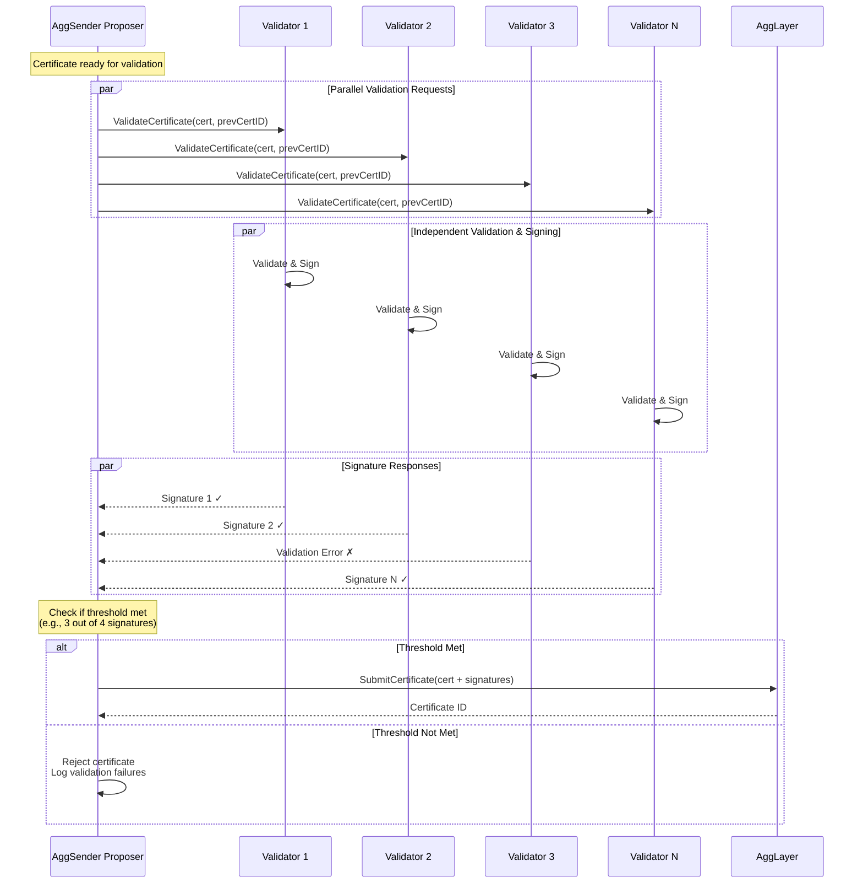
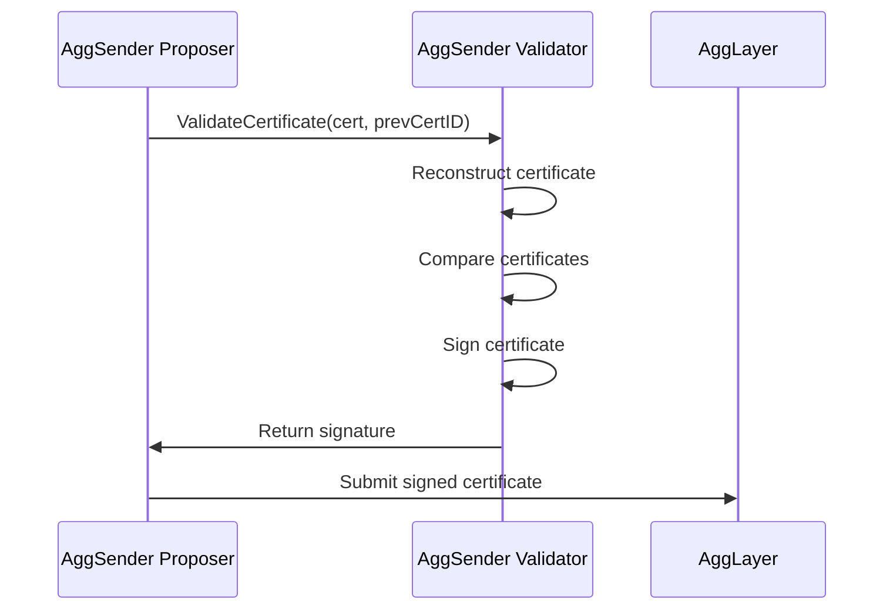

# AggSender Validator Component

The `AggsenderValidator` is a critical component of the AggKit framework that provides certificate validation services for the AggSender. It ensures that certificates built by the AggSender are correct and valid before they are submitted to the AggLayer.

## Conceptual Overview

### Purpose

The Aggsender Validator serves as an independent validation layer that verifies the correctness of certificates generated by the AggSender Proposer. It acts as a security gate, ensuring that only properly constructed certificates are submitted to the AggLayer, preventing invalid submissions that could cause issues in the chain . A given validator is part of a committee whose signature acts as a vote for correctness of a new certificate. When a threshold of signatures for a new certificate is reached, a certificate can be accepted by the Agglayer.

### Key Functions

1. **Certificate Validation**: Validates the structure, content, and integrity of certificates
2. **Certificate Signing**: Signs valid certificates using a configured signer
3. **Health Monitoring**: Provides health check endpoints for monitoring service status
4. **gRPC Service**: Exposes validation functionality through a gRPC interface

### Validation Process

The validator performs comprehensive checks on incoming certificates:

- **Certificate Continuity**: Verifies certificates are contiguous (no gaps in height)
- **Previous Certificate Status**: Checks that previous certificates are properly settled
- **Certificate Reconstruction**: Rebuilds the certificate using data indexed from the L1 and L2 RPCs and compares with incoming certificate. Validators and proposers should use independent RPCs 
- **Content Verification**: Validates that all certificate fields match expected values

## Architecture Overview

### Components

The AggsenderValidator consists of several key components:

```
┌─────────────────────────────────────────────────────────────┐
│                    AggsenderValidator                       │
├─────────────────────────────────────────────────────────────┤
│  ┌─────────────────┐  ┌─────────────────┐                   │
│  │  gRPC Service   │  │ Validation Logic│                   │
│  │                 │  │                 │                   │
│  │ - HealthCheck   │  │ - CertValidator │                   │
│  │ - ValidateCert  │  │ - FlowInterface │                   │
│  └─────────────────┘  └─────────────────┘                   │
│                                                             │
│  ┌─────────────────┐  ┌─────────────────┐                   │
│  │   Data Access   │  │     Signing     │                   │
│  │                 │  │                 │                   │
│  │ - L1InfoTree    │  │ - Signer        │                   │
│  │ - CertQuerier   │  │ - KeyManagement │                   │
│  │ - LERQuerier    │  │                 │                   │
│  └─────────────────┘  └─────────────────┘                   │
└─────────────────────────────────────────────────────────────┘
```

### Aggsender Validator as a part of a committee

The Aggsender Validator operates as part of a distributed validator committee that provides security through consensus. This multi-signature approach ensures that certificates are validated by multiple independent parties before being accepted by the AggLayer.



#### Committee Consensus Process

1. **Certificate Proposal**: The AggSender Proposer builds a certificate and submits it to all committee members
2. **Parallel Validation**: Each validator independently validates the certificate using the same validation logic
3. **Independent Signing**: Valid certificates are signed by each validator using their unique private keys
4. **Signature Collection**: The proposer collects signatures from all validators
5. **Threshold Check**: The proposer verifies that enough validators have signed (e.g., 3 out of 4, or 67% majority)
6. **Certificate Submission**: If threshold is met, the certificate with collected signatures is submitted to AggLayer
7. **Rejection Handling**: If threshold is not met, the certificate is rejected and the process logs validation failures

This committee-based approach provides several security benefits:

- **Decentralization**: No single point of failure in validation
- **Consensus**: Multiple independent validators must agree on certificate validity
- **Fault Tolerance**: System continues to operate even if some validators are unavailable
- **Security**: Malicious or compromised validators cannot unilaterally approve invalid certificates

### Core Interfaces

#### CertificateValidator

The main validation engine that implements the core validation logic:

- `ValidateCertificate(ctx, params)`: Main validation method
- Checks certificate continuity, and content verification, verifies proof for each claim (imported bridge exit)

#### ValidatorService (gRPC)

Exposes validation functionality via gRPC:

- `HealthCheck()`: Returns service status and version
- `ValidateCertificate()`: Validates and signs certificates

#### Local vs Remote Validation

The system supports two validation modes:

1. **LocalValidator**: Validates certificates locally without signing
2. **RemoteValidator**: Connects to a remote validation service via gRPC

### Validation Modes

#### Local Validator

- Runs validation logic in the same process as AggSender
- Does not sign certificates (validation only)
- Useful for development and testing
- Direct access to storage and other components

#### Remote Validator

- Connects to a separate AggsenderValidator service
- Provides full validation and signing capabilities
- Production-ready with proper isolation
- Communicates via gRPC protocol

## Requirements & Configuration

### Prerequisites

1. **Go Environment**: Go 1.24+
2. **Database Access**: SQLite databases for L1InfoTreeSync and BridgeL2Sync
3. **L1/L2 Connectivity**: Access to L1 and L2 RPC endpoints
4. **Signer Configuration**: Private key for certificate signing
5. **AggLayer Client**: gRPC connection to AggLayer
6. **Expose gRPC service**: Needs to be accessible to Aggsender Proposer

### Configuration Parameters

The validator is configured using a `.toml` file. Check the default values in this [file](https://github.com/agglayer/aggkit/blob/develop/config/default.go).

| Name                          | Type    | Description                                                                                                                              |
|-------------------------------|---------|------------------------------------------------------------------------------------------------------------------------------------------|
| MaxLogBlockRange              | uint64  | Proactive max block range for `eth_getLogs` calls issued while validating certificates. 0 disables proactive chunking; recognized RPC max-range errors still trigger reactive chunking. |

### Running the Validator

#### As a Standalone Component

```bash
# Run only the validator component
./aggkit run --components aggsender-validator --cfg config.toml
```

#### As Part of AggSender

The validator can be integrated into the AggSender flow:

```bash
# Run AggSender with validator in PessimisticProof mode
./aggkit run --components aggsender --cfg config.toml
```

Configuration in AggSender:

```toml
[AggSender]
Mode = "PessimisticProof"
RequireValidatorCall = true  # Use remote validator

[AggSender.ValidatorClient]
URL = "localhost:50051"
```

#### Development Setup

For local development and testing:

1. **Setup Database**: Ensure SQLite databases are accessible
2. **Configure Components**: Set up L1InfoTreeSync and BridgeSync
3. **Start Dependencies**: Run required L1/L2 networks
4. **Launch Validator**: Start the validator service

### Integration with AggSender

The validator integrates with AggSender in two ways:

1. **Local Integration**: Embedded validation within AggSender process (used only for development purposes, to validate the certificate using the same logic as Aggsender Validator, but in the Aggsender Proposer itself)
2. **Remote Integration**: Separate validator service accessed via gRPC

#### Remote Integration Flow



## gRPC API

The validator exposes a gRPC API defined in `proto/v1/validator.proto`:

### Service Definition

```protobuf
service AggsenderValidator {
    rpc HealthCheck(google.protobuf.Empty) returns (HealthCheckResponse);
    rpc ValidateCertificate(ValidateCertificateRequest) returns (ValidateCertificateResponse);
}
```

### Methods

#### HealthCheck

Returns the status and version of the validator service.

**Response:**

```protobuf
message HealthCheckResponse {
  string version = 1;  // Version of the validator
  string status = 2;   // Status (OK, ERROR, etc.)
  string reason = 3;   // Additional status information
}
```

#### ValidateCertificate

Validates a certificate and returns a signature if valid. If not, it returns an error.

**Request:**

```protobuf
message ValidateCertificateRequest {
  agglayer.node.types.v1.CertificateId previous_certificate_id = 1;
  agglayer.node.types.v1.Certificate certificate = 2;
  uint64 last_l2_block_in_cert = 3;
}
```

**Response:**

```protobuf
message ValidateCertificateResponse {
  agglayer.interop.types.v1.FixedBytes65 signature = 1;
}
```

## Validation Logic

### Certificate Validation Steps

1. **Null Check**: Ensure proposed certificate is not null
3. **Certificate Continuity**: Check height progression and LocalExitRoot continuity
4. **Previous Certificate Status**: Ensure previous certificate is settled
5. **Certificate Reconstruction**: Rebuild certificate using the same building logic the proposer used
6. **Content Comparison**: Compare reconstructed vs. incoming certificate
7. **Proof Verification**: Verifying proofs for each claim (iimported bridge exit)
8. **Signing**: Sign the certificate if validation passes

### Key Validation Rules

- **Height Continuity**: Each certificate height must be previous + 1
- **LER Consistency**: `PrevLocalExitRoot` must match previous certificate's `NewLocalExitRoot`
- **First Certificate**: Height 0 must have correct starting LocalExitRoot defined in the rollup contract
- **Block Range**: Must be contiguous with no gaps

### Error Handling

The validator returns specific errors for different validation failures:

- `ErrNilCertificate`: Certificate is null
- Certificate height mismatch errors
- LocalExitRoot continuity errors
- Certificate comparison differences

## Monitoring & Debugging

### Health Checks

The validator provides health check endpoints for monitoring:

```bash
# Check validator health via gRPC
grpcurl -plaintext localhost:50051 aggkit.aggsender.validator.v1.AggsenderValidator/HealthCheck
```

### Logging

The validator provides detailed logging for debugging:

- Certificate validation steps
- Comparison differences between certificates
- Error details and stack traces
- Performance metrics

### Common Issues

1. **Certificate Height Gaps**: Ensure continuous certificate submission
2. **LocalExitRoot Mismatches**: Verify bridge synchronization is correct  
3. **Signing Failures**: Verify signer configuration and key access
4. **gRPC Connection Issues**: Check network connectivity and service status

## Best Practices

1. **Use Remote Validation**: For production environments, use remote validator service
2. **Monitor Health**: Implement regular health checks and alerting
3. **Secure Keys**: Use proper key management for signing certificates
4. **Backup Storage**: Ensure L2 bridge and L1InfoTree syncers storage is backed up
5. **Performance Monitoring**: Monitor validation times and resource usage
6. **Error Handling**: Implement proper retry logic for transient failures

## Examples

### Basic Validation Call

```go
// Create validator
validator := validator.NewAggsenderValidator(
    logger, flowPP, l1InfoTreeQuerier, certQuerier, lerQuerier)

// Validate certificate
params := types.VerifyIncomingRequest{
    Certificate:         cert,
    PreviousCertificate: prevCert,
    LastL2BlockInCert:   blockNumber,
}

err := validator.ValidateCertificate(ctx, params)
if err != nil {
    log.Errorf("Validation failed: %v", err)
    return err
}
```

### Remote Validator Client

```go
// Create remote validator client
remoteValidator, err := validator.NewRemoteValidator(
    grpcConfig, storage)
if err != nil {
    return err
}

// Validate and sign certificate
signature, err := remoteValidator.ValidateAndSignCertificate(
    ctx, certificate, lastL2Block)
if err != nil {
    log.Errorf("Remote validation failed: %v", err)
    return err
}
```
