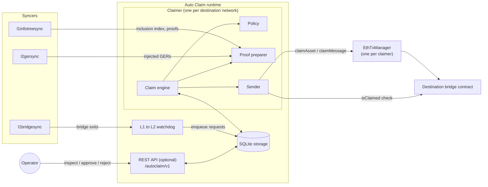
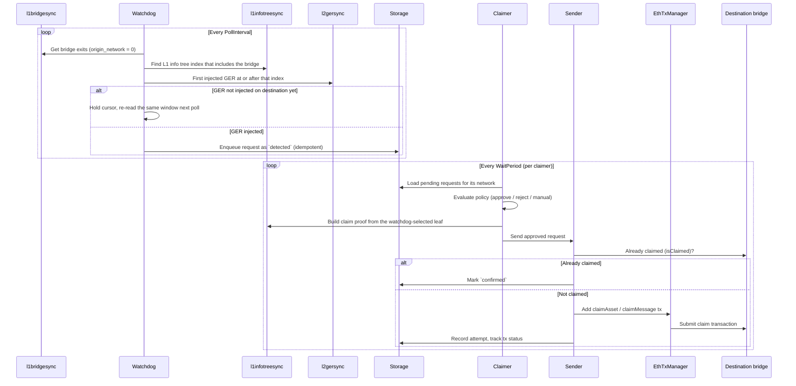
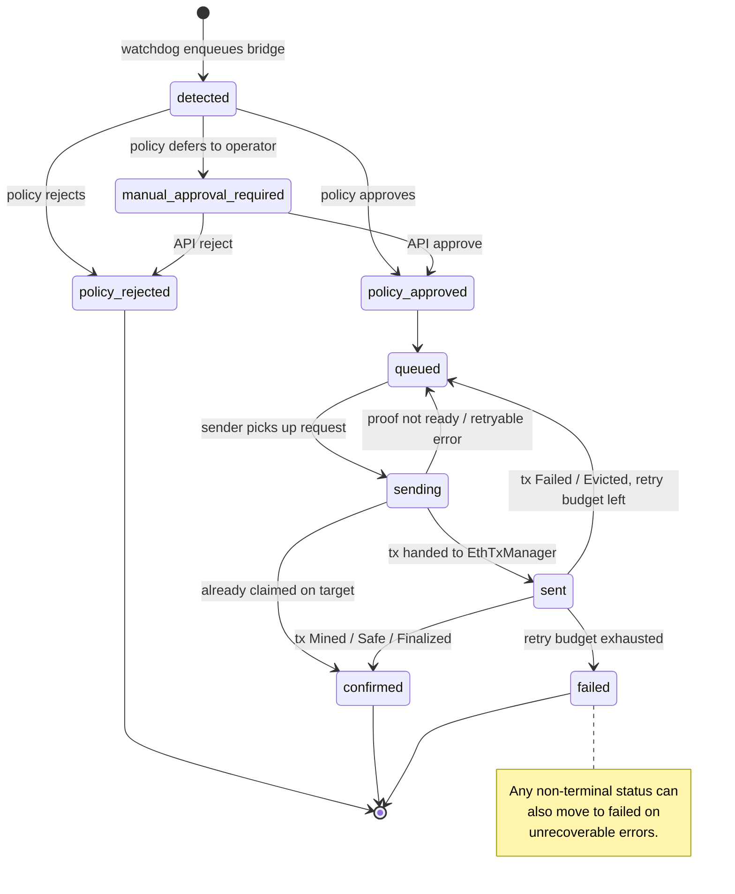

# Auto Claim Service

The Auto Claim service automates L1 to L2 bridge claims for configured L2 destination networks. It discovers eligible
L1 bridge exits from `l1bridgesync`, stores each one as a request in a local SQLite database, evaluates a configurable
policy, prepares the L1 claim proof in-process, submits the destination-chain claim transaction through `EthTxManager`,
and tracks the request through confirmation or failure.

Auto Claim is disabled by default. The supported scope is L1 to L2 only, where `origin_network` is `0`. L2 to Lx Auto
Claim is not implemented and must remain disabled.

## Architecture

Auto Claim runs inside the Aggkit process and reuses the existing syncers. One watchdog discovers L1 bridge exits for
all destinations, and one claimer (with its own policy, sender, and `EthTxManager`) owns each destination network. All
components share a single Auto Claim SQLite database.



Package layout (for contributors):

| Package | Responsibility |
| --- | --- |
| `autoclaim/runtime` | Wires storage, watchdog, claimers, senders, transaction managers, and the API at startup. |
| `autoclaim/watchdog` | L1 to L2 bridge discovery, GER-anchor selection, durable cursor, idempotent enqueue. |
| `autoclaim/claimer` | Per-destination engine: policy evaluation, proof preparation, send orchestration, recovery. |
| `autoclaim/policy` | Named policy registry and the `allow-all`, `api-approve`, `no-message`, `basic-filter` implementations. |
| `autoclaim/proof` | L1 info tree index selection and claim proof construction from `l1infotreesync` and `l1bridgesync`. |
| `autoclaim/sender` | Claim submission through `EthTxManager`, transaction attempt tracking, status mapping, retries. |
| `autoclaim/claimtx` | ABI packing of `claimAsset` and `claimMessage` calldata. |
| `autoclaim/simulator` | `eth_estimateGas` claim simulation on the target chain, used by `basic-filter`. |
| `autoclaim/storage` | SQLite repository and migrations for requests, attempts, and cursors. |
| `autoclaim/api` | Optional REST handlers for inspection and manual decisions, plus generated swagger docs. |
| `autoclaim/types` | Request lifecycle state machine, domain records, and shared interfaces. |
| `autoclaim/config` | Configuration structs, defaults, and validation. |

## How a claim is processed



The watchdog anchors every claim on a destination-injected Global Exit Root, following the bridge service flow: find
the L1 info tree index where the L1 bridge is included, then use the first GER injected on the destination at or after
that index as the claim proof anchor. A bridge whose GER has not been injected yet is not enqueued and the watchdog
cursor is held, so the same window is re-read until the bridge becomes claimable.

## Request lifecycle

Requests are uniquely keyed by `origin_network:destination_network:deposit_count` (for example `0:1:42`); this key is
also the request ID used by the API. For the current L1 to L2 scope, `origin_network` is always `0`.



Status values: `detected`, `policy-approved`, `policy-rejected`, `manual-approval-required`, `queued`, `sending`,
`sent`, `confirmed`, `failed` (the diagram uses underscores because hyphens are not valid in mermaid state names).
Terminal statuses are `policy-rejected`, `confirmed`, and `failed`. Policy results are `approved`, `rejected`, and
`manual`.

Step by step:

1. The watchdog polls `l1bridgesync` and keeps only bridge exits with `origin_network = 0` whose destination matches an
   enabled claimer.
2. For each bridge it resolves the L1 info tree inclusion index, then the first destination-injected GER at or after
   that index. If no such GER exists yet, the bridge is not enqueued and the cursor is held.
3. Once anchored, the request is stored as `detected` with the selected L1 info tree index. Enqueue is idempotent and
   deduplicated by the request key.
4. The claimer evaluates the configured policy and moves the request to `policy-approved`, `policy-rejected`, or
   `manual-approval-required`. For `basic-filter`, the claimer prepares and stores the exact claim proof before policy
   evaluation so simulation uses the same calldata as the later send path; if proof data is not ready, the request
   stays `detected` and is retried.
5. Approved requests move to `queued` and then `sending`. The proof is built from `l1infotreesync` and L1 bridge sync
   data using the watchdog-selected L1 info tree index; if proof data is not ready the request returns to `queued`.
6. The sender first checks whether the target bridge already reports the global index as claimed; if so the request is
   `confirmed` without submitting a duplicate transaction.
7. Otherwise the sender packs `claimAsset` (asset leaves) or `claimMessage` (message leaves), submits through
   `EthTxManager`, and records each transaction attempt.
8. Transaction-manager statuses `Created` and `Sent` keep the request in flight; `Mined`, `Safe`, or `Finalized` mark
   it `confirmed`; `Failed` and `Evicted` send it back to `queued` while retry budget remains (`retry_count <
   MaxRetries`), otherwise it becomes `failed`.

## Running Auto Claim

Run Aggkit with the `autoclaim` component selected and set `[AutoClaim].Enabled = true`; both are required. Startup
also requires:

- `l1bridgesync` and `l1infotreesync`, always: the watchdog reads L1 bridge exits and the claimer prepares L1 info
  tree proofs in-process.
- `l2gersync`, when `[AutoClaim.L1ToL2Watchdog].Enabled = true`: the watchdog must know which GER has actually been
  injected on the destination network before it queues a claim.

The optional REST API is not needed to submit claims. Enable it only when operators need request inspection or use the
`api-approve` policy, which requires manual decisions through the API.

## Configuration

Minimal L1 to L2 configuration:

```toml
[AutoClaim]
Enabled = true
StoragePath = "/var/lib/aggkit/autoclaim.sqlite"

[AutoClaim.API]
Enabled = true
Host = "0.0.0.0"
Port = 5579

[AutoClaim.L1ToL2Watchdog]
Enabled = true
StartBlock = 0
PollInterval = "3s"
RetryAfterErrorPeriod = "1s"
MaxRetryAttemptsAfterError = -1
EtrogL1UpgradeBlock = 0

[AutoClaim.L2ToLxWatchdog]
Enabled = false

[[AutoClaim.Claimers]]
Enabled = true
ID = "l2-primary"
NetworkType = "EVM"
NetworkID = 1
URLRPC = "http://l2-rpc:8545"
BridgeAddr = "0x0000000000000000000000000000000000000000"
PolicyName = "api-approve"
GasOffset = 100000
WaitPeriod = "1s"
RetryAfter = "1s"
MaxRetries = 30

[AutoClaim.Claimers.Policy]
AllowMessageClaims = false
AllowedOrigins = [0]
AllowedTokens = []
ManualFallback = false
MaxGas = 500000

[AutoClaim.Claimers.EthTxManager]
FrequencyToMonitorTxs = "1s"
WaitTxToBeMined = "2s"
WaitReceiptMaxTime = "250ms"
WaitReceiptCheckInterval = "1s"
PrivateKeys = [
    { Method = "local", Path = "/etc/aggkit/autoclaim.keystore", Password = "change-me" },
]
ForcedGas = 0
GasPriceMarginFactor = 1
MaxGasPriceLimit = 0
StoragePath = "/var/lib/aggkit/ethtxmanager-autoclaim-l2-primary.sqlite"
ReadPendingL1Txs = false
SafeStatusL1NumberOfBlocks = 0
FinalizedStatusL1NumberOfBlocks = 0
EstimateGasMaxRetries = 1

[AutoClaim.Claimers.EthTxManager.Etherman]
URL = "http://l2-rpc:8545"
MultiGasProvider = false
L1ChainID = 2151908
HTTPHeaders = {}
```

Replace `BridgeAddr`, `NetworkID`, `URLRPC`, `L1ChainID`, storage paths, and signer settings with values for the target
L2. Use the existing `EthTxManager` configuration style for private keys; do not put secrets in logs or checked-in
configuration.

### Top-level keys

| Key | Default | Required when enabled | Description |
| --- | --- | --- | --- |
| `AutoClaim.Enabled` | `false` | Yes | Enables Auto Claim runtime startup. The `autoclaim` component must also be selected. |
| `AutoClaim.StoragePath` | `{{PathRWData}}/autoclaim.sqlite` | Yes | SQLite database for requests, cursors, decisions, proofs, and transaction attempts. |
| `AutoClaim.API.Enabled` | `false` | No | Starts the optional REST API for inspection and manual decisions. |
| `AutoClaim.API.Host` | `0.0.0.0` | When API enabled | API listen host. |
| `AutoClaim.API.Port` | `5579` | When API enabled | API listen port. |
| `AutoClaim.L1ToL2Watchdog.Enabled` | `false` | No | Enables L1 bridge discovery for configured L2 claimers. |
| `AutoClaim.L1ToL2Watchdog.StartBlock` | `0` | No | First L1 block used when a destination-network cursor does not exist. New claimers backfill from this block. |
| `AutoClaim.L1ToL2Watchdog.PollInterval` | `3s` | Yes | How often the watchdog polls `l1bridgesync`. Must be greater than zero. |
| `AutoClaim.L1ToL2Watchdog.RetryAfterErrorPeriod` | `1s` | Yes | Reserved retry delay for watchdog errors. Must be greater than zero. |
| `AutoClaim.L1ToL2Watchdog.MaxRetryAttemptsAfterError` | `-1` | No | Reserved retry limit. `-1` means unlimited. |
| `AutoClaim.L1ToL2Watchdog.EtrogL1UpgradeBlock` | `0` | No | L1 block where Etrog global-index encoding becomes active for legacy zkEVM destination network `1`; `0` treats bridges as post-Etrog. |
| `AutoClaim.L2ToLxWatchdog.Enabled` | `false` | Must stay `false` | Reserved for future L2 to Lx support. This direction is not implemented. |

### Claimer keys

Each enabled `[[AutoClaim.Claimers]]` entry owns one destination network.

| Key | Required | Description |
| --- | --- | --- |
| `Enabled` | Yes | Disabled claimers are ignored. |
| `ID` | Yes | Unique operator-readable claimer ID. Duplicate enabled IDs are rejected. |
| `NetworkType` | Yes | Must be `EVM`. |
| `NetworkID` | Yes | Destination network ID. Duplicate enabled network IDs are rejected. |
| `URLRPC` | Yes | Destination-chain JSON-RPC URL used for claim state checks and transaction submission. |
| `BridgeAddr` | Yes | Destination bridge contract address. |
| `PolicyName` | Yes | One of `allow-all`, `api-approve`, `no-message`, or `basic-filter`. |
| `Policy` | Policy-dependent | Static policy configuration. |
| `GasOffset` | No | Extra gas passed to `EthTxManager.Add` for claim transactions. |
| `WaitPeriod` | Yes | Claimer poll period and transaction-result polling interval. Must be greater than zero. |
| `RetryAfter` | No | Retry delay after a failed claim attempt. Defaults to `WaitPeriod` when omitted or zero. |
| `MaxRetries` | No | Maximum claim submission retries before the request is marked failed. `0` means failures are immediately final. |
| `EthTxManager` | Yes | Independent transaction-manager configuration and storage path for this claimer. |

## Policies

| Policy | Behavior |
| --- | --- |
| `allow-all` | Approves every eligible L1 to L2 request automatically. |
| `api-approve` | Stores the request as `manual-approval-required`; an operator must approve or reject through the API. |
| `no-message` | Rejects message bridge leaves and approves asset bridge leaves. |
| `basic-filter` | Simulates the claim with `eth_estimateGas` on the destination chain for asset claims and, when `AllowMessageClaims = true`, message claims. It rejects claims whose simulated gas exceeds `MaxGas`, rejects disallowed origins or asset tokens, and returns a blocking policy error when proof preparation, calldata packing, or simulation fails. |

`Policy.AllowMessageClaims`, `Policy.AllowedOrigins`, `Policy.AllowedTokens`, `Policy.ManualFallback`, and
`Policy.MaxGas` are policy configuration inputs. Notes on `basic-filter`:

- It does not honor `ManualFallback`; operational errors remain blocked with `last_error` instead of becoming
  manual-review requests, and claimer recovery stops until the process is restarted after the underlying issue is
  fixed.
- It uses only normal JSON-RPC `eth_estimateGas` against latest target state. It does not require archive nodes,
  `debug_*` or `trace_*` APIs, historical state replay, or internal call traces.
- It does not inspect direct or indirect nested bridge calls. Approved simulation metadata includes
  `nested_bridge_detection = "skipped"` so operators do not mistake the result for real nested-call inspection.

## API

The optional API uses the `/autoclaim/v1` prefix and is independent from the bridge service `/bridge/v1` prefix.

| Method and path | Purpose |
| --- | --- |
| `GET /autoclaim/v1/bridges` | List tracked requests. |
| `GET /autoclaim/v1/bridges/{id}` | Inspect one request by Auto Claim request ID (`origin:destination:deposit_count`). |
| `POST /autoclaim/v1/bridges/{id}/approve` | Approve a request currently in `manual-approval-required`. |
| `POST /autoclaim/v1/bridges/{id}/reject` | Reject a request currently in `manual-approval-required`. |

List query parameters: `origin_network`, `destination_network`, `status`, `policy_status` (alias: `policy_result`),
`bridge_tx_hash`, `claim_tx_hash`, `from_block`, `to_block`, `page_number`, and `page_size` (maximum 1000).

Manual approval and rejection bodies are optional JSON objects:

```json
{
  "reason": "approved by operator",
  "metadata": {
    "ticket": "OPS-123"
  },
  "decider": "operator",
  "decider_id": "alice"
}
```

The API returns request fields including `id`, `status`, bridge identifiers, `global_index`, `bridge_tx_hash`,
`claim_tx_hash`, `tx_manager_id`, `l1_info_tree_index`, retry counters, policy decision metadata, manual decision
metadata, timestamps, and `last_error`.

Example workflow for `api-approve`:

```bash
curl "http://localhost:5579/autoclaim/v1/bridges?status=manual-approval-required"
curl "http://localhost:5579/autoclaim/v1/bridges/0:1:42"
curl -X POST "http://localhost:5579/autoclaim/v1/bridges/0:1:42/approve" \
  -H "Content-Type: application/json" \
  -d '{"reason":"approved after bridge review","decider":"operator","decider_id":"alice"}'
```

Approving or rejecting a request in any status other than `manual-approval-required` returns `409 Conflict`.

### API documentation

<iframe src="assets/swagger/autoclaim/index.html"
  style="width: 100%; height: 90vh; border: none;"
  loading="lazy"></iframe>

The swagger definition is generated with `make generate-swagger-docs`, which writes
`autoclaim/api/docs/autoclaim_swagger.json` and copies it to `docs/assets/swagger/autoclaim/swagger.json` for the
rendered documentation. Rerun it after changing API annotations in `autoclaim/api`.

## Storage

Auto Claim owns one SQLite database (`AutoClaim.StoragePath`) with three tables, created by migration
`autoclaim/storage/migrations/autoclaim0001.sql`:

| Table | Key | Purpose |
| --- | --- | --- |
| `autoclaim_request` | `request_key`; `UNIQUE(origin_network, destination_network, deposit_count)` | One row per tracked request: status, policy result, global index, L1 info tree index, retry counters, `last_error`, and JSON blobs for the bridge, proof, policy decision, and manual decision. |
| `autoclaim_transaction_attempt` | `(request_key, attempt_number)` | One row per claim transaction attempt with transaction-manager ID, claim transaction hash, status, and timestamps. |
| `autoclaim_bridge_cursor` | `cursor_name` | Durable watchdog cursor (block window and position) per destination network. |

Each claimer's `EthTxManager` keeps its own independent database at `Claimers.EthTxManager.StoragePath`.

## Operational notes

- Disable Auto Claim by setting `[AutoClaim].Enabled = false` or by not selecting the `autoclaim` component.
- Disable the API independently with `[AutoClaim.API].Enabled = false`; automatic claiming continues for non-manual
  policies.
- Use separate `StoragePath` values for Auto Claim storage and each claimer's `EthTxManager.StoragePath`.
- The watchdog uses a durable cursor and overlap-safe polling. Duplicate bridge exits are deduplicated by the request
  key, so re-reading a window is safe.
- The watchdog intentionally holds its cursor when a matched bridge is not yet backed by a destination-injected GER.
  This re-reads the same bridge window on later polls; enqueue is idempotent, and holding the cursor prevents skipping
  a claim that becomes ready later.
- The sender does not independently poll the target GER map before submitting. GER readiness is established by the
  watchdog through `l2gersync`, and the proof is built from that injected L1 info tree leaf.
- Auto Claim logs startup, API startup, watchdog polling errors, claimer recovery errors, and per-request errors
  through the standard Aggkit logger. Request-level error details are also stored in `last_error` and exposed by the
  API. The component does not export Prometheus metrics.
- Failed or evicted transaction-manager results are retried while retry budget remains. Exhausted requests become
  `failed` and require operator investigation.
- Use `api-approve` when an operator must explicitly inspect each request before claim submission. Expose the API only
  on trusted networks or behind access controls; it can approve or reject pending manual requests.

## Testing

Unit tests live next to each package; run them with the standard targets:

```bash
make build
make lint
make test-unit
```

The focused end-to-end tests run against the dockerized e2e environment (see [End-to-end tests](./e2e_tests.md)):

```bash
go test -v -run 'TestAutoClaimL1ToL2(AllowAll|APIApprove)' -timeout 30m ./test/e2e
```

`TestAutoClaimL1ToL2AllowAll` exercises the fully automatic flow with the `allow-all` policy;
`TestAutoClaimL1ToL2APIApprove` exercises the manual flow, approving the request through the API. Mocks for the
interfaces in `autoclaim/types` are generated with `make generate-mocks`.
