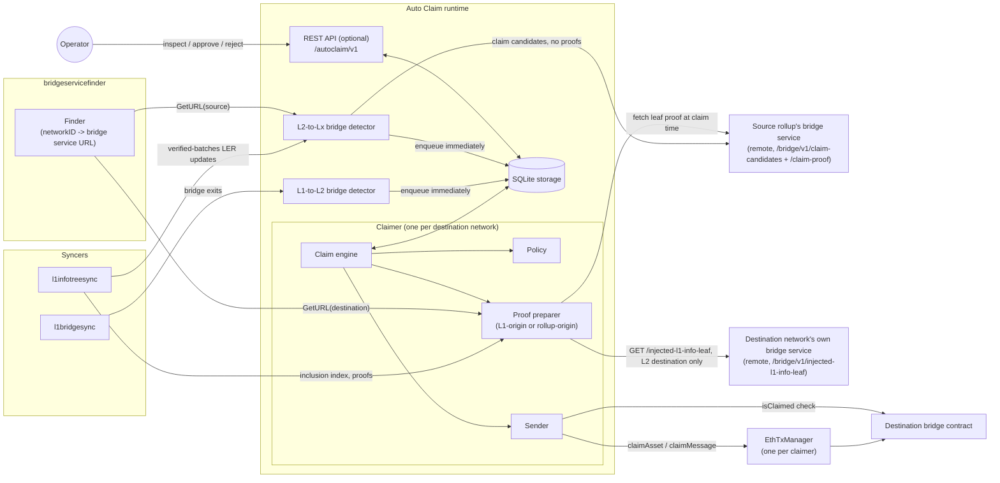
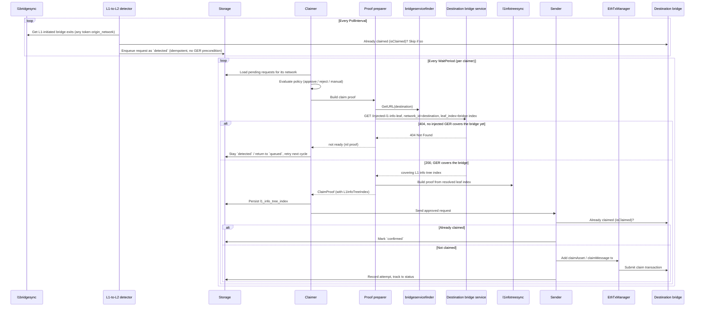
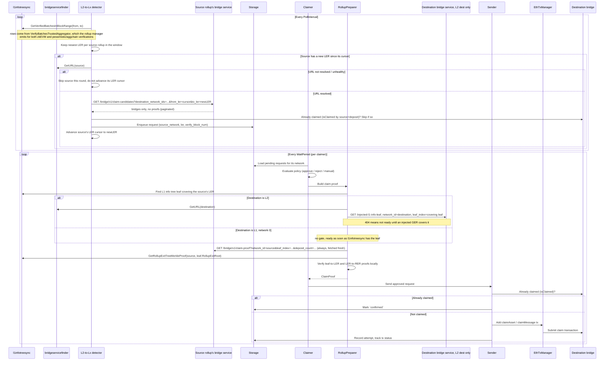
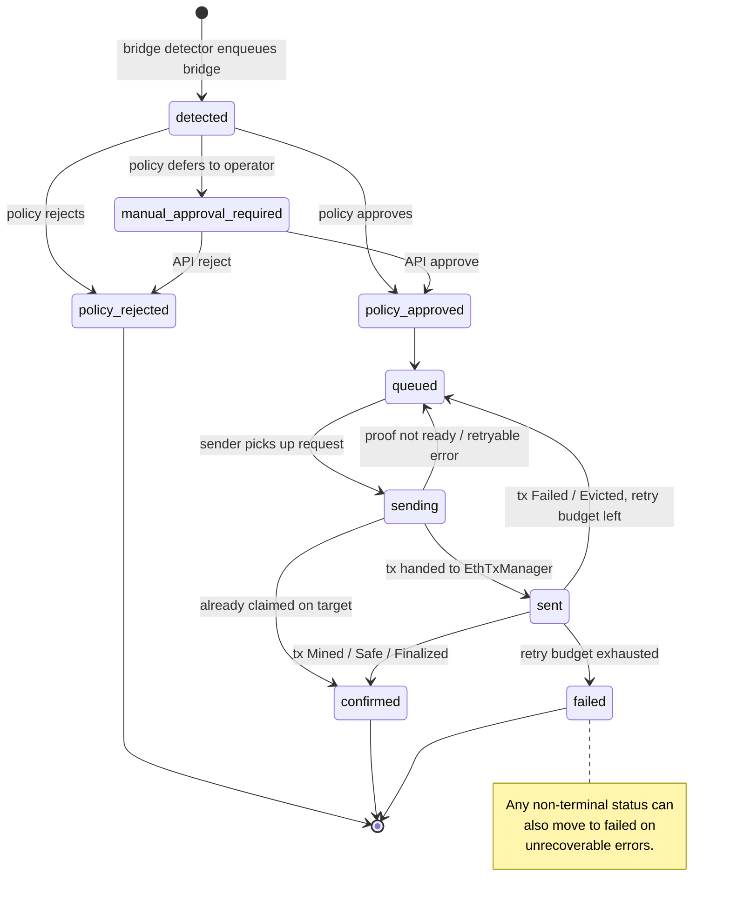

# Auto Claim Service

The Auto Claim service automates bridge claims for configured destination networks, in both directions:

- **L1 to L2**: bridge exits initiated on L1, discovered from `l1bridgesync`.
- **L2 to Lx** (L2 to L1 and L2 to L2): bridge exits initiated on a rollup, discovered by watching each source
  rollup's local exit root (LER) advance in `l1infotreesync` and fetching the corresponding bridges and Merkle
  proofs from that rollup's own bridge service through `bridgeservicefinder`.

For every discovered bridge exit, Auto Claim stores it as a request in a local SQLite database, evaluates a
configurable policy, prepares the claim proof in-process, submits the destination-chain claim transaction through
`EthTxManager`, and tracks the request through confirmation or failure.

Auto Claim is disabled by default. `origin_network` on a bridge exit is the origin network of the bridged token
(used in the claim calldata), which is distinct from `source_network`, the network the bridge exit was initiated
on. For an L1-to-L2 request `source_network` is always `0`; for an L2-to-Lx request it is the source rollup's
network ID. `source_network`, together with `destination_network` and `deposit_count`, is the request's real claim
identity — it is also what the claim global index encodes.

## Architecture

Auto Claim runs inside the Aggkit process and reuses the existing syncers. Two bridge detectors discover bridge
exits — one per direction — and feed the same per-destination claimers. Each claimer (with its own policy, sender,
and `EthTxManager`) owns one destination network. Readiness for an L2-destination claimer is no longer tracked by a
dedicated per-claimer `l2gersync` instance; instead, during proof preparation the claimer gates on the
**destination** network's own aggkit bridge service, calling its `GET /bridge/v1/injected-l1-info-leaf` endpoint
(resolved through the shared `bridgeservicefinder.Finder` — the same finder the L2-to-Lx detector uses to resolve
**source** bridge services). This applies uniformly to both directions, including L1-to-L2: an L1-to-L2 claimer with
an L2 destination gates the same way. A claimer whose destination is L1 (`NetworkID = 0`) has no such gate: it is
ready as soon as `l1infotreesync` has the relevant leaf, since the GER already exists in the L1 GER manager by
construction. All Auto Claim request/cursor state lives in a single Auto Claim SQLite database; there is no
per-claimer isolated SQLite database or L2 reorg detector anymore.



Package layout (for contributors):

| Package | Responsibility |
| --- | --- |
| `autoclaim/runtime` | Wires storage, both bridge detectors, the bridge service finder, claimers, senders, transaction managers, and the API at startup. |
| `autoclaim/bridgedetector` | L1-to-L2 (`bridgedetector.L1ToL2`) and L2-to-Lx (`bridgedetector.L2ToLx`) bridge discovery, durable cursors, idempotent enqueue. |
| `autoclaim/claimer` | Per-destination engine: policy evaluation, proof preparation, send orchestration, recovery. |
| `bridgeservicefinder` (reused) | Resolves each network's bridge service base URL from the rollup manager and health-gates it — as a **source** (the L2-to-Lx detector's claim-candidate discovery, and the rollup-origin proof preparer's claim-time leaf-proof fetch) and as a **destination** (every L2-destination claimer's GER-injection readiness gate, in either direction). |
| `autoclaim/policy` | Named policy registry and the `allow-all`, `api-approve`, `no-message`, `basic-filter` implementations. |
| `autoclaim/proof` | Claim proof construction: `Preparer` for L1-origin requests (from `l1infotreesync` and `l1bridgesync`), `RollupPreparer` for rollup-origin requests (from `l1infotreesync` and the source rollup's bridge service), and `SourceAwarePreparer`, which dispatches between them per request. |
| `autoclaim/sender` | Claim submission through `EthTxManager`, transaction attempt tracking, status mapping, retries. |
| `autoclaim/claimtx` | ABI packing of `claimAsset` and `claimMessage` calldata (byte-identical for L1- and L2-destination bridges). |
| `autoclaim/simulator` | `eth_estimateGas` claim simulation on the target chain, used by `basic-filter`. |
| `autoclaim/storage` | SQLite repository and migrations for requests, attempts, and cursors (including the per-source LER cursor). |
| `autoclaim/api` | Optional standalone admin REST handlers for manual approve/reject decisions, plus generated swagger docs. |
| `autoclaim/apitypes` | Shared REST DTOs and query parsing used by the admin API and the bridge-service public endpoints. |
| `autoclaim/types` | Request lifecycle state machine, domain records, and shared interfaces. |
| `autoclaim/config` | Configuration structs, defaults, and validation. |

## How a claim is processed

### L1 to L2



The L1-to-L2 detector enqueues detected bridge exits immediately as `detected` requests — it imposes no GER
precondition and does not hold its cursor waiting for GER injection. The only detector-side filter is an
already-claimed pre-check: before enqueueing, it asks the destination claimer whether the target bridge already
reports the global index as claimed (`isClaimed`), and skips such bridges without storing a request. GER readiness
is checked per-claimer during proof preparation, by calling the **destination** network's own aggkit bridge service
rather than running a dedicated per-claimer GER syncer: the preparer resolves the destination's bridge service base
URL through `bridgeservicefinder.Finder.GetURL(destination)` and calls its `GET /bridge/v1/injected-l1-info-leaf`
with `network_id=<destination>` and `leaf_index=<bridge inclusion index>`. A `404` response means no injected GER
covers the bridge yet — the preparer returns "not ready" and the claimer retries on the next cycle without consuming
retry budget. A `200` response returns the covering L1 info tree leaf index, which the preparer then uses to build
the proof from `l1infotreesync`. This removes the need for a per-claimer `l2gersync` instance (and its own isolated
SQLite database and L2 reorg detector): the destination network's own aggkit node already runs the GER syncer that
backs its bridge service (supporting both legacy `GlobalExitRootMap` polling and sovereign
`UpdateHashChainValue`-event tracking), so Auto Claim reuses that state over the network instead of duplicating it
locally. **This is a breaking operational requirement:** any claimer whose destination is an L2 network
(`NetworkID != 0`), in either direction, now requires `[AutoClaim.BridgeServiceFinder].RollupManagerAddr` to be
configured and that destination network's bridge service to be reachable — even for a pure L1-to-L2 setup with
`[AutoClaim.L2ToLxBridgeDetector].Enabled = false`.

### L2 to Lx (L2 to L1 and L2 to L2)



The L2-to-Lx detector (`bridgedetector.L2ToLx`) does not sync any source L2 locally. It polls
`l1infotreesync.GetVerifiedBatchesInBlockRange` over an L1 block window (same window/overlap mechanism as the
L1-to-L2 detector, durable cursor name `l2-to-lx`) for verified-batches rows — populated by `l1infotreesync` from
`VerifyBatchesTrustedAggregator`, which the rollup manager emits for both zkEVM/state-transition and
pessimistic/aggchain verifications — and keeps the newest local exit root (LER) per source rollup network observed
in the window.

For each source network whose newest LER differs from its stored **LER cursor** (`autoclaim_ler_cursor`, keyed by
`source_network`):

1. It resolves the source's bridge service base URL through `bridgeservicefinder.Finder.GetURL(source)`. A finder
   miss (unresolved or unhealthy URL) skips the source for this round without advancing its LER cursor — no LERs are
   lost, they are simply retried on the next poll once the URL becomes available.
2. It fetches every page of `GET /bridge/v1/claim-candidates` from that source's bridge service, requesting
   `destination_network_ids` = every enabled claimer's destination network except the source itself,
   `from_ler` = the source's previous LER cursor (or the value derived below the first time the source is seen),
   and `to_ler` = the newly observed LER. A `404` response (the source has not synced the requested LER yet) is
   treated as "not synced yet, retry later" and also skips the source without advancing its cursor.
3. Each returned candidate is routed to the claimer owning its destination network. The detector asks that claimer
   whether the bridge is already claimed (keyed by `source_network` + `deposit_count`, not by token origin); already
   claimed candidates are skipped without being stored. The remaining candidates are enqueued as `detected` requests
   carrying `source_network`, the observed `ler`, and the L1 block the LER was verified at (`verify_block_num`).
   `claim-candidates` no longer returns a per-bridge Merkle proof, and the detector does not fetch or store one: the
   leaf-to-LER proof is always fetched fresh from the source's bridge service at claim time (see below).
4. Only once every page for a source has been enqueued does the detector advance that source's LER cursor to the new
   LER. Sources are processed independently — a finder miss or sync delay on one source never blocks others.

Source rollup networks are **auto-discovered**: any rollup ID that appears in a verified-batches row is a source,
and `bridgeservicefinder` resolves its URL from the on-chain rollup manager (or from a static override — see
[Configuration](#configuration)) without any per-source configuration list.

**Initial LER cursor.** The first time a source network is seen (no LER cursor row yet), the detector derives the
initial `from_ler`: if `AutoClaim.L2ToLxBridgeDetector.StartL1Block` is `0`, `from_ler` is omitted (the full bridge
history is requested). Otherwise it resolves `l1infotreesync.GetLatestL1InfoLeafUntilBlock(StartL1Block)`, then that
leaf's `GetLocalExitRoot(source, leaf.RollupExitRoot)`; a zero LER (the source had not yet been verified at that
block) also falls back to omitting `from_ler`.

**Proof preparation** for a rollup-origin request (`autoclaim/proof.RollupPreparer`) mirrors the L1-to-L2 preparer
but adds a source-network dimension:

1. It selects the first L1 info tree leaf, at or after the request's `verify_block_num`, whose rollup exit root
   contains a LER of the source network that covers the bridge (the stored LER or a later one — the rollup exit
   tree is append-only, so any later LER still covers it).
2. Destination readiness: for an L2 destination, it calls that destination network's own aggkit bridge service
   (`GET /bridge/v1/injected-l1-info-leaf`, resolved through `bridgeservicefinder.Finder.GetURL(destination)`) for
   the first injected GER at or after the chosen leaf, exactly like the L1-to-L2 path — a `404` means not ready yet.
   For an **L1 destination** (`NetworkID = 0`), there is no such gate — the request is ready as soon as
   `l1infotreesync` has the leaf, since the GER already exists in the L1 GER manager by construction.
3. It always fetches a fresh leaf-to-LER Merkle proof from the source network's bridge service, via `GET
   /bridge/v1/claim-proof?network_id=<source>&leaf_index=<chosen leaf>&deposit_count=<dc>` (resolved through the
   same `bridgeservicefinder.Finder`). The proof is never fetched or stored at detection time (see above), so this
   claim-time fetch is the only place it ever exists, and it always reflects the source's current state at the
   chosen leaf — there is no separate "staleness" case to special-case. A transient fetch failure (source not synced
   yet, network error) yields "not ready" and is retried next cycle without burning the claim retry budget.
4. It builds the LER-to-rollup-exit-root proof locally from `l1infotreesync.GetRollupExitTreeMerkleProof(source,
   leaf.RollupExitRoot)` — non-empty for a rollup source, unlike the always-empty L1-origin case.
5. Both proofs are verified locally (`tree.VerifyProof`) before the claim proof is used; a verification failure is a
   hard error, not a retry.

Claim submission for a rollup-origin request uses the same `claimAsset`/`claimMessage` ABI packing as the L1-to-L2
path (all v2 bridge contracts — L1 and L2 — share an identical claim ABI), with the claim global index and
`isClaimed` check keyed by `source_network` (`bridgesync.GenerateGlobalIndexForNetworkID(source, depositCount)`)
instead of always assuming L1 origin.

`RollupPreparer` and the L1-origin `Preparer` are combined behind a single `proof.SourceAwarePreparer`, which every
claimer uses: it dispatches each request to the L1-origin preparer when `Bridge.SourceNetwork == 0`, and to the
rollup-origin preparer otherwise. A claimer's routing therefore depends on each request's source, not on the
claimer's own destination network.

## Request lifecycle

Requests are uniquely keyed by `source_network:destination_network:deposit_count` (for example `0:1:42` for an
L1-to-L2 request, or `1:0:7` for an L2-to-L1 request from rollup 1); this key is also the request ID used by the
API. `source_network` is the network the bridge exit was initiated on — always `0` for L1-to-L2 requests, the
source rollup's network ID for L2-to-Lx requests — and is distinct from `origin_network`, the bridged token's
origin network, which can be non-zero for either direction (for example an L2-origin token bridged from L1, or a
wrapped token bridged from one rollup to another).



Status values: `detected`, `policy-approved`, `policy-rejected`, `manual-approval-required`, `queued`, `sending`,
`sent`, `confirmed`, `failed`, `dry-run` (the diagram uses underscores because hyphens are not valid in mermaid state
names). Terminal statuses are `policy-rejected`, `confirmed`, `failed`, and `dry-run`. Policy results are `approved`,
`rejected`, and `manual`. Both directions share the same state machine, policies, and claimer/sender code; only bridge
discovery and proof preparation differ.

Step by step:

1. A bridge detector (L1-to-L2 or L2-to-Lx) discovers a bridge exit whose destination matches an enabled claimer.
   Bridges the target bridge contract already reports as claimed (`isClaimed`, keyed by `source_network` and
   `deposit_count`) are skipped without being stored. Each remaining matched bridge exit is enqueued immediately as
   `detected` with no GER precondition. Enqueue is idempotent and deduplicated by the request key.
2. The claimer evaluates the configured policy and moves the request to `policy-approved`, `policy-rejected`, or
   `manual-approval-required`. For `basic-filter`, the claimer prepares and stores the exact claim proof before
   policy evaluation so simulation uses the same calldata as the later send path; if proof data is not ready, the
   request stays `detected` and is retried next claimer cycle without burning retry budget.
3. During proof preparation the claimer gates on destination readiness: for an L2 destination, the destination
   network's own bridge service must report (via `GET /bridge/v1/injected-l1-info-leaf`) an injected GER whose L1
   info tree leaf index is at or after the bridge's inclusion index; for an L1 destination, `l1infotreesync` having
   the relevant leaf is sufficient. If not ready, preparation returns "not ready" and the claimer retries.
4. Once ready, the proof is built — from `l1infotreesync` and `l1bridgesync` for an L1-origin request, or from
   `l1infotreesync` and a fresh leaf-to-LER proof fetched from the source rollup's bridge service for a
   rollup-origin request (fetched fresh at claim time on every attempt, never stored). The `l1_info_tree_index` is
   written to the stored request at this point.
5. Approved requests move to `queued` and then `sending`. If proof data is no longer available the request returns
   to `queued`.
6. The sender first checks whether the target bridge already reports the global index as claimed; if so the request
   is `confirmed` without submitting a duplicate transaction.
7. Otherwise the sender packs `claimAsset` (asset leaves) or `claimMessage` (message leaves) — identical ABI for
   L1- and L2-destination claims — submits through `EthTxManager`, and records each transaction attempt.
8. Transaction-manager statuses `Created` and `Sent` keep the request in flight; `Mined`, `Safe`, or `Finalized` mark
   it `confirmed`; `Failed` and `Evicted` send it back to `queued` while retry budget remains (`retry_count <
   MaxRetries`), otherwise it becomes `failed`.

## Running Auto Claim

Run Aggkit with the `autoclaim` component selected; that alone enables Auto Claim (there is no separate enable flag).
Set `[AutoClaim].DryRun = true` to run the full pipeline (discovery, policy evaluation, proof preparation) while
skipping claim transaction submission — matching requests end in the terminal `dry-run` status. Startup also
requires:

- `l1bridgesync` and `l1infotreesync`, always: the L1-to-L2 detector reads L1 bridge exits, and the claimer prepares
  L1 info tree proofs in-process for every request regardless of direction.
- `[AutoClaim.BridgeServiceFinder].RollupManagerAddr`, whenever `[AutoClaim.L2ToLxBridgeDetector].Enabled = true`
  **or** any enabled claimer has an L2 destination (`NetworkID != 0`), in either direction: required for the finder
  to resolve bridge service URLs — as a source (the L2-to-Lx detector's discovery and the rollup-origin proof
  preparer's claim-time leaf-proof fetch) and/or as a destination (every L2-destination claimer's GER-injection
  readiness gate). This is a **breaking operational requirement**: even a pure L1-to-L2 deployment now needs a
  configured, reachable `[AutoClaim.BridgeServiceFinder]` and a reachable destination bridge service whenever it
  targets an L2 destination, regardless of whether `[AutoClaim.L2ToLxBridgeDetector]` is enabled.
- At least one claimer with `NetworkID = 0` (an L1 destination) requires `[AutoClaim.L2ToLxBridgeDetector].Enabled =
  true`, since only that detector can discover requests destined for L1.

Auto Claim no longer runs a per-claimer GER syncer: there is no per-claimer `l2gersync` instance, no isolated
per-claimer SQLite database, and no per-claimer L2 reorg detector or dedicated L2 RPC client for GER tracking. An
L1-destination claimer (`NetworkID = 0`) has no GER-injection gate at all — it is ready as soon as `l1infotreesync`
has the relevant leaf. Every L2-destination claimer instead gates readiness with an HTTP call to that network's own
aggkit bridge service. The shared `[L2GERSync]` and `[ReorgDetectorL2]` sections are unrelated to Auto Claim now —
they only configure the node-global `l2gersync` instance that backs Aggoracle and the bridge service's own
`/bridge/v1/injected-l1-info-leaf` handler, not anything Auto Claim consumes directly.

Public request inspection (`will / will not claim`) is served by the bridge service when the `autoclaim` component
runs (see [API](#api)); the standalone Auto Claim admin API only needs to be enabled for the manual `approve` /
`reject` endpoints used by the `api-approve` policy, so operators can keep admin controls off the public surface.

## Configuration

Minimal configuration enabling both directions:

```toml
[AutoClaim]
# DryRun = true   # optional: prepare claims but do not submit them (requests end as "dry-run")
StoragePath = "/var/lib/aggkit/autoclaim.sqlite"

# Optional admin API for manual approve / reject (api-approve policy). Public request inspection is
# served by the bridge service instead — see the API section.
[AutoClaim.API]
Enabled = true
Host = "0.0.0.0"
Port = 5579

[AutoClaim.L1ToL2BridgeDetector]
Enabled = true
StartBlock = 0
PollInterval = "3s"
EtrogL1UpgradeBlock = 0

[AutoClaim.L2ToLxBridgeDetector]
Enabled = true
StartL1Block = 0
PollInterval = "3s"

[AutoClaim.BridgeServiceFinder]
RollupManagerAddr = "0x0000000000000000000000000000000000000000"
PollInterval = "30s"
# BlockFinality, BlockChunkSize, HealthCheckPath, HealthCheckTimeout, RequireAllHealthyOnStart default to
# FinalizedBlock, 10000, "/health", "5s", and false respectively when left unset (see the table below).

[AutoClaim.BridgeServiceFinder.BridgeURLs]
# Static override map from source network ID to bridge service base URL. Required to reach network 0 (L1),
# which is never enumerated on-chain:
# 0 = "http://static-override-l1:5577"

[[AutoClaim.Claimers]]
Enabled = true
ID = "l2-primary"
NetworkType = "EVM"
NetworkID = 1
URLRPC = "http://l2-rpc:8545"
BridgeAddr = "0x0000000000000000000000000000000000000000"
PolicyName = "api-approve"
GasOffset = 100000
WaitPeriod = "1s"
RetryAfter = "1s"
MaxRetries = 30

[AutoClaim.Claimers.Policy]
AllowMessageClaims = false
AllowedOrigins = [0]
AllowedTokens = []
ManualFallback = false
MaxGas = 500000

[AutoClaim.Claimers.EthTxManager]
FrequencyToMonitorTxs = "1s"
WaitTxToBeMined = "2s"
WaitReceiptMaxTime = "250ms"
WaitReceiptCheckInterval = "1s"
PrivateKeys = [
    { Method = "local", Path = "/etc/aggkit/autoclaim.keystore", Password = "change-me" },
]
ForcedGas = 0
GasPriceMarginFactor = 1
MaxGasPriceLimit = 0
StoragePath = "/var/lib/aggkit/ethtxmanager-autoclaim-l2-primary.sqlite"
ReadPendingL1Txs = false
SafeStatusL1NumberOfBlocks = 0
FinalizedStatusL1NumberOfBlocks = 0
EstimateGasMaxRetries = 1

[AutoClaim.Claimers.EthTxManager.Etherman]
URL = "http://l2-rpc:8545"
MultiGasProvider = false
L1ChainID = 2151908
HTTPHeaders = {}
```

Replace `BridgeAddr`, `NetworkID`, `URLRPC`, `L1ChainID`, `RollupManagerAddr`, storage paths, and signer settings
with values for the target networks. Use the existing `EthTxManager` configuration style for private keys; do not
put secrets in logs or checked-in configuration. An L1-destination claimer uses the same `[[AutoClaim.Claimers]]`
shape with `NetworkID = 0`, `BridgeAddr` set to the L1 bridge contract, and `URLRPC` pointing at an L1 RPC endpoint;
it has no GER-injection gate at all, since the GER already exists on L1 by construction.

### Top-level keys

| Key | Default | Required when enabled | Description |
| --- | --- | --- | --- |
| `AutoClaim.DryRun` | `false` | No | Runs the full pipeline but skips submitting claim transactions; matching requests end in the terminal `dry-run` status. Auto Claim is enabled by selecting the `autoclaim` component (there is no separate enable flag). |
| `AutoClaim.StoragePath` | `{{PathRWData}}/autoclaim.sqlite` | Yes | SQLite database for requests, cursors, decisions, proofs, and transaction attempts. |
| `AutoClaim.API.Enabled` | `false` | No | Enables the admin routes (approve/reject) on the shared admin API server (`[AdminREST]`). |
| `AutoClaim.L1ToL2BridgeDetector.Enabled` | `true` | No | Enables L1 bridge discovery for configured L2 claimers. |
| `AutoClaim.L1ToL2BridgeDetector.StartBlock` | `0` | No | First L1 block used when a destination-network cursor does not exist. New claimers backfill from this block. |
| `AutoClaim.L1ToL2BridgeDetector.PollInterval` | `3s` | Yes | How often the bridge detector polls `l1bridgesync`. Must be greater than zero. |
| `AutoClaim.L1ToL2BridgeDetector.EtrogL1UpgradeBlock` | `0` | No | L1 block where Etrog global-index encoding becomes active for legacy zkEVM destination network `1`; `0` treats bridges as post-Etrog. |
| `AutoClaim.L2ToLxBridgeDetector.Enabled` | `false` | No | Enables rollup-origin (L2-to-L1, L2-to-L2) bridge discovery. Requires `AutoClaim.BridgeServiceFinder.RollupManagerAddr` to be set, and is itself required by any claimer with `NetworkID = 0`. |
| `AutoClaim.L2ToLxBridgeDetector.StartL1Block` | `0` | No | L1 block used to derive a newly discovered source network's initial LER cursor (via the GER at that block); `0` means full history (`from_ler` omitted on first fetch). |
| `AutoClaim.L2ToLxBridgeDetector.PollInterval` | `3s` | Yes, when the detector is enabled | How often the detector polls `l1infotreesync` for new verified-batches rows. Must be greater than zero. |
| `AutoClaim.BridgeServiceFinder.RollupManagerAddr` | `{{L1NetworkConfig.RollupManagerAddr}}` | Yes, when `L2ToLxBridgeDetector.Enabled = true` or any enabled claimer has an L2 destination (`NetworkID != 0`) | Address of the rollup manager / agglayer manager contract on L1 used to enumerate attached rollups and resolve their bridge service URLs — both as claim-candidate/claim-proof sources and as GER-injection-gate destinations — and their bridge contracts. |
| `AutoClaim.BridgeServiceFinder.BridgeURLs` | `{}` | No | Static override map from source network ID to bridge service base URL (e.g. `1 = "http://bridge-svc-1:5577"`). Highest-priority source; never overridden by on-chain events. The only way to resolve network 0 (L1), which is not enumerated on-chain. |
| `AutoClaim.BridgeServiceFinder.PollInterval` | `30s` | No | Period between finder event-scan iterations that keep cached URLs fresh from on-chain events. |
| `AutoClaim.BridgeServiceFinder.BlockFinality` | `FinalizedBlock` | No | Finality level bounding the upper block of each event scan. Empty inherits the default. |
| `AutoClaim.BridgeServiceFinder.BlockChunkSize` | `10000` | No | Maximum number of blocks queried per `FilterLogs` request while scanning. `0` inherits the default. |
| `AutoClaim.BridgeServiceFinder.HealthCheckPath` | `/health` | No | HTTP path probed to assert a resolved bridge service is alive. Empty inherits the default. |
| `AutoClaim.BridgeServiceFinder.HealthCheckTimeout` | `5s` | No | Timeout applied to each health-check HTTP request. `0` inherits the default. |
| `AutoClaim.BridgeServiceFinder.RequireAllHealthyOnStart` | `false` | No | When `true`, finder startup fails if any resolved bridge service is unreachable; when `false`, unreachable services are cached as unhealthy and may heal from a later on-chain update. |

The `BlockFinality`, `BlockChunkSize`, `HealthCheckPath`, `HealthCheckTimeout`, and `RequireAllHealthyOnStart` values
above are the finder's built-in defaults applied whenever the corresponding field is left unset (zero value); the
shipped `[AutoClaim.BridgeServiceFinder]` default config template only sets `RollupManagerAddr` and `PollInterval`
explicitly.

### Claimer keys

Each enabled `[[AutoClaim.Claimers]]` entry owns one destination network. `NetworkID = 0` (L1) is a valid
destination, reachable only through the L2-to-Lx detector.

| Key | Required | Description |
| --- | --- | --- |
| `Enabled` | Yes | Disabled claimers are ignored. |
| `ID` | Yes | Unique operator-readable claimer ID. Duplicate enabled IDs are rejected. |
| `NetworkType` | Yes | Must be `EVM`. |
| `NetworkID` | Yes | Destination network ID. `0` means L1. Duplicate enabled network IDs are rejected. |
| `URLRPC` | Yes | Destination-chain JSON-RPC URL used for claim state checks and transaction submission. |
| `BridgeAddr` | Yes | Destination bridge contract address. |
| `PolicyName` | Yes | One of `allow-all`, `api-approve`, `no-message`, or `basic-filter`. |
| `Policy` | Policy-dependent | Static policy configuration. |
| `GasOffset` | No | Extra gas passed to `EthTxManager.Add` for claim transactions. |
| `WaitPeriod` | Yes | Claimer poll period and transaction-result polling interval. Must be greater than zero. |
| `RetryAfter` | No | Retry delay after a failed claim attempt. Defaults to `WaitPeriod` when omitted or zero. |
| `MaxRetries` | No | Maximum claim submission retries before the request is marked failed. `0` means failures are immediately final. |
| `EthTxManager` | Yes | Independent transaction-manager configuration and storage path for this claimer. |

## Policies

| Policy | Behavior |
| --- | --- |
| `allow-all` | Approves every eligible request automatically, regardless of direction. |
| `api-approve` | Stores the request as `manual-approval-required`; an operator must approve or reject through the API. |
| `no-message` | Rejects message bridge leaves and approves asset bridge leaves. |
| `basic-filter` | Simulates the claim with `eth_estimateGas` on the destination chain for asset claims and, when `AllowMessageClaims = true`, message claims. It rejects claims whose simulated gas exceeds `MaxGas` (`MaxGas = 0` disables the gas cap), rejects disallowed origins or asset tokens, and returns a blocking policy error when proof preparation, calldata packing, or simulation fails. |

`Policy.AllowMessageClaims`, `Policy.AllowedOrigins`, `Policy.AllowedTokens`, `Policy.ManualFallback`, and
`Policy.MaxGas` are policy configuration inputs. An empty `AllowedOrigins` or `AllowedTokens` list allows all origins
or tokens respectively; token matching is case-insensitive. `AllowedOrigins` matches the bridged token's
`origin_network`, not the bridge exit's `source_network`. Notes on `basic-filter`:

- It does not honor `ManualFallback`; operational errors remain blocked with `last_error` instead of becoming
  manual-review requests, and claimer recovery stops until the process is restarted after the underlying issue is
  fixed.
- It uses only normal JSON-RPC `eth_estimateGas` against latest target state. It does not require archive nodes,
  `debug_*` or `trace_*` APIs, historical state replay, or internal call traces.
- It does not inspect direct or indirect nested bridge calls. Approved simulation metadata includes
  `nested_bridge_detection = "skipped"` so operators do not mistake the result for real nested-call inspection.

## API

Auto Claim endpoints are split by audience so operators can expose request status publicly without exposing admin
controls:

- **Public, read-only** request inspection is served on the **public API** (`[PublicREST]` port, default 5577) under
  the `/autoclaim/v1` prefix. These routes are registered only when the `autoclaim` component is running.
- **Admin** manual decisions are served on the **admin API** (`[AdminREST]` port, default 5579) under the
  `/autoclaim/v1` prefix, gated by `[AutoClaim.API].Enabled`, so it can be firewalled off.

| Method and path | Server | Purpose |
| --- | --- | --- |
| `GET /autoclaim/v1/bridges` | Public (`[PublicREST]`) | List tracked requests. |
| `GET /autoclaim/v1/bridges/{id}` | Public (`[PublicREST]`) | Inspect one request by Auto Claim request ID (`source_network:destination_network:deposit_count`). |
| `POST /autoclaim/v1/bridges/{id}/approve` | Admin (`[AdminREST]`) | Approve a request currently in `manual-approval-required`. |
| `POST /autoclaim/v1/bridges/{id}/reject` | Admin (`[AdminREST]`) | Reject a request currently in `manual-approval-required`. |

List query parameters: `source_network`, `origin_network`, `destination_network`, `status`, `policy_status` (alias:
`policy_result`), `bridge_tx_hash`, `claim_tx_hash`, `from_block`, `to_block`, `page_number`, and `page_size`
(maximum 1000).

Manual approval and rejection bodies are optional JSON objects:

```json
{
  "reason": "approved by operator",
  "metadata": {
    "ticket": "OPS-123"
  },
  "decider": "operator",
  "decider_id": "alice"
}
```

The API returns request fields including `id`, `status`, `source_network`, bridge identifiers (including
`origin_network`), `global_index`, `bridge_tx_hash`, `claim_tx_hash`, `tx_manager_id`, `l1_info_tree_index`, `ler`
(the source network's local exit root observed at detection time, used to select the covering L1 info tree leaf;
the leaf-to-LER Merkle proof itself is always fetched fresh from the source's bridge service at claim time and is
never stored, so it is not part of the API response; `ler` is omitted/empty for L1-origin requests), retry counters,
policy decision metadata, manual decision metadata, timestamps, and `last_error`.

Example workflow for `api-approve`:

```bash
# Inspect via the public API ([PublicREST] port, e.g. 5577).
curl "http://localhost:5577/autoclaim/v1/bridges?status=manual-approval-required"
curl "http://localhost:5577/autoclaim/v1/bridges/0:1:42"
# Approve via the admin API ([AdminREST] port, e.g. 5579).
curl -X POST "http://localhost:5579/autoclaim/v1/bridges/0:1:42/approve" \
  -H "Content-Type: application/json" \
  -d '{"reason":"approved after bridge review","decider":"operator","decider_id":"alice"}'
```

Approving or rejecting a request in any status other than `manual-approval-required` returns `409 Conflict`.

The L2-to-Lx bridge detector discovers rollup-origin bridges by calling the source rollup's own bridge service
(a remote node, not this one) — see the [Bridge service `claim-candidates` endpoint](./bridge_service.md#claim-candidates-endpoint)
for that API's contract.

### API documentation

<iframe src="assets/swagger/autoclaim/index.html"
  style="width: 100%; height: 90vh; border: none;"
  loading="lazy"></iframe>

The swagger definition is generated with `make generate-swagger-docs`, which writes
`autoclaim/api/docs/autoclaim_swagger.json` and copies it to `docs/assets/swagger/autoclaim/swagger.json` for the
rendered documentation. Rerun it after changing API annotations in `autoclaim/api`.

## Storage

Auto Claim owns one SQLite database (`AutoClaim.StoragePath`) with four tables, created by migrations
`autoclaim/storage/migrations/autoclaim0001.sql` and `autoclaim0002.sql`:

| Table | Key | Purpose |
| --- | --- | --- |
| `autoclaim_request` | `request_key`; `UNIQUE(source_network, destination_network, deposit_count)` | One row per tracked request: `source_network`, status, policy result, global index, L1 info tree index, `ler` and `verify_block_num` (rollup-origin requests only), retry counters, `last_error`, and JSON blobs for the bridge, proof, policy decision, and manual decision. The leaf-to-LER Merkle proof is never stored here — it is fetched fresh from the source's bridge service every time a claim is prepared (see the L2-to-Lx proof preparation steps above). |
| `autoclaim_transaction_attempt` | `(request_key, attempt_number)` | One row per claim transaction attempt with transaction-manager ID, claim transaction hash, status, and timestamps. |
| `autoclaim_bridge_cursor` | `cursor_name` | Durable per-detector block-window cursor (block window and position); one row for the L1-to-L2 detector and one (`l2-to-lx`) for the L2-to-Lx detector. |
| `autoclaim_ler_cursor` | `source_network` | Durable per-source-network cursor tracking the last local exit root (LER) and L1 verify block the L2-to-Lx detector has fully processed for that source. |

`autoclaim0002` also re-keyed every pre-existing `autoclaim0001` row's `request_key` from
`origin_network:destination_network:deposit_count` to `source_network:destination_network:deposit_count` (equivalent
for those rows, since every one is L1-origin, i.e. `source_network = 0`). `autoclaim0002` (unshipped when this
change landed) no longer defines a `leaf_proof_json` column: it briefly held the detection-time leaf proof, which is
now always fetched fresh at claim time instead of being persisted, so the column was dropped from the migration in
place rather than removed by a follow-up migration.

Each claimer's `EthTxManager` keeps its own independent database at `Claimers.EthTxManager.StoragePath`. There is no
per-claimer GER-syncer database: readiness for an L2-destination claimer is checked with an HTTP call to that
network's own bridge service, not a locally-synced database, so no per-claimer SQLite database or L2 reorg detector
is created for GER tracking.

## Operational notes

- Disable Auto Claim entirely by not selecting the `autoclaim` component (there is no `[AutoClaim].Enabled` flag).
- Disable the API independently with `[AutoClaim.API].Enabled = false`; automatic claiming continues for non-manual
  policies.
- Disable either direction independently: `[AutoClaim.L1ToL2BridgeDetector].Enabled = false` or
  `[AutoClaim.L2ToLxBridgeDetector].Enabled = false`. Both detectors are always constructed; a disabled one is a
  no-op that never polls.
- Use separate `StoragePath` values for Auto Claim storage and each claimer's `EthTxManager.StoragePath`.
- Both bridge detectors advance their block-window cursor after each successfully processed poll window, even when
  nothing was enqueued. Bridges already claimed on the target bridge are skipped before enqueue; duplicate bridge
  exits are deduplicated by the request key and enqueue is idempotent. The L2-to-Lx detector additionally advances a
  per-source-network LER cursor, but only after every claim-candidate page for that source's new LER has been
  enqueued — a finder miss or an unsynced source leaves that source's LER cursor untouched so nothing is missed.
- GER readiness is checked per-claimer during proof preparation, not by either bridge detector, and the same
  mechanism applies to both directions. For an L2-destination claimer, readiness is gated by an HTTP call to that
  destination network's own aggkit bridge service (`GET /bridge/v1/injected-l1-info-leaf`, resolved through
  `bridgeservicefinder.Finder`) rather than a locally-synced GER syncer; a `404` means no injected GER covers the
  bridge yet, and the proof preparer returns "not ready" so the request is retried next claimer cycle without
  consuming retry budget. An L1-destination claimer has no such gate: it is ready as soon as `l1infotreesync` has
  the relevant leaf.
- Auto Claim logs startup, API startup, bridge detector polling errors, claimer recovery errors, and per-request
  errors through the standard Aggkit logger. Request-level error details are also stored in `last_error` and exposed
  by the API. The component does not export Prometheus metrics.
- Failed or evicted transaction-manager results are retried while retry budget remains. Exhausted requests become
  `failed` and require operator investigation.
- Use `api-approve` when an operator must explicitly inspect each request before claim submission. Expose the API
  only on trusted networks or behind access controls; it can approve or reject pending manual requests.

## Testing

Unit tests live next to each package; run them with the standard targets:

```bash
make build
make lint
make test-unit
```

The focused end-to-end tests run against the two-chain `anvil-2chains` environment by default (see
[End-to-end tests](./e2e_tests.md)):

```bash
go test -v -run 'TestAutoClaimL1ToL2(AllowAll|APIApprove|BasicFilter)|TestAutoClaimL2ToL1AllowAll' -timeout 30m ./test/e2e
```

`TestAutoClaimL1ToL2AllowAll` exercises the fully automatic L1-to-L2 flow with the `allow-all` policy;
`TestAutoClaimL1ToL2APIApprove` exercises the manual flow, approving the request through the API;
`TestAutoClaimL1ToL2BasicFilter` exercises the `basic-filter` policy with target-chain gas simulation;
`TestAutoClaimL2ToL1AllowAll` exercises the fully automatic L2-to-L1 flow (L2-to-Lx detector, `RollupPreparer`, an
`NetworkID = 0` claimer).

L2-to-L2 uses the same default environment:

```bash
go test -v -run 'TestAutoClaimL2ToL2AllowAll' -timeout 30m ./test/e2e
```

`TestAutoClaimL2ToL2AllowAll` exercises the fully automatic L2-to-L2 flow end to end: the L2-to-Lx detector and
`bridgeservicefinder` resolving both the source and destination networks, the destination-bridge-service
GER-injection gate, and the claim-time leaf-proof fetch. Mocks for the interfaces in `autoclaim/types` and the other
touched packages are generated with `make generate-mocks`.
