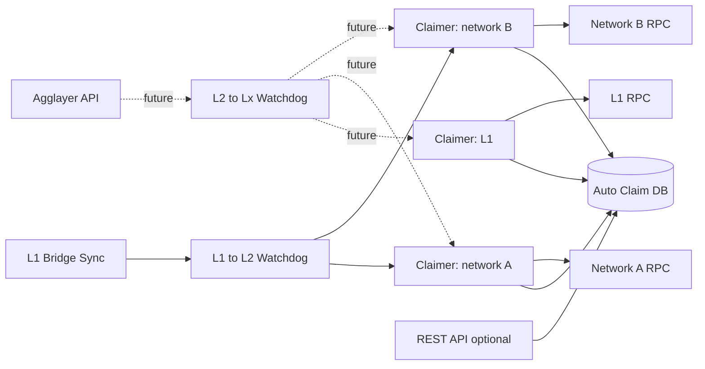
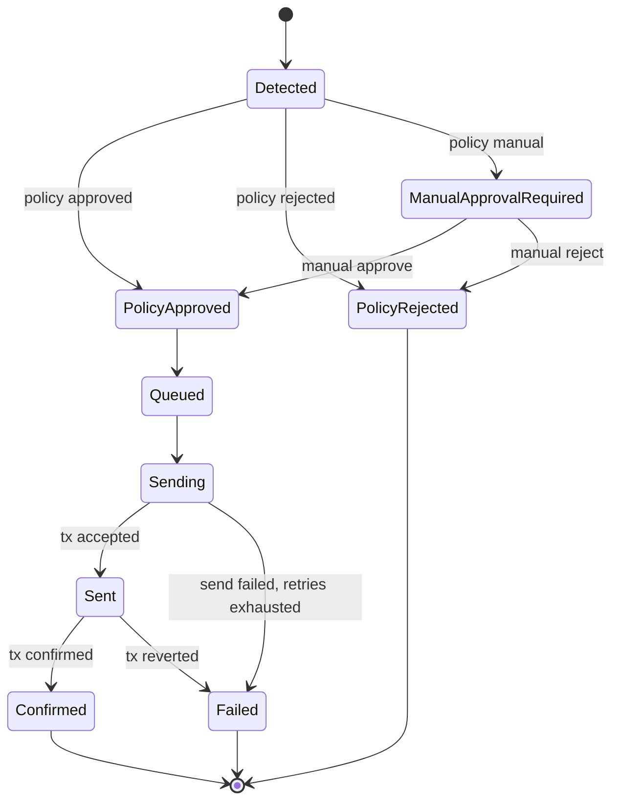
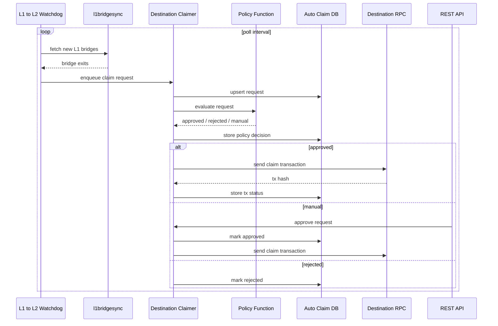
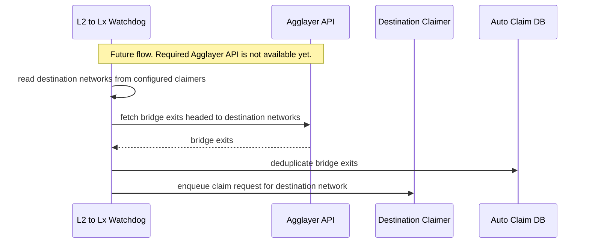

# Auto Claim Service

The Auto Claim service sends claim transactions that complete bridge interactions.

It tracks bridge requests, applies a configurable policy before sending each claim transaction, stores request status,
and allows manual approval when the optional API is enabled.

## Goals

- Claim eligible bridges on any configured destination network.
- Persist every tracked bridge and claim request in a local DB.
- Persist status for each request. Expose it through REST only when the API is enabled.
- Allow a policy function to approve, reject, or require manual approval before a transaction is sent.
- Support multiple destination networks by instantiating one claimer per configured network.
- Use `l1bridgesync` as the only required syncer. Future L2 to Lx discovery comes from Agglayer APIs.

## Components



### Claimer

Receives requests to claim bridges on one configured network. The network can be L1 or an L2.

Aggkit must support multiple claimers in one process. Each claimer tracks exactly one network.

Responsibilities:

- Store requests in the DB.
- Execute the policy function before sending a transaction.
- Queue approved requests for sending.
- Submit `claimAsset` or `claimMessage` transactions on the target network.
- Track transaction hash, confirmations, failures, retries, and final status.
- Persist request status. Expose it through the REST API when enabled.

Each claimer has independent config:

- `network_id`
- network type: L1 or L2
- RPC URL
- bridge contract address
- `EVMSender.EthTxManager` with per-network private key config
- DB namespace or claimer ID
- selected policy name
- transaction retry configuration

### L1 to L2 Watchdog

Polls `l1bridgesync` for bridges from L1 to configured L2 networks.

When a new bridge is detected, it builds a claim request and submits it to the claimer that tracks the destination L2.

This is the only watchdog that is fully in scope for the first implementation.

### L2 to Lx Watchdog

Detects bridges from any L2 to the networks tracked by configured claimers. A destination network can be L1 or an L2.

This watchdog depends on Agglayer exposing the required bridge discovery API. That API does not exist yet,
so this section is intentionally limited to the expected integration point.

When available, the watchdog will:

- Build the destination network set from configured claimers.
- Query Agglayer for bridge exits headed to those destination networks, regardless of origin L2.
- Submit claim requests to the claimer that tracks the destination network.
- Deduplicate requests against the Auto Claim DB.

### REST API

Optional service that exposes tracked bridges and their claim status.

The Auto Claim service must work without this API. When disabled, claimers and watchdogs keep running and status remains
available in the DB.

Endpoints when enabled:

| Method | Path | Description |
|--------|------|-------------|
| `GET` | `/bridges` | List tracked bridges with filters. |
| `GET` | `/bridges/{id}` | Get one tracked bridge and claim request status. |
| `POST` | `/bridges/{id}/approve` | Manually approve a bridge waiting for approval. |
| `POST` | `/bridges/{id}/reject` | Manually reject a bridge waiting for approval. |

Useful filters for `GET /bridges`:

- `origin_network`
- `destination_network`
- `status`
- `policy_status`
- `bridge_tx_hash`
- `claim_tx_hash`
- `from_block`
- `to_block`

## Policy Function

Each claimer executes its selected policy function before sending a queued claim transaction.

Policy functions are implemented in Aggkit code and registered by name. Configuration selects one policy per claimer.
Different claimers can use different policies.

Inputs should include:

- bridge leaf data
- origin network
- destination network
- bridge transaction hash
- receiver
- token address
- amount
- metadata hash
- detected source
- current request status
- target network RPC access

Outputs:

| Result | Meaning |
|--------|---------|
| `approved` | Queue the claim transaction for sending. |
| `rejected` | Mark the request rejected. Do not send a transaction. |
| `manual` | Keep the request pending until operator approval or rejection. |

The policy decision must be stored with the request.

Initial policy registry:

| Name | Behavior |
|------|----------|
| `allow-all` | Approves every request. Useful for development. |
| `api-approve` | Marks every request as manual approval required through the REST API. |
| `no-message` | Rejects `bridgeMessage` claims. Approves only `bridgeAsset` claims. |
| `basic-filter` | Rejects claims that exceed a configured gas limit or create another bridge. |

Policy functions have access to the target network RPC. They can simulate claim execution and query the network before
returning `approved`, `rejected`, or `manual`.

## Request State



Status fields:

| Field | Description |
|-------|-------------|
| `status` | Request lifecycle state. |
| `policy_status` | `approved`, `rejected`, or `manual`. |
| `policy_reason` | Short reason returned by the policy. |
| `claim_tx_hash` | Claim transaction hash when available. |
| `last_error` | Latest send or confirmation error. |
| `retry_count` | Number of send attempts. |
| `created_at` | Request creation time. |
| `updated_at` | Last request update time. |

## L1 to L2 Flow



## L2 to Lx Flow



## Storage

The DB must be the source of truth for:

- detected bridges
- claim requests
- policy decisions
- manual approval decisions
- transaction attempts
- final claim status

Recommended unique key:

```text
origin_network + destination_network + deposit_count
```

The storage layer must make enqueue idempotent. Watchdogs can safely resubmit the same bridge after restarts or polling
overlap.

## Claim Sending

Claimers should use the existing transaction manager patterns where possible.

Sending rules:

- Only `approved` requests can be sent.
- A request with an existing confirmed claim must not be sent again.
- Retry transient RPC and transaction manager errors.
- Store each send attempt.
- Treat reverted transactions as failed unless retry policy explicitly allows another attempt.
- Confirmation depth must be configurable per target network.

## Configuration

Suggested top-level shape:

```toml
[AutoClaim]
    Enabled = true
    StoragePath = "autoclaim.sqlite"

    [AutoClaim.API]
        Enabled = false
        RESTAddr = "0.0.0.0:8080"

    [[AutoClaim.Claimers]]
        Enabled = true
        ID = "l1"
        NetworkType = "L1"
        NetworkID = 0
        URLRPC = "..."
        BridgeAddr = "..."
        PolicyName = "api-approve"
        [AutoClaim.Claimers.EVMSender]
            GasOffset = 0
            WaitPeriodMonitorTx = "1s"
            [AutoClaim.Claimers.EVMSender.EthTxManager]
                FrequencyToMonitorTxs = "1s"
                WaitTxToBeMined = "2s"
                GetReceiptMaxTime = "250ms"
                GetReceiptWaitInterval = "1s"
                PrivateKeys = [
                    {Method = "local", Path = "/app/keystore/autoclaim-l1.keystore", Password = "testonly"},
                ]
                StoragePath = "ethtxmanager-autoclaim-l1.sqlite"
                [AutoClaim.Claimers.EVMSender.EthTxManager.Etherman]
                    URL = "..."
                    L1ChainID = 0

    [[AutoClaim.Claimers]]
        Enabled = true
        ID = "l2-1"
        NetworkType = "L2"
        NetworkID = 1
        URLRPC = "..."
        BridgeAddr = "..."
        PolicyName = "basic-filter"
        [AutoClaim.Claimers.Policy]
            MaxGas = 500000
        [AutoClaim.Claimers.EVMSender]
            GasOffset = 0
            WaitPeriodMonitorTx = "1s"
            [AutoClaim.Claimers.EVMSender.EthTxManager]
                FrequencyToMonitorTxs = "1s"
                WaitTxToBeMined = "2s"
                GetReceiptMaxTime = "250ms"
                GetReceiptWaitInterval = "1s"
                PrivateKeys = [
                    {Method = "local", Path = "/app/keystore/autoclaim-l2-1.keystore", Password = "testonly"},
                ]
                StoragePath = "ethtxmanager-autoclaim-l2-1.sqlite"
                [AutoClaim.Claimers.EVMSender.EthTxManager.Etherman]
                    URL = "..."
                    L1ChainID = 0

    [AutoClaim.L1ToL2Watchdog]
        Enabled = true
        PollInterval = "5s"

    [AutoClaim.L2ToLxWatchdog]
        Enabled = false
```

Key settings:

| Name | Description |
|------|-------------|
| `Enabled` | Enables the Auto Claim service. |
| `StoragePath` | Auto Claim DB path. |
| `API.Enabled` | Enables the optional REST API. Claiming must work when this is false. |
| `API.RESTAddr` | REST API bind address. |
| `Claimers` | List of claimer instances. Each one tracks one L1 or L2 network. |
| `Claimers.NetworkType` | `L1` or `L2`. |
| `Claimers.NetworkID` | Network ID tracked by the claimer. |
| `Claimers.URLRPC` | RPC URL for the tracked network. |
| `Claimers.PolicyName` | Name of the Aggkit policy function selected for this claimer. |
| `Claimers.Policy` | Policy-specific config. Example: `MaxGas` for `basic-filter`. |
| `EVMSender.EthTxManager` | Transaction manager config for the claimer target network. |
| `EVMSender.EthTxManager.PrivateKeys` | Per-network signer config, using the existing private key config style. |
| `L1ToL2Watchdog` | Polling config for `l1bridgesync`. |
| `L2ToLxWatchdog` | Future Agglayer based watchdog config. Uses configured claimers as destinations. |

## Initial Scope

In scope:

- Multiple claimer instances, each tracking one L1 or L2 network.
- L1 to L2 watchdog using `l1bridgesync`.
- DB-backed queue and status tracking.
- Per-claimer policy function selection.
- Optional REST API for listing, inspecting, approving, and rejecting requests.

Out of scope:

- Full L2 to Lx watchdog implementation.
- New syncers besides `l1bridgesync`.
- Bridge discovery from L2 syncers.
- Policy language design beyond the claimer policy interface.
