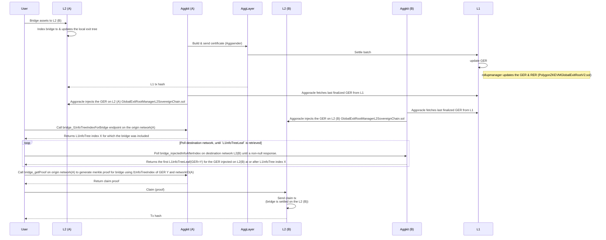
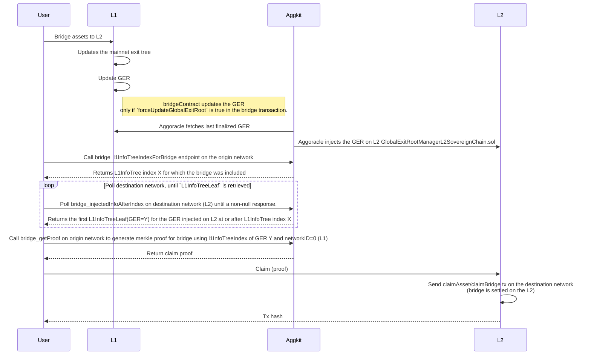
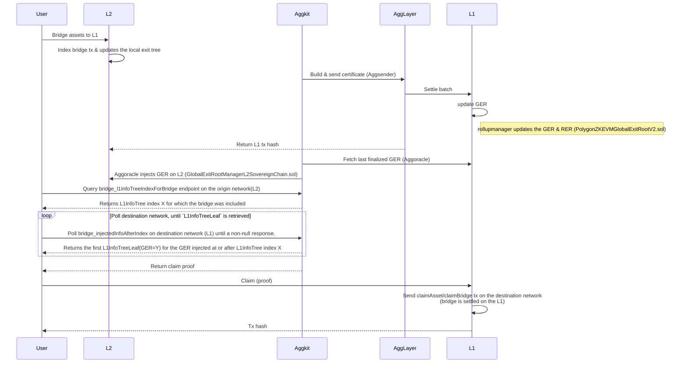
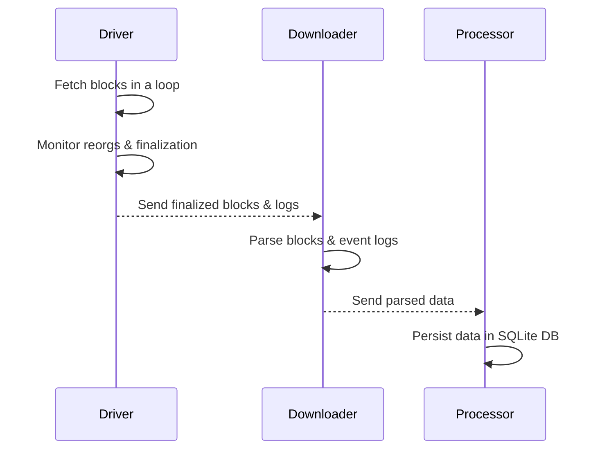
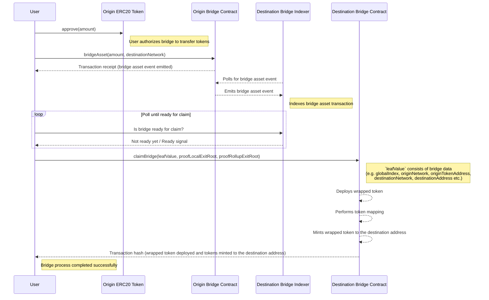

# Bridge service component

The bridge service abstracts interaction with the unified LxLy bridge. It represents decentralized indexer, that sequences the bridge data. Each bridge service sequences L1 network and a dedicated L2 one (which is uniquely defined by the network id parameter). Therefore, each agglayer connected chain runs its own bridge service. It is implemented as a JSON RPC service.

## Bridge flow


### Bridge flow L2 -> L2

The diagram below describes the basic L2 -> L2 bridge workflow.



### Bridge flow L1 -> L2

The diagram below describes the basic L1 -> L2 bridge workflow.



**Notes:**  

1. In CDK-Erigon, the Global Exit Root (GER) on the L2 smart contract (`PolygonZKEVMGlobalExitRootL2.sol`) is automatically updated by the sequencer. In a sovereign chain, the GER is injected on L2 (`GlobalExitRootManagerL2SovereignChain.sol`) by the Aggoracle component.  

2. A non-null response from `bridge_injectedInfoAfterIndex` indicates that the bridge is ready to be claimed on the destination network.  

3. If `forceUpdateGlobalExitRoot` is set to false in a bridge transaction, the GER will not be updated with that transaction. The user must wait until the GER is updated by another bridge transaction before claiming. This is done to save gas costs while bridging.

### Bridge flow L2 -> L1

The diagram below describes the basic L2 -> L1 bridge workflow.



## Indexers

The bridge service relies on specific data located on different chains (such as `bridge`, `claim`, and `token mapping` events, as well as the L1 info tree). These data are retrieved using indexers. Indexers consists of three components: driver, downloader and processor. 

### Driver

Driver is in charge of retrieving the blocks and also monitors for the reorgs (using the reorg detector component). The idea is to have driver implementation per chain type (so far we have the EVM driver, but in future, each non-evm chain would require a new driver implementation).

### Downloader

Downloader is in charge of parsing the blocks and logs that are retrieved by the driver. Downloader (indirectly, via the driver) passes the parsed data to the processor.

### Processor

Processor represents the persistance layer, which writes retrieved indexer data in a format suitable for serving it via API. It utilizes SQL lite database.

The diagram below depicts the interaction between components of each indexer.



## Syncers

In this paragraph, we will list and briefly describe syncers that are of interest for the bridge service.

### L1 Info Tree Sync

It interacts with L1 execution layer (via RPC) in order to:

- Sync the L1 info tree,
- Generate merkle proofs,
- Build the relation `bridge <-> L1InfoTree index` for bridges originated on L1
- Sync the rollup exit tree (namely a tree consisted of all local exit trees, that tracks exits per rollup network), persist, generate proofs

### Bridge Sync

It interacts with the L2 or L1 execution layer (via RPC) in order to:

- Sync bridges, claims and token mappings. Needs to be modular as it's execution client specific.
- Build the local exit tree
- Generate merkle proofs

## Bridging custom ERC20 token

When a non-native ERC20 token, not yet mapped on a destination network, is bridged, its representation is deployed on the destination network using the `CREATE2` opcode. The mapping process emits the `NewWrappedToken` [event](https://github.com/0xPolygonHermez/zkevm-contracts/blob/21d3fd6ec0881731de49f1a6133fb97ed863a7ab/contracts/v2/PolygonZkEVMBridgeV2.sol#L561-L566) on the destination network.

Mapped token details are available via the `bridge_getTokenMappings` endpoint.

The following diagram depicts the basic flow of bridging the custom ERC20 token.



## API

This paragraph explains a set of endpoints, that are necessary in order to conduct the bridge flow described above.

### Get bridges

Retrieves the bridge(s) for a specified network, supporting pagination. The bridges represent the `BridgeEvent` events emitted by the bridge contract.

#### Parameters

| **Name**       | **Type**  | **Description**                                                 | **Required** | **Notes**                 |
|----------------|-----------|---------------------------------------------------------------- |--------------|---------------------------|
| `networkID`    | `uint32`  | ID of the network to fetch bridges from.                        | Yes          | `0` for L1 (otherwise L2) |
| `pageNumber`   | `*uint32` | Page number for pagination (pointer to `uint32`).               | No           | Defaults if `nil`.        |
| `pageSize`     | `*uint32` | Number of items per page (pointer to `uint32`).                 | No           | Defaults if `nil`.        |
| `depositCount` | `*uint32` | Query param for a specific Deposit Count (pointer to `uint32`). | No           | Defaults if `nil`.        |


#### Return value

Successful response (`BridgesResult`)

- `bridges`: Array of bridges (Bridge) with details:
  - `block_num`: Block number where the event was recorded.
  - `block_pos`: Position of the log within the block.
  - `block_timestamp`: Timestamp of the block.
  - `leaf_type`: Type of bridge (unspecified, asset, message).
  - `origin_network`: Network ID where the original token resides.
  - `origin_address`: Address of the original token on the origin network.
  - `destination_network`: Destination network where we are bridging to
  - `destination_address`: Destination address where we are bridging to
  - `amount`: Amount of the bridge
  - `metadata`: Additional encoded information.
  - `deposit_count`: Deposit count for the bridge
  - `tx_hash`: Hash of the transaction that triggered the event.
  - `from_address`: Address which initiated the event.
  - `bridge_hash`: Hash of the bridge
- `count`: Total number of bridges available.

```json
{
  "bridges": [
    {
      "block_num": 11952,
      "block_pos": 1,
      "block_timestamp": 1739563963,
      "leaf_type": 1,
      "origin_network": 0,
      "origin_address": "0xc67dc429d7bde82abf29ae609c9213276d803acf",
      "destination_network": 0,
      "destination_address": "0xa67dc429d7bde82abf29ae609c9213276d803acf",
      "amount": 1,
      "metadata": "Base64 or Hex-encoded data",
      "deposit_count": 1,
      "tx_hash": "0xd4c6e67a65e6cc35965d692cfc7c176d954a660bc7bef34dd5dd3491a53352b5",
      "from_address": "0xb67dc429d7bde82abf29ae609c9213276d803acf",
    }
  ],
  "count": 1
}
```

Failed response (`rpc.Error`)

- `code` - error code
- `message` - error message

### Get claims

Retrieves the claim(s) for a specified network with support for pagination returning results in descending order of `block_num`. The claims represent the `ClaimEvent` events emitted by the bridge contract.

#### Parameters

| **Name**       | **Type**  | **Description**                                                 | **Required** | **Notes**                 |
|----------------|-----------|---------------------------------------------------------------- |--------------|---------------------------|
| `networkID`    | `uint32`  | ID of the network to fetch claims from.                         | Yes          | `0` for L1 (otherwise L2) |
| `pageNumber`   | `*uint32` | Page number for pagination (pointer to `uint32`).               | No           | Defaults if `nil`.        |
| `pageSize`     | `*uint32` | Number of items per page (pointer to `uint32`).                 | No           | Defaults if `nil`.        |

#### Return value

Successful response (`ClaimsResult`)

- `claims`: Array of claims (Claim) with details:
  - `block_num`: Block number where the event was recorded.
  - `block_timestamp`: Timestamp of the block.
  - `tx_hash`: Hash of the transaction that triggered the `ClaimEvent`.
  - `global_index`: Global index of the claim.
  - `origin_address`: Address of the original token on the origin network.
  - `origin_network`: Network ID where the original token resides.
  - `destination_address`: Destination address where we are claiming.
  - `destination_network`: Destination network where we are claiming.
  - `amount`: Amount of the claim.
  - `from_address`: Address which initiated the event.
- `count`: Total number of claims available.

```json
{
  "claims": [
    {
      "block_num": 11952,
      "block_timestamp": 1739563963,
      "tx_hash": "0x02152c9059502b05d5fa68cb796be72eba32c9b2504c004a775a80008cbc0766",
      "global_index": 18446744073709551610,
      "origin_address": "0xb26f25ed6bcb8dd7c1c7266e12fa4aaff48fc892",
      "origin_network": 0,
      "destination_address": "0x85da99c8a7c2c95964c8efd687e95e632fc533d6",
      "destination_network": 1,
      "amount": 100000000000000000,      
      "from_address": "0xb67dc429d7bde82abf29ae609c9213276d803acf",
    }
  ],
  "count": 1
}
```

Failed response (`rpc.Error`)

- `code` - error code
- `message` - error message

### Get token mappings

Retrieves the token mappings for a specified network, supporting pagination. The token mappings represent the `NewWrappedToken` events emitted by the bridge contract.

#### Parameters

| **Name**           | **Type**    | **Description**                                             | **Required** | **Notes**                       |
|--------------------|-------------|-------------------------------------------------------------|--------------|---------------------------------|
| `networkID`        | `uint32`    | ID of the network to fetch token mappings from.             | Yes          | `0` for L1(otherwise L2)        |
| `pageNumber`       | `*uint32`   | Page number for pagination (pointer to `uint32`).           | No           | Defaults if `nil`.              |
| `pageSize`         | `*uint32`   | Number of items per page (pointer to `uint32`).             | No           | Defaults if `nil`.              |

---

#### Return value

Successful response (`TokenMappingResult`)

- `tokenMappings`: Array of token mappings (TokenMapping) with details:
  - `block_num`: Block number where the event was recorded.
  - `block_pos`: Position of the log within the block.
  - `block_timestamp`: Timestamp of the block.
  - `tx_hash`: Hash of the transaction that triggered the event.
  - `origin_network`: Network ID where the original token resides.
  - `origin_token_address`: Address of the original token on the origin network.
  - `wrapped_token_address`: Address of the deployed wrapped token on the destination network.
  - `metadata`: Additional encoded information.
- `count`: Total number of token mappings available.

```json
{
  "tokenMappings": [
    {
      "block_num": 11952,
      "block_pos": 1,
      "block_timestamp": 1739563963,
      "tx_hash": "0xd4c6e67a65e6cc35965d692cfc7c176d954a660bc7bef34dd5dd3491a53352b5",
      "origin_network": 0,
      "origin_token_address": "0xc67dc429d7bde82abf29ae609c9213276d803acf",
      "wrapped_token_address": "0xa10efd92865e759b699ba2d96047459d89ca4844",
      "metadata": "Base64 or Hex-encoded data"
    }
  ],
  "count": 1
}
```

Failed response (`rpc.Error`)

- `code` - error code
- `message` - error message

### L1 info tree index for bridge

L1InfoTreeIndexForBridge returns the first L1 info tree index where the specified bridge transaction was included. This method must be called against a client connected to the same network in which the bridge transaction was sent.

#### Parameters

| **Name**       | **Type** | **Description**                                                      | **Required** | **Notes**                       |
|----------------|----------|----------------------------------------------------------------------|--------------|---------------------------------|
| `networkID`    | `uint32` | ID of the network to fetch L1 info tree index.                       | Yes          | `0` for L1(otherwise L2)        |
| `depositCount` | `uint32` | Deposit count of the bridge for we have requested L1 info tree index | Yes          |                                 |

---

#### Return value

Successful response

- uint32

Failed response (`rpc.Error`)

- `code` - error code
- `message` - error message

### Injected L1 tree info after index

The InjectedInfoAfterIndex endpoint returns the first Global Exit Root (GER) injected into the network with an index equal to or greater than the provided value. This endpoint is useful for determining when a bridge becomes eligible for claiming on its destination network.

#### Parameters

| **Name**          | **Type** | **Description**                                                      | **Required** |**Notes**                      |
|-------------------|----------|----------------------------------------------------------------------|--------------|-------------------------------|
| `networkID`       | `uint32` | ID of the network to fetch L1 info tree index.                       | Yes          | 0 for L1(otherwise L2)        |
| `l1InfoTreeIndex` | `uint32` | The starting index in the L1 info tree used to query for GER info.   | Yes          |                               |

---

#### Return value

Successful response (`L1InfoTreeLeaf`)

- `block_num`: Block number where the event was recorded.
- `block_pos`: Position of the log within the block.
- `position`: Position of the leaf in the L1 info tree.
- `previous_block_hash`: Hash of the previous block.
- `timestamp`: Timestamp of the block.
- `mainnet_exit_root`: Mainnet exit root.
- `rollup_exit_root`: Rollup exit root.
- `global_exit_root`: Global exit root.
- `hash`: Hash of the leaf.

Failed response (`rpc.Error`)

- `code` - error code
- `message` - error message

### Get proof

GetProof endpoint retrieves the Merkle proof necessary to claim a bridge transaction on the destination chain. This method must be invoked on a client connected to the same network where the bridge transaction was initially submitted.

#### Parameters

| **Name**       | **Type** | **Description**                                                      | **Required** | **Notes**                       |
|----------------|----------|----------------------------------------------------------------------|--------------|---------------------------------|
| `networkID`    | `uint32` | ID of the origin network where bridge transaction was initiated.     | Yes          | 0 for L1(otherwise L2)          |
| `depositCount` | `uint32` | Deposit count of the bridge for which proof is being generated.      | Yes          |                                 |
| `l1InfoTreeIndex` | `uint32` | The index in the L1 info tree where the bridge has already been included or later. | Yes          |

---

#### Return value

Successful response (`ClaimProof`)

- `proof_local_exit_root`: Proof for the local exit root.
- `proof_rollup_exit_root`: Proof for the rollup exit root.
- `l1_info_tree_leaf`: L1 info tree leaf.
  - `block_num`: Block number where the event was recorded.
  - `block_pos`: Position of the log within the block.
  - `position`: Position of the leaf in the L1 info tree.
  - `previous_block_hash`: Hash of the previous block.
  - `timestamp`: Timestamp of the block.
  - `mainnet_exit_root`: Mainnet exit root.
  - `rollup_exit_root`: Rollup exit root.
  - `global_exit_root`: Global exit root.
  - `hash`: Hash of the leaf.

Failed response (`rpc.Error`)

- `code` - error code
- `message` - error message

### Get Last Reorg Event

The `GetLastReorgEvent` endpoint retrieves the most recent reorg event detected by the ReorgDetector on L1 and L2. Each bridge service can access this data only for L1 and its own corresponding L2 network.

#### Parameters

| **Name**       | **Type** | **Description**                                                      | **Required** | **Notes**                       |
|----------------|----------|----------------------------------------------------------------------|--------------|---------------------------------|
| `networkID`    | `uint32` | The ID of the network for which the reorg event is being queried.     | Yes          | 0 for L1(otherwise L2)          |

#### Return value

Successful response (`LastReorg`)

- `detected_at`: Timestamp when the reorg was detected.
- `from_block`: Starting block number of the reorg.
- `to_block`: Ending block number of the reorg.

Failed response (`rpc.Error`)

- `code` - error code
- `message` - error message