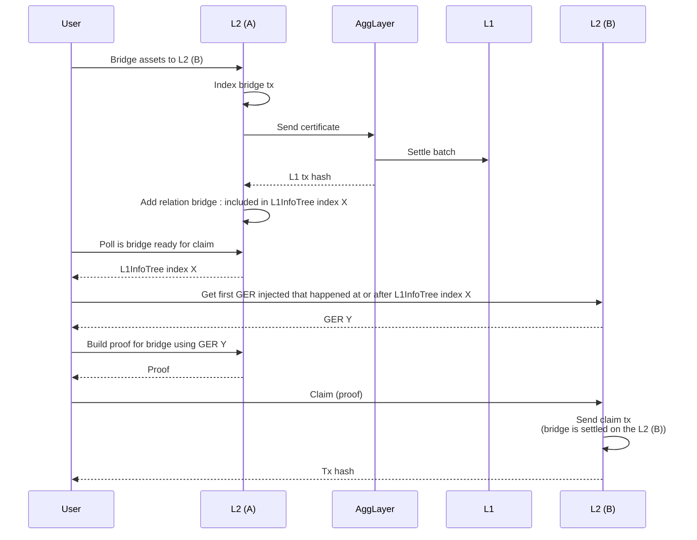
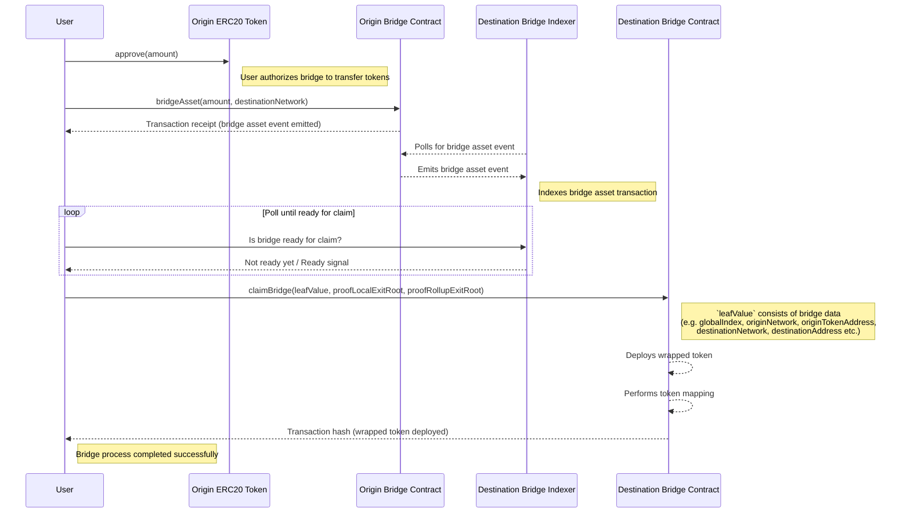

# Bridge service component

The bridge service abstracts interaction with the unified LxLy bridge. It represents decentralized indexer, that sequences the bridge data. Each bridge service sequences L1 network and a dedicated L2 one (which is uniquely defined by the network id parameter). It is implemented as a JSON RPC service.

## Bridge flow

The diagram below describes the basic L2 -> L2 bridge workflow. Note that L2 networks consist of the aggkit node and execution client.



## Bridging custom ERC20 token
When a non-native ERC20 token, not yet mapped on a destination network, is bridged, its representation is deployed on the destination network using the `CREATE2` opcode. The mapping process emits the `NewWrappedToken` [event](https://github.com/0xPolygonHermez/zkevm-contracts/blob/21d3fd6ec0881731de49f1a6133fb97ed863a7ab/contracts/v2/PolygonZkEVMBridgeV2.sol#L561-L566) on the destination network. 

Mapped token details are available via the `bridge_getTokenMappings` endpoint.

The following diagram depicts the basic flow of bridging the custom ERC20 token.



## Endpoints
This paragraph explains a set of endpoints, that are providing indexed bridge data.

### Get bridges
<!-- TODO: @temaniarpit27 -->

### Get claims
<!-- TODO: @rachit77 -->

### Get token mappings

Retrieves the token mappings for a specified network, supporting pagination. The token mappings represent the `NewWrappedToken` events emitted by the bridge contract.

#### Parameters

| **Name**           | **Type**    | **Description**                                             | **Required** | **Notes**                       |
|--------------------|-------------|-------------------------------------------------------------|--------------|---------------------------------|
| `networkID`        | `uint32`    | ID of the network to fetch token mappings from.             | Yes          | `0` for L1(otherwise L2)        |
| `pageNumber`       | `*uint32`   | Page number for pagination (pointer to `uint32`).           | No           | Defaults if `nil`.              |
| `pageSize`         | `*uint32`   | Number of items per page (pointer to `uint32`).             | No           | Defaults if `nil`.              |

---

#### Return value

Successful response (`TokenMappingResult`)

- `tokenMappings`: Array of token mappings (TokenMapping) with details:
- `block_num`: Block number where the event was recorded.
- `block_pos`: Position of the log within the block.
- `block_timestamp`: Timestamp of the block.
- `tx_hash`: Hash of the transaction that triggered the event.
- `origin_network`: Network ID where the original token resides.
- `origin_token_address`: Address of the original token on the origin network.
- `wrapped_token_address`: Address of the deployed wrapped token on the destination network.
- `metadata`: Additional encoded information.
- `count`: Total number of token mappings available.

```json
{
  "tokenMappings": [
    {
      "block_num": 11952,
      "block_pos": 1,
      "block_timestamp": 1739563963,
      "tx_hash": "0xd4c6e67a65e6cc35965d692cfc7c176d954a660bc7bef34dd5dd3491a53352b5",
      "origin_network": 0,
      "origin_token_address": "0xc67dc429d7bde82abf29ae609c9213276d803acf",
      "wrapped_token_address": "0xa10efd92865e759b699ba2d96047459d89ca4844",
      "metadata": "Base64 or Hex-encoded data"
    }
  ],
  "count": 1
}
```

Failed response (`rpc.Error`)
- `code` - error code
- `message` - error message

### L1 info tree index for bridge

### Injected L1 tree info after index

### Get proof