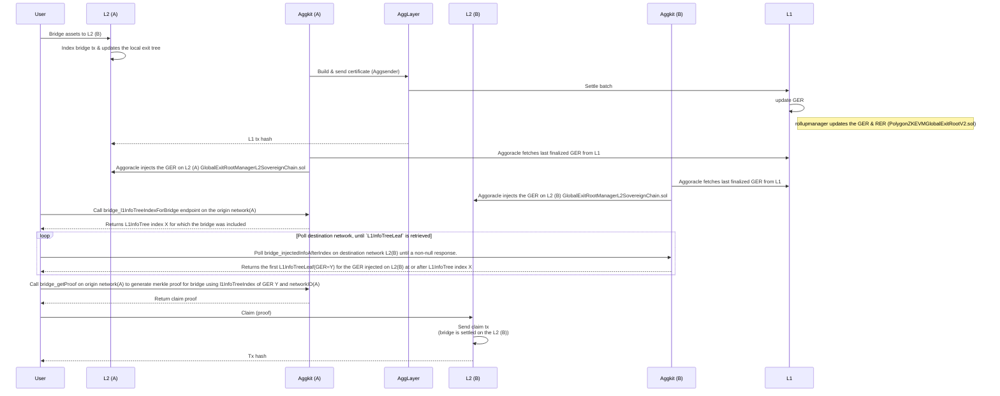
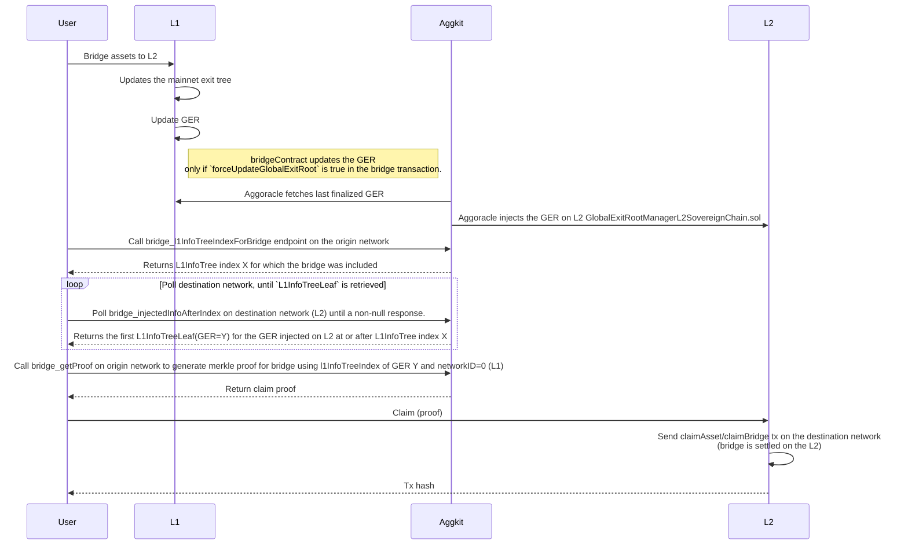
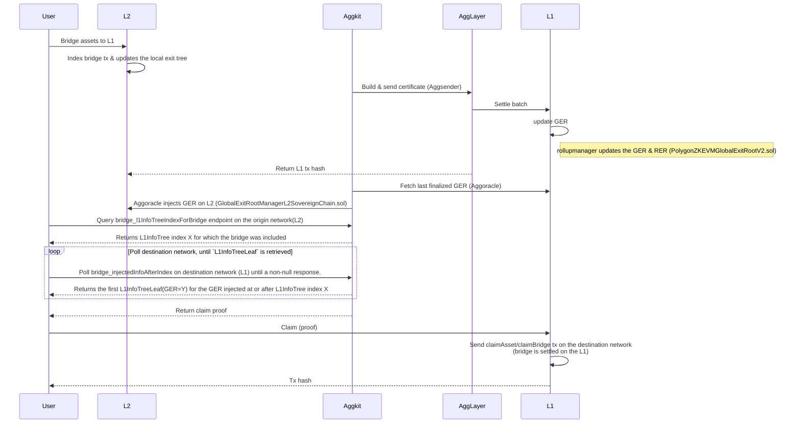
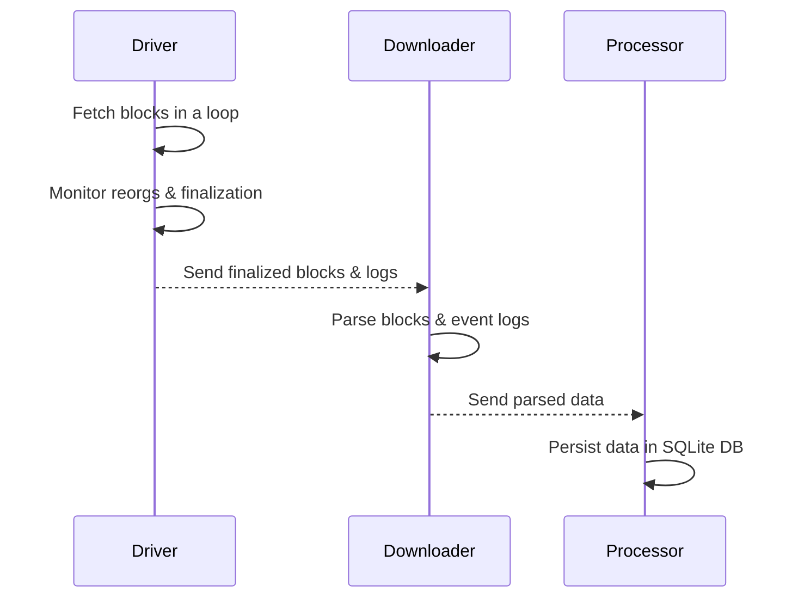
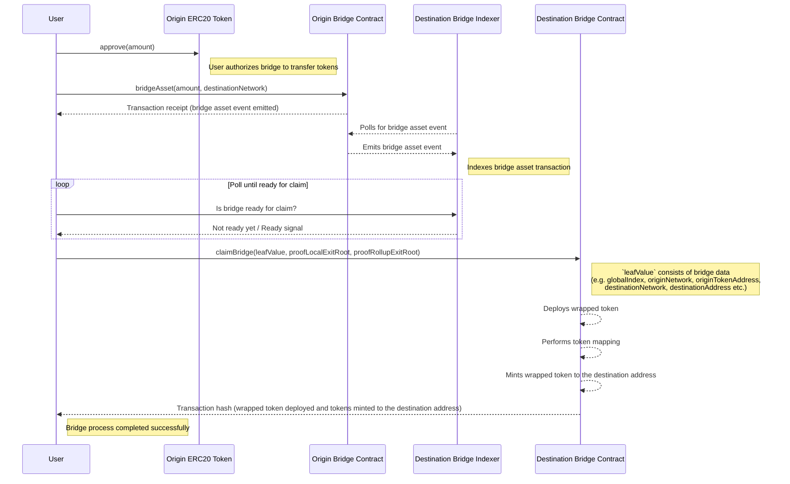

# Bridge service component

The bridge service abstracts interaction with the unified LxLy bridge. It represents decentralized indexer, that sequences the bridge data. Each bridge service sequences L1 network and a dedicated L2 one (which is uniquely defined by the network id parameter). Therefore, each agglayer connected chain runs its own bridge service. It is implemented as a JSON RPC service.

## Bridge flow

### Bridge flow L2 -> L2

The diagram below describes the basic L2 -> L2 bridge workflow.

### Bridge flow L1 -> L2

The diagram below describes the basic L1 -> L2 bridge workflow.

**Notes:**  

1. In CDK-Erigon, the Global Exit Root (GER) on the L2 smart contract (`PolygonZKEVMGlobalExitRootL2.sol`) is automatically updated by the sequencer. In a sovereign chain, the GER is injected on L2 (`GlobalExitRootManagerL2SovereignChain.sol`) by the Aggoracle component.  

2. A non-null response from `bridge_injectedInfoAfterIndex` indicates that the bridge is ready to be claimed on the destination network.  

3. If `forceUpdateGlobalExitRoot` is set to false in a bridge transaction, the GER will not be updated with that transaction. The user must wait until the GER is updated by another bridge transaction before claiming. This is done to save gas costs while bridging.

### Bridge flow L2 -> L1

The diagram below describes the basic L2 -> L1 bridge workflow.

## Indexers

The bridge service relies on specific data located on different chains (such as `bridge`, `claim`, and `token mapping` events, as well as the L1 info tree). These data are retrieved using indexers. Indexers consists of three components: driver, downloader and processor. 

### Driver

Driver is in charge of retrieving the blocks and also monitors for the reorgs (using the reorg detector component). The idea is to have driver implementation per chain type (so far we have the EVM driver, but in future, each non-evm chain would require a new driver implementation).

### Downloader

Downloader is in charge of parsing the blocks and logs that are retrieved by the driver. Downloader (indirectly, via the driver) passes the parsed data to the processor.

### Processor

Processor represents the persistance layer, which writes retrieved indexer data in a format suitable for serving it via API. It utilizes SQL lite database.

The diagram below depicts the interaction between components of each indexer.

## Syncers

In this paragraph, we will list and briefly describe syncers that are of interest for the bridge service.

### L1 Info Tree Sync

It interacts with L1 execution layer (via RPC) in order to:

- Sync the L1 info tree,
- Generate merkle proofs,
- Build the relation `bridge <-> L1InfoTree index` for bridges originated on L1
- Sync the rollup exit tree (namely a tree consisted of all local exit trees, that tracks exits per rollup network), persist, generate proofs

### Bridge Sync

It interacts with the L2 or L1 execution layer (via RPC) in order to:

- Sync bridges, claims and token mappings. Needs to be modular as it's execution client specific.
- Build the local exit tree
- Generate merkle proofs

## Bridging custom ERC20 token

When a non-native ERC20 token, not yet mapped on a destination network, is bridged, its representation is deployed on the destination network using the `CREATE2` opcode. The mapping process emits the `NewWrappedToken` [event](https://github.com/0xPolygonHermez/zkevm-contracts/blob/21d3fd6ec0881731de49f1a6133fb97ed863a7ab/contracts/v2/PolygonZkEVMBridgeV2.sol#L561-L566) on the destination network.

Mapped token details are available via the `bridge_getTokenMappings` endpoint.

The following diagram depicts the basic flow of bridging the custom ERC20 token.

## API Documentation

<iframe src="assets/swagger/bridge_service/index.html" 
  style="width: 100%; height: 90vh; border: none;"
  loading="lazy"></iframe>
