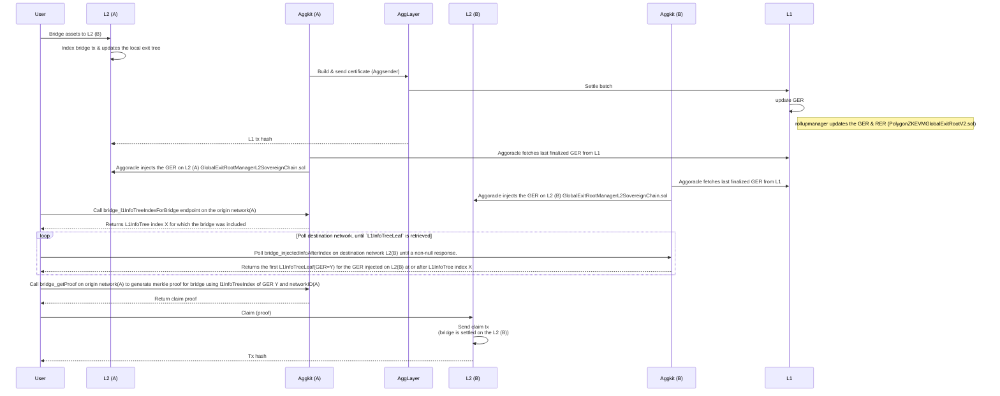
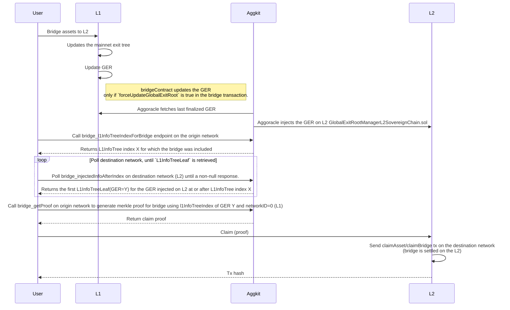
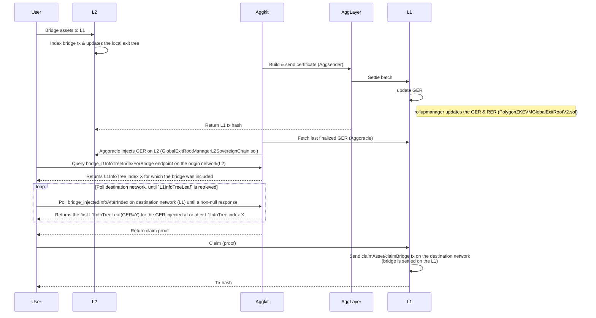
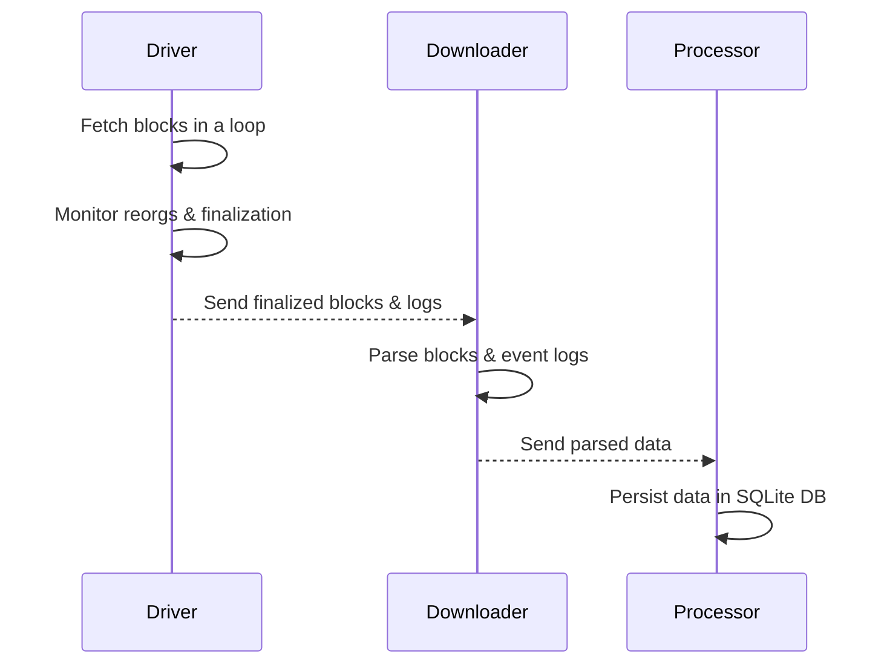
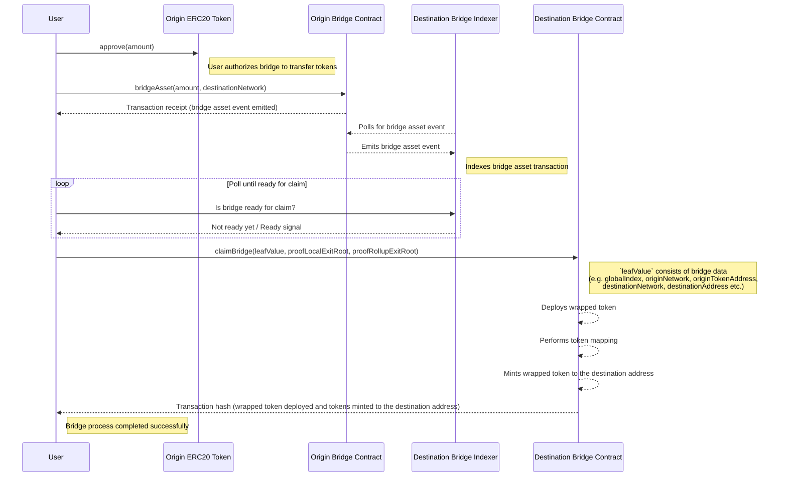

# Bridge service component

The bridge service abstracts interaction with the unified LxLy bridge. It represents decentralized indexer, that sequences the bridge data. Each bridge service sequences L1 network and a dedicated L2 one (which is uniquely defined by the network id parameter). Therefore, each agglayer connected chain runs its own bridge service. It is implemented as a JSON RPC service.

## Bridge flow


### Bridge flow L2 -> L2

The diagram below describes the basic L2 -> L2 bridge workflow.


```mermaid
sequenceDiagram
    participant User
    participant L2 (A)
    participant Aggkit (A)
    participant AggLayer
    participant L2 (B)
    participant Aggkit (B)
    participant L1

    User->>L2 (A): Bridge assets to L2 (B)
    L2 (A)->>L2 (A): Index bridge tx & updates the local exit tree
    Aggkit (A)->>AggLayer: Build & send certificate (Aggsender)
    AggLayer->>L1: Settle batch
    L1->>L1: update GER
    Note right of L1: rollupmanager updates the GER & RER (PolygonZKEVMGlobalExitRootV2.sol)
    AggLayer-->>L2 (A): L1 tx hash

    Aggkit (A)->>L1: Aggoracle fetches last finalized GER from L1
    Aggkit (A)->>L2 (A): Aggoracle injects the GER on L2 (A) GlobalExitRootManagerL2SovereignChain.sol
    Aggkit (B)->>L1: Aggoracle fetches last finalized GER from L1
    Aggkit (B)->>L2 (B): Aggoracle injects the GER on L2 (B) GlobalExitRootManagerL2SovereignChain.sol

    User->>Aggkit (A): Call bridge_l1InfoTreeIndexForBridge endpoint on the origin network(A)
    Aggkit (A)-->>User: Returns L1InfoTree index X for which the bridge was included
    loop Poll destination network, until `L1InfoTreeLeaf` is retrieved  
      User->>Aggkit (B): Poll bridge_injectedInfoAfterIndex on destination network L2(B) until a non-null response.  
      Aggkit (B)-->>User: Returns the first L1InfoTreeLeaf(GER=Y) for the GER injected on L2(B) at or after L1InfoTree index X
    end 
    User->>Aggkit (A): Call bridge_getProof on origin network(A) to generate merkle proof for bridge using l1InfoTreeIndex of GER Y and networkID(A)
    
    Aggkit (A)-->>User: Return claim proof
    User->>L2 (B): Claim (proof)
    L2 (B)->>L2 (B): Send claim tx<br/>(bridge is settled on the L2 (B))
    L2 (B)-->>User: Tx hash
```

### Bridge flow L1 -> L2

The diagram below describes the basic L1 -> L2 bridge workflow.


```mermaid
sequenceDiagram
    participant User
    participant L1
    participant Aggkit
    participant L2

    User->>L1: Bridge assets to L2
    L1->>L1: Updates the mainnet exit tree
    L1->>L1: Update GER
    Note right of L1: bridgeContract updates the GER<br/>only if `forceUpdateGlobalExitRoot` is true in the bridge transaction.
    Aggkit->>L1: Aggoracle fetches last finalized GER
    Aggkit->>L2: Aggoracle injects the GER on L2 GlobalExitRootManagerL2SovereignChain.sol

    User->>Aggkit: Call bridge_l1InfoTreeIndexForBridge endpoint on the origin network
    Aggkit-->>User: Returns L1InfoTree index X for which the bridge was included
    loop Poll destination network, until `L1InfoTreeLeaf` is retrieved  
      User->>Aggkit: Poll bridge_injectedInfoAfterIndex on destination network (L2) until a non-null response.  
      Aggkit-->>User: Returns the first L1InfoTreeLeaf(GER=Y) for the GER injected on L2 at or after L1InfoTree index X
    end 

    User->>Aggkit: Call bridge_getProof on origin network to generate merkle proof for bridge using l1InfoTreeIndex of GER Y and networkID=0 (L1)
    Aggkit-->>User: Return claim proof
    User->>L2: Claim (proof)
    L2->>L2: Send claimAsset/claimBridge tx on the destination network<br/>(bridge is settled on the L2)
    L2-->>User: Tx hash
```

**Notes:**  

1. In CDK-Erigon, the Global Exit Root (GER) on the L2 smart contract (`PolygonZKEVMGlobalExitRootL2.sol`) is automatically updated by the sequencer. In a sovereign chain, the GER is injected on L2 (`GlobalExitRootManagerL2SovereignChain.sol`) by the Aggoracle component.  

2. A non-null response from `bridge_injectedInfoAfterIndex` indicates that the bridge is ready to be claimed on the destination network.  

3. If `forceUpdateGlobalExitRoot` is set to false in a bridge transaction, the GER will not be updated with that transaction. The user must wait until the GER is updated by another bridge transaction before claiming. This is done to save gas costs while bridging.

4. Over the REST API, `bridge_injectedInfoAfterIndex` is served by `GET /bridge/v1/injected-l1-info-leaf`, which now
   responds `404 Not Found` (not `500`) when no injected global exit root covers the requested L1 info tree index
   yet — callers should treat `404` as "not ready yet, retry later" rather than a hard failure. The Go client
   (`bridgeservice/client.Client.GetInjectedL1InfoLeaf`) surfaces this as the `client.ErrNotFound` sentinel.

5. The same `404`-for-not-ready contract from note 4 now also applies to `GET /bridge/v1/l1-info-tree-index`
   (`bridge_l1InfoTreeIndexForBridge`) and `GET /bridge/v1/claim-proof`: both previously returned `500` whenever
   the L1 info tree syncer or a bridge syncer had simply not caught up yet to the requested deposit/leaf, and now
   return `404` for that condition, reserving `500` for genuine faults. The Go client surfaces this as
   `client.ErrNotFound` on `Client.GetL1InfoTreeIndex` and `Client.GetClaimProof`. In addition, the `404`
   semantics described in note 4 for `/injected-l1-info-leaf` now cover its **L1** path (`network_id=0`) as well
   as its L2 path — previously the L1 path fell through to `500` when `l1infotreesync` had not yet indexed the
   requested leaf; it now answers `404` there too.

6. `/l1-info-tree-index`, `/claim-proof`, and `/injected-l1-info-leaf` can also respond `503 Service Unavailable`
   when a syncer they read from is halted or in an inconsistent state (e.g. resolving a reorg). `503` is a second
   retry-later code, but it does **not** mean the same thing as `404`: `404` means the syncer is healthy and
   simply hasn't indexed the requested data yet, while `503` means a syncer is in an operational fault state.
   Retrying is appropriate for both, but operators and client authors should not conflate them — persistent `503`s
   warrant investigating the syncer, whereas persistent `404`s only indicate lag.

7. The fallback inside `getFirstL1InfoTreeIndexForL1Bridge`, which backs `bridge_l1InfoTreeIndexForBridge` in the
   flow diagrams above, was corrected. When the primary `GetRootByLER` lookup misses because the L1 bridge syncer
   has not yet caught up to the tip of the L1 info tree, the fallback now clamps to the most recent L1 info tree
   leaf at or before the last block the L1 bridge syncer has indexed. It previously reused a position from the L1
   bridge **exit** tree (a deposit count) as if it were an L1 **info** tree index — two different counters in two
   different trees — which could surface as a `500` `sql: no rows in result set` error for a deposit that was
   already settled. The flow itself is unchanged; only the correctness of this internal fallback lookup was fixed.

### Bridge flow L2 -> L1

The diagram below describes the basic L2 -> L1 bridge workflow.


```mermaid
sequenceDiagram
    participant User
    participant L2
    participant Aggkit
    participant AggLayer
    participant L1

    User->>L2: Bridge assets to L1
    L2->>L2: Index bridge tx & updates the local exit tree
    Aggkit->>AggLayer: Build & send certificate (Aggsender)
    AggLayer->>L1: Settle batch
    L1->>L1: update GER
    Note right of L1: rollupmanager updates the GER & RER (PolygonZKEVMGlobalExitRootV2.sol)
    AggLayer-->>L2: Return L1 tx hash
    Aggkit->>L1: Fetch last finalized GER (Aggoracle)
    Aggkit->>L2: Aggoracle injects GER on L2 (GlobalExitRootManagerL2SovereignChain.sol)

    User->>Aggkit: Query bridge_l1InfoTreeIndexForBridge endpoint on the origin network(L2)
    Aggkit-->>User: Returns L1InfoTree index X for which the bridge was included 
    loop Poll destination network, until `L1InfoTreeLeaf` is retrieved
      User->>Aggkit: Poll bridge_injectedInfoAfterIndex on destination network (L1) until a non-null response.
      Aggkit-->>User: Returns the first L1InfoTreeLeaf(GER=Y) for the GER injected at or after L1InfoTree index X
    end

    Aggkit-->>User: Return claim proof
    User->>L1: Claim (proof)
    L1->>L1: Send claimAsset/claimBridge tx on the destination network<br/>(bridge is settled on the L1)
    L1-->>User: Tx hash
```

## Indexers

The bridge service relies on specific data located on different chains (such as `bridge`, `claim`, and `token mapping` events, as well as the L1 info tree). These data are retrieved using indexers. Indexers consists of three components: driver, downloader and processor. 

### Driver

Driver is in charge of retrieving the blocks and also monitors for the reorgs (using the reorg detector component). The idea is to have driver implementation per chain type (so far we have the EVM driver, but in future, each non-evm chain would require a new driver implementation).

### Downloader

Downloader is in charge of parsing the blocks and logs that are retrieved by the driver. Downloader (indirectly, via the driver) passes the parsed data to the processor.

### Processor

Processor represents the persistance layer, which writes retrieved indexer data in a format suitable for serving it via API. It utilizes SQL lite database.

The diagram below depicts the interaction between components of each indexer.


```mermaid
sequenceDiagram
    participant Driver
    participant Downloader
    participant Processor

    Driver->>Driver: Fetch blocks in a loop
    Driver->>Driver: Monitor reorgs & finalization
    Driver-->>Downloader: Send finalized blocks & logs
    Downloader->>Downloader: Parse blocks & event logs
    Downloader-->>Processor: Send parsed data
    Processor->>Processor: Persist data in SQLite DB
```

## Syncers

In this paragraph, we will list and briefly describe syncers that are of interest for the bridge service.

### L1 Info Tree Sync

It interacts with L1 execution layer (via RPC) in order to:

- Sync the L1 info tree,
- Generate merkle proofs,
- Build the relation `bridge <-> L1InfoTree index` for bridges originated on L1
- Sync the rollup exit tree (namely a tree consisted of all local exit trees, that tracks exits per rollup network), persist, generate proofs

### Bridge Sync

It interacts with the L2 or L1 execution layer (via RPC) in order to:

- Sync bridges, claims and token mappings. Needs to be modular as it's execution client specific.
- Build the local exit tree
- Generate merkle proofs

## Health check

`GET /` and `GET /health` (an explicit alias of the same handler, issue #1689) both return a
`types.HealthCheckResponse` — service identity/version plus a summary bridge sync status:

```json
{
  "status": "ok",
  "time": "2025-06-05T07:30:00Z",
  "version": "v0.11.0",
  "sync_status": "pending",
  "details": {
    "l1": { "is_active": true, "is_synced": false, "is_halted": false },
    "l2": { "is_active": true, "is_synced": true, "is_halted": false },
    "l2_ger": { "is_active": true, "is_halted": false },
    "l1_info_tree": { "is_active": true, "is_halted": false },
    "claim_l1": { "is_active": true, "is_halted": false },
    "claim_l2": { "is_active": true, "is_halted": false }
  }
}
```

`sync_status` (`types.HealthSyncStatus`) is one of:

- `done` — every configured sync component is fully caught up (or has no "caught up" signal at all,
  see below).
- `pending` — no configured component is halted or erroring, but the L1 or L2 bridge syncer has not yet
  caught up (`is_synced == false`). Not an error: this is the expected transient state while a node
  catches up after startup or a burst of activity. l2gersync, l1infotreesync and claimsync never put the
  instance in `pending` — they have no "caught up" signal today, so they only ever contribute to `done`
  or `error`.
- `error` — a configured component is halted (`is_halted: true`) or its sync status could not be computed
  (an RPC/DB error while checking it, surfaced as a non-empty `details.<component>.error` with
  `is_active: true`). This takes priority over `pending`: if one component is behind and another is
  halted or erroring, the overall `sync_status` is `error`.

`details` is a per-component breakdown (`l1`, `l2`, `l2_ger`, `l1_info_tree`, `claim_l1`, `claim_l2`,
each a `types.ComponentHealth` with `is_active`, `is_halted`, an optional `is_synced`, and an optional
`error`) derived from the exact same computation `GET /bridge/v1/sync-status` uses, so the two endpoints
can never disagree — `is_active`, `is_halted` and `error` are copied verbatim from the matching
sync-status entry. A component that is not configured on this instance at all (for example no L1 bridge
syncer on an L2-only bridge service, or no l2gersync/l1infotreesync/claimsync wired in) is **omitted
from `details` entirely** and excluded from the `sync_status` aggregation — it is normal, expected
topology for a large fraction of deployed instances, not a fault.

`l2gersync` (`l2_ger`), `l1infotreesync` (`l1_info_tree`) and claimsync (`claim_l1`/`claim_l2`) never
have a meaningful "caught up" signal today, so none of them ever set `is_synced` and none of them gate
`pending`/`done`. `l1infotreesync` is the only one of the three that can halt (e.g. resolving a reorg),
which puts it in the `error` bucket via `is_halted`; l2gersync and claimsync have no halt state, so
`is_halted` is always `false` for `l2_ger`, `claim_l1` and `claim_l2`, and they only ever reach the
`error` bucket through a non-empty `error`.

Putting the aggregation rule together: any configured component that is halted or has a non-empty
`error` puts the instance in `error`; otherwise, if the L1 or L2 bridge syncer is behind, the instance is
`pending`; otherwise it is `done`.

**This endpoint always answers HTTP 200**, regardless of `sync_status` — including `error`. This is
deliberate: it backs the liveness/routing probe a `bridgeservicefinder.Finder` instance uses to decide
whether a resolved bridge service is healthy enough to route to (`bridgeservicefinder/health.go`'s
health checker treats any 2xx response as healthy). A syncer that is merely lagging or hitting a
transient error is not the same thing as this instance being unreachable or broken, and evicting it
from routing over a `pending`/`error` `sync_status` would make an already-degraded topology worse by
removing a node that could otherwise still serve requests. Callers that need to react to sync health
should inspect `sync_status`/`details`, never the HTTP status code of this endpoint.

There is deliberately no second endpoint that returns a non-2xx on `sync_status: "error"`. Adding one would
recreate the hazard this design avoids: `bridgeservicefinder` gates routing on a 2xx at
`DefaultHealthCheckPath` (`/`), so any probe path that can go non-2xx risks being pointed at by a finder or an
ingress check and evicting an instance that is merely catching up. A consumer that genuinely wants to gate on
sync state reads the body instead. For a Kubernetes readiness probe that means an `exec` probe, not `httpGet`
with extra fields — the two are mutually exclusive in a single probe:

```yaml
readinessProbe:
  exec:
    command:
      - /bin/sh
      - -c
      - 'curl -sf localhost:8080/health | jq -e ".sync_status != \"error\""'
  periodSeconds: 10
  failureThreshold: 3
livenessProbe:
  httpGet:
    path: /health
    port: 8080
```

Keep `livenessProbe` on the plain `httpGet` above: liveness should restart a wedged process, not a lagging one,
and `/health` answering 200 at all is exactly the "process is serving" signal it wants.

The result is cached for `bridgeservice.DefaultHealthCheckCacheTTL` (2 seconds) so a burst of
concurrent health probes within that window collapses into a single underlying computation instead of
recomputing `sync_status` on every call; a stale-cache read and a fresh computation racing each other
share the same in-flight result rather than duplicating work.

A single computation is additionally bounded by `Config.HealthCheckComputeTimeout` (default
`bridgeservice.DefaultHealthCheckComputeTimeout`, 3 seconds), deliberately separate from
`ReadTimeout`. `ReadTimeout` is request-scoped and can be as large as 5 minutes
(`PublicREST.ReadTimeout`'s default), which is sized for large paginated response bodies, not for a
liveness probe: without its own bound, a black-holed RPC endpoint would let `/` and `/health` hang for
up to `ReadTimeout`, taking every concurrent caller waiting on the shared in-flight result with them.
On expiry the endpoint still answers **200** with `sync_status: "error"`, never a hang. Raise it if
your RPC endpoints are legitimately slower than the default.

**Both `HealthCheckCacheTTL` and `HealthCheckComputeTimeout` are fields on `bridgeservice.Config`
with the Go defaults above, but neither is wired to TOML today** — there is no `[BridgeService]`
section, so they cannot be set from `config.toml.example` or a CLI flag. Code embedding the bridge
service can set them; changing the effective default for a normal deployment currently requires a
code change.

## Sync status

`GET /bridge/v1/sync-status` reports the synchronization status of every syncer this bridge service
instance runs: the L1 and L2 bridge indexers (`bridgesync`), the l2gersync (injected-GER) syncer,
l1infotreesync, and the L1/L2 claimsync syncers. Response shape (`types.SyncStatus`):

```json
{
  "l1_info": {
    "contract_deposit_count": 100,
    "synchronized_deposit_count": 100,
    "is_synced": true,
    "is_active": true,
    "is_halted": false,
    "last_processed_block": 1234,
    "network_block": 2555
  },
  "l2_info": {
    "contract_deposit_count": 200,
    "synchronized_deposit_count": 200,
    "is_synced": true,
    "is_active": true,
    "is_halted": false,
    "last_processed_block": 5678,
    "network_block": 5680
  },
  "l2_ger_info": {
    "is_active": true,
    "is_halted": false,
    "last_processed_block": 12345678
  },
  "l1_info_tree_info": {
    "is_active": true,
    "is_halted": false,
    "last_processed_block": 777
  },
  "claim_l1_info": {
    "is_active": true,
    "is_halted": false,
    "last_processed_block": 888
  },
  "claim_l2_info": {
    "is_active": true,
    "is_halted": false,
    "last_processed_block": 999
  }
}
```

`l1_info` / `l2_info` (`NetworkSyncInfo`) compare on-chain bridge deposit counts against the local
`bridgesync` database counts, per network.

`l2_ger_info` (`L2GERSyncInfo`) reports the l2gersync (injected-GER) syncer's own progress, independent of
`l2_info`:

- `is_active` — `true` when this bridgeservice instance has an l2gersync syncer wired in. It is always
  `false` on an **L1 bridgeservice** (l2gersync only runs against an L2 sovereign chain), and `false` when
  running against an L2 that isn't configured with l2gersync.
- `last_processed_block` — the last L2 block l2gersync has processed. Compare this against the L2 chain
  head (`l2_info.network_block`) to tell whether l2gersync is keeping up. A value that stays pinned below
  a known block while the chain head keeps advancing indicates l2gersync is stuck — most commonly because
  an invalid GER was injected and not yet removed on-chain; see the
  [remove-GER runbook](./remove_ger_runbook.md#blocking-and-automatic-recovery) for the blocking/automatic
  recovery behavior and how to use this field to confirm recovery.

`l1_info_tree_info`, `claim_l1_info` and `claim_l2_info` (all `SyncerSyncInfo`) report l1infotreesync
and the L1/L2 claimsync syncers. These three syncers have no in-service "caught up" signal — in
particular claimsync claims on demand, so there is no on-chain count to compare `last_processed_block`
against — so `SyncerSyncInfo` has no `is_synced` field. They are entirely absent (omitted, `omitempty`)
from the JSON response when the corresponding syncer is not configured on this instance, unlike the
three legacy entries above (see "Not configured vs. halted" below).

### `is_halted`

Every entry, legacy and new, carries `is_halted`. It is `true` only for a **configured, halt-capable**
syncer whose processor is currently halted (e.g. resolving a reorg): today that means `l1_info`,
`l2_info` and `l1_info_tree_info` only. `l2gersync` and both claimsync syncers have no halt state at
all, so `l2_ger_info.is_halted`, `claim_l1_info.is_halted` and `claim_l2_info.is_halted` are always
`false`.

For every configured entry, `is_active == !is_halted`: a halted syncer stops serving reads (no deposit
counts, no last-processed-block), so its entry collapses to `{"is_active": false, "is_halted": true}`
with every other field at its zero value (and never an `error` — a halt is reported through
`is_halted`, not through `error`).

### Not configured vs. halted

Before `is_halted` existed, `is_active: false` on `l1_info`/`l2_info` was ambiguous: it meant either
"this syncer is not wired into this instance" or "it is wired in but halted". `is_halted` resolves that
ambiguity for the three legacy entries, which keep their pre-existing, always-present shape for backward
compatibility:

- **Not configured** (legacy entries only): `{"is_active": false, "is_halted": false}` — the entry is
  still present, with every other field at its zero value.
- **Halted** (legacy entries): `{"is_active": false, "is_halted": true}`.

The three new entries (`l1_info_tree_info`, `claim_l1_info`, `claim_l2_info`) don't need this
disambiguation: when not configured, they are simply **omitted** from the response entirely (the key
does not appear in the JSON), matching how `/health`'s `details` already handles an unconfigured
component. A present-but-unconfigured shape only exists for the three legacy entries.

### `error`

Every entry (legacy and new) has an optional `error` string, set when this syncer's status could not
be computed (an RPC or DB call failed). It is omitted (`omitempty`) when there is no error. `GET
/bridge/v1/sync-status` computes every configured syncer independently, so one syncer's error never
prevents the others from being reported.

`error` text is redacted before it reaches this endpoint: any URL is replaced with `<redacted-url>`
and any bare host, IP address or DNS name is replaced with `<redacted-host>`, so an RPC error such as
`Post "https://mainnet.example.com/v3/<api-key>": dial tcp 10.1.2.3:8545: connect: connection refused`
is never exposed verbatim — it appears with the sensitive tokens replaced. Database errors (e.g.
`database is locked`) carry no such tokens and pass through unchanged. The redacted text is exactly
what appears in the matching `/health` `details.<component>.error` field: only that redacted text is
ever returned to clients, and the raw error is logged server-side.

**Deposit counts are meaningless when `error` is set.** For `l1_info`/`l2_info`, `contract_deposit_count`
and `synchronized_deposit_count` are not `omitempty`, so they still appear in the JSON as `0` when
`error` is non-empty — that `0` is not a real count, just the zero value of a struct field that could
not be populated. Check `error` before trusting either count.

**An absent `last_processed_block` means nothing has been processed yet**, not an error. This applies to
`l1_info_tree_info` and the two claimsync entries: a syncer that is active, not halted, and has no
`error` but omits `last_processed_block` is a syncer that simply hasn't processed any block yet (for
example, a fresh claimsync instance still on its initial block).

### This endpoint always answers HTTP 200

Every configured syncer is computed independently; a syncer whose status could not be computed reports
its own `error` in its own entry, and this never fails the request as a whole. **This is a behaviour
change**: previously, the first syncer that failed to compute its status short-circuited the whole
handler and produced an HTTP 500 with no information about the other syncers. Callers that used to treat
a non-2xx response from this endpoint as a signal must now inspect the per-entry `error`/`is_halted`
fields instead.

## Public configuration

`GET /bridge/v1/config` returns a sanitized view of this instance's configuration, useful e.g. to
configure a proxy in front of the bridge service without duplicating its contract addresses.
It never exposes RPC URLs, DB paths, private keys, or any other internal/sensitive configuration
value. Response shape (`types.PublicConfigResponse`):

```json
{
  "network_id": 10,
  "components": {
    "L1InfoTreeSync": {
      "block_finality": "FinalizedBlock",
      "initial_block": 0,
      "sync_block_chunk_size": 100
    },
    "BridgeL1Sync": {
      "block_finality": "LatestBlock",
      "initial_block": 0,
      "sync_block_chunk_size": 100
    },
    "BridgeL2Sync": {
      "block_finality": "LatestBlock",
      "initial_block": 0,
      "sync_block_chunk_size": 100
    },
    "L2GERSync": {
      "block_finality": "LatestBlock",
      "initial_block": 0,
      "sync_block_chunk_size": 100,
      "sync_mode": "SovereignChain"
    }
  },
  "contracts": {
    "L1": {
      "GlobalExitRootAddr": "0x0000000000000000000000000000000000000000",
      "RollupManagerAddr": "0x0000000000000000000000000000000000000000",
      "BridgeAddr": "0x0000000000000000000000000000000000000000"
    },
    "L2": {
      "GlobalExitRootAddr": "0x0000000000000000000000000000000000000000",
      "BridgeAddr": "0x0000000000000000000000000000000000000000"
    }
  },
  "internal_config_checksum": "1f6d1a8b3c2e9f04",
  "public_config_checksum": "af63bd4c8601b7df"
}
```

`network_id` is the rollup/network ID this bridge service instance's bridge/claim syncers are
listening on (the destination network for L2, `0` for L1). `components` mirrors the public subset
of each syncer's own configuration (`SyncComponentConfig`) for every syncer actually running on
this instance — a component is omitted entirely (not just left empty) when it isn't running, so a
client can't be misled into configuring itself against a component that isn't backing this
instance. `contracts` deduplicates the smart contract addresses used by this instance instead of
repeating them once per component (as they appear in the raw aggkit configuration).

`components.L2GERSync.sync_mode` is not configuration — it's the GER manager mode (`Legacy` or
`SovereignChain`) l2gersync auto-detected by probing the L2 GER contract at startup (see
[l2_ger_syncer.go](../l2gersync/l2_ger_syncer.go)) — but useful operational information, so it's
reported alongside that component's config.

`internal_config_checksum` and `public_config_checksum` are hex-encoded FNV-1a checksums (not
cryptographically secure — they're not meant to be, just fast fingerprints for detecting
incidental change):
- `internal_config_checksum` covers this instance's entire fully-resolved configuration (public
  and private alike), so it changes on any config change, even one that isn't exposed on this
  endpoint.
- `public_config_checksum` covers only what's actually published in this response (`network_id`,
  `components`, `contracts`), so a caller (e.g. a proxy) can detect when the public-facing
  configuration it depends on has changed, without reacting to unrelated internal-only config
  changes that also move `internal_config_checksum`.

## Bridging custom ERC20 token

When a non-native ERC20 token, not yet mapped on a destination network, is bridged, its representation is deployed on the destination network using the `CREATE2` opcode. The mapping process emits the `NewWrappedToken` [event](https://github.com/0xPolygonHermez/zkevm-contracts/blob/21d3fd6ec0881731de49f1a6133fb97ed863a7ab/contracts/v2/PolygonZkEVMBridgeV2.sol#L561-L566) on the destination network.

Mapped token details are available via the `bridge_getTokenMappings` endpoint.

The following diagram depicts the basic flow of bridging the custom ERC20 token.


```mermaid
sequenceDiagram
    participant User
    participant OriginERC20 as Origin ERC20 Token
    participant OriginBridge as Origin Bridge Contract
    participant DestIndexer as Destination Bridge Indexer
    participant DestBridge as Destination Bridge Contract

    %% Step 1: Approve Transaction
    User->>OriginERC20: approve(amount)
    Note right of OriginERC20: User authorizes bridge to transfer tokens

    %% Step 2: Call Bridge Asset
    User->>OriginBridge: bridgeAsset(amount, destinationNetwork)
    OriginBridge-->>User: Transaction receipt (bridge asset event emitted)

    %% Step 3: Indexing on Destination
    DestIndexer-->>OriginBridge: Polls for bridge asset event
    OriginBridge-->>DestIndexer: Emits bridge asset event
    Note right of DestIndexer: Indexes bridge asset transaction

    %% Step 4: Polling for Claim Readiness
    loop Poll until ready for claim
        User->>DestIndexer: Is bridge ready for claim?
        DestIndexer-->>User: Not ready yet / Ready signal
    end

    %% Step 5: Claim Bridge on Destination
    User->>DestBridge: claimBridge(leafValue, proofLocalExitRoot, proofRollupExitRoot)
    Note right of DestBridge: `leafValue` consists of bridge data <br/> (e.g. globalIndex, originNetwork, originTokenAddress, <br/>destinationNetwork, destinationAddress etc.)
    DestBridge-->>DestBridge: Deploys wrapped token
    DestBridge-->>DestBridge: Performs token mapping
    DestBridge-->>DestBridge: Mints wrapped token to the destination address

    %% Step 6: Final Transaction Hash to User
    DestBridge-->>User: Transaction hash (wrapped token deployed and tokens minted to the destination address)
    Note right of User: Bridge process completed successfully
```

## Prometheus Metrics

The bridge service exposes several Prometheus metrics to track the number of handled requests and their latencies for different API endpoints.
These metrics help monitor service performance, request volume, and latency distribution across various handlers.
Each handler is described with a unique handler id and these are the values, depending of what data they are providing:
- `get_bridges`,
- `get_claims`,
- `get_token_mappings`,
- `get_legacy_token_migrations`,
- `l1_info_tree_index_for_bridge`,
- `injected_info_after_index`,
- `claim_proof`,
- `last_reorg_event`,
- `get_sync_status`,
- `health_check`,

| **Metric Name** | **Type** | **Description** |
| --- | --- | --- |
| `bridge_total_requests` | CounterVec | Total number of requests handled per endpoint (`handler_id`) and HTTP status code (`status_code`). |
| `bridge_request_latency_seconds` | HistogramVec | Latency of requests in seconds, recorded per endpoint (`handler_id`). Useful for analyzing request duration distributions. |

### Usage Notes

All metrics are counters, meaning they only increase over time.
Each metric helps monitor usage and performance of its corresponding API endpoint.

## API Documentation

<iframe src="assets/swagger/bridge_service/index.html" 
  style="width: 100%; height: 90vh; border: none;"
  loading="lazy"></iframe>

