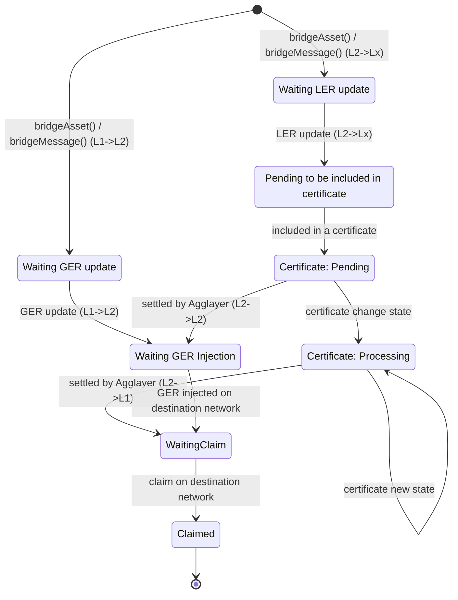
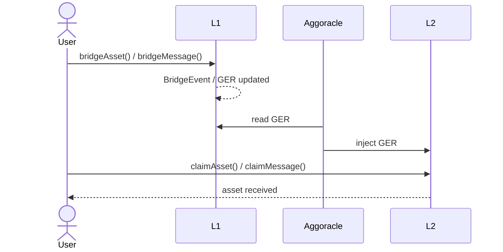
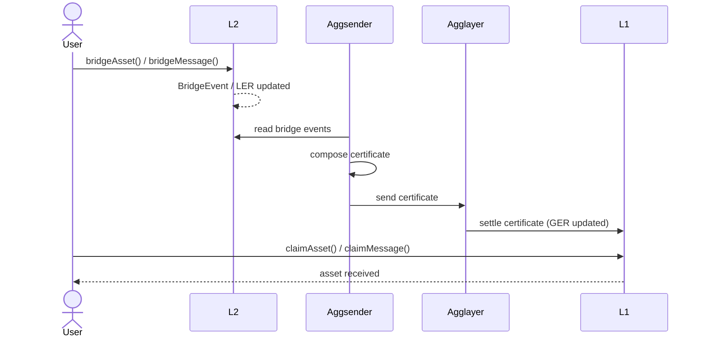
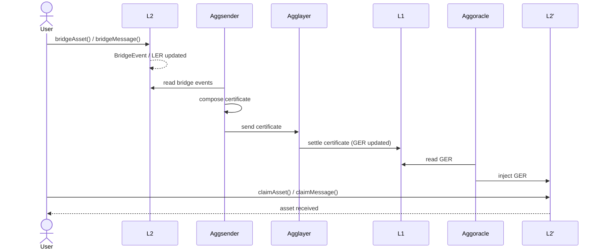

# Description
This project is to describre the work into aggkit-proxy component

## Generic Bridge states

A bridge (deposit) goes through the following states, from its creation with `bridgeAsset` or `bridgeMessage` (both are supervised) until it is claimed on the destination network:

| State | Description |
| --- | --- |
| Pending to be included in certificate | The bridge has been created (`BridgeEvent` emitted) but is not yet part of any certificate. |
| Certificate: Pending | The bridge is included in a certificate that has been sent to the Agglayer and is awaiting settlement. |
| Certificate: InError | The certificate containing the bridge failed. The bridge must be included in a new certificate (back to Pending). |
| Certificate: Settled | The certificate containing the bridge has been settled by the Agglayer. |
| WaitingClaim | The Global Exit Root that includes the bridge has been injected on the destination network, so the bridge is ready to be claimed. |
| Claimed | The bridge has been claimed on the destination network. |

## L1->L2 Bridge states 
The bridge don't need to be part of certificate to the state is: 

# L1 -> L2 Sequence diagram

# L2 -> L1 Sequence diagram

# L2 -> L2 Sequence diagram

# How obtain status
- User provide TxHash -> `[ TxBlockNumber, GER/GERBlockNumber, bridgeEvent , Type:L1->L2, L2->L1, L2->L2]`
  - Tx BlockNumber 
  - L1: get event `BridgeEvent`
  - Wait event `UpdateL1InfoTree` >=TxBlockNumber -> `GER` (maybe the call to `BridgeAsset`/`BridgeMessage` have `forceUpdateGlobalExitRoot=false`)

- Aggoracle injected[bridgeEvent.depositCount]: 
  - bridge: `GET /bridge/v1/injected-l1-info-leaf?network_id=X&leaf_index=N`

- L2: Certificate Agglayer[GER] -> [ certID, certStatus, SettlementTxHash]
  - from GER we can get the L2BlockNumber (need LER synchronized)
  - agglayer:GetLatestSettledCertificateHeader aka LS
    - GER <= LS.NewLocalExitRoot ? -> [certID, status: settled, SettlementTxHash]
    - GER >  LS.NewLocalExitRoot: GetLatestPendingCertificateHeader aka LP
      - GER <= LP.NewLocalExitRoot: -> [certID, status: LP.status ]
      - GER >  LS.NewLocalExitRoot -> [-, status: not include yet ]

# Data source
- Wait event `UpdateL1InfoTree`: 
- GER we can get the L2BlockNumber: we need a LER synchronized
   - ask to bridge?
   - have the bridgesyncer??

