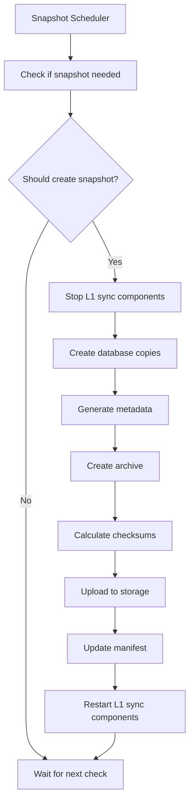

# L1 Snapshot Mechanism

## Overview

The L1 Snapshot Mechanism is designed to significantly speed up the initial synchronization of L1 components in the AggKit system by providing pre-built SQLite database snapshots. This mechanism allows new nodes to download a verified snapshot of the L1 state instead of performing a full sync from genesis.

## Problem Statement

Currently, when starting a new AggKit node, the L1 syncing components (`l1infotreesync`, `bridgesync`, `lastgersync`, `reorgdetector`) must sync from genesis block, which can take several hours or days depending on the network activity and RPC performance. This creates a significant barrier to entry for new participants in the network.

## Solution Architecture

### 1. Snapshot Components

The snapshot mechanism will include the following L1-related databases:

- **L1InfoTreeSync**: Contains L1 info tree leaves, rollup exit tree data, and verify batches information
- **BridgeSync (L1)**: Contains bridge events (deposits) and claim events from L1
- **LastGERSync**: Contains imported global exit root mappings
- **ReorgDetector (L1)**: Contains tracked L1 blocks for reorg detection

### 2. Snapshot Creation Process

#### 2.1 Automated Snapshot Generation



#### 2.2 Snapshot Metadata

Each snapshot will include:

```json
{
  "version": "1.0.0",
  "created_at": "2024-01-15T10:30:00Z",
  "block_height": 15000000,
  "block_hash": "0x1234...",
  "components": {
    "l1infotreesync": {
      "last_processed_block": 15000000,
      "l1_info_tree_root": "0xabcd...",
      "rollup_exit_tree_root": "0xefgh...",
      "leaf_count": 50000
    },
    "bridgesync_l1": {
      "last_processed_block": 15000000,
      "bridge_count": 1000,
      "claim_count": 500
    },
    "lastgersync": {
      "last_processed_block": 15000000,
      "ger_count": 2000
    },
    "reorgdetector_l1": {
      "last_processed_block": 15000000,
      "tracked_blocks": 1000
    }
  },
  "checksums": {
    "sha256": "abc123...",
    "sha512": "def456..."
  },
  "size_bytes": 104857600,
  "compression": "gzip"
}
```

### 3. Snapshot Distribution

#### 3.1 Storage Strategy

Snapshots will be distributed through multiple channels for redundancy:

1. **Primary**: GitHub Releases in the official AggKit repository
2. **Secondary**: CDN/Object Storage (AWS S3, Cloudflare R2)
3. **Tertiary**: IPFS for decentralized distribution

#### 3.2 File Structure

```
snapshots/
├── v1.0.0/
│   ├── l1-snapshot-15000000.tar.gz
│   ├── l1-snapshot-15000000.sha256
│   ├── l1-snapshot-15000000.sha512
│   └── manifest.json
├── latest/
│   ├── l1-snapshot-latest.tar.gz
│   ├── l1-snapshot-latest.sha256
│   └── manifest.json
└── index.json
```

### 4. CLI Integration

#### 4.1 New Commands

```bash
# Download and apply latest snapshot
aggkit snapshot download [--output-dir /path/to/db] [--verify]

# Download specific snapshot by block height
aggkit snapshot download --block-height 15000000 [--verify]

# List available snapshots
aggkit snapshot list

# Verify existing snapshot
aggkit snapshot verify /path/to/snapshot.tar.gz

# Create snapshot (admin only)
aggkit snapshot create --output /path/to/snapshot.tar.gz
```

#### 4.2 Integration with Run Command

```bash
# Use snapshot for initial sync
aggkit run --use-snapshot --snapshot-block-height 15000000

# Verify snapshot before using
aggkit run --use-snapshot --verify-snapshot
```

### 5. Snapshot Validation

#### 5.1 Integrity Checks

1. **File Integrity**: Verify checksums (SHA256, SHA512)
2. **Database Integrity**: Check SQLite database integrity
3. **Schema Validation**: Verify database schema matches expected version
4. **Data Consistency**: Validate foreign key relationships

#### 5.2 Merkle Tree Validation

```go
// Pseudo-code for tree validation
func ValidateL1InfoTree(db *sql.DB, expectedRoot common.Hash) error {
    // Rebuild tree from leaves
    tree := NewAppendOnlyTree(db, "l1info")

    // Get all leaves
    leaves := getAllLeaves(db)

    // Rebuild tree structure
    for _, leaf := range leaves {
        tree.AddLeaf(leaf.Hash)
    }

    // Compare with expected root
    actualRoot := tree.GetLastRoot()
    if actualRoot.Hash != expectedRoot {
        return fmt.Errorf("tree root mismatch: expected %s, got %s",
                         expectedRoot, actualRoot.Hash)
    }

    return nil
}
```

#### 5.3 Block Chain Validation

```go
// Pseudo-code for block chain validation
func ValidateBlockChain(db *sql.DB, expectedLastBlock uint64) error {
    // Verify block continuity
    blocks := getBlocksOrdered(db)

    for i := 1; i < len(blocks); i++ {
        if blocks[i].Num != blocks[i-1].Num+1 {
            return fmt.Errorf("block discontinuity at %d", blocks[i].Num)
        }
    }

    // Verify last block
    if blocks[len(blocks)-1].Num != expectedLastBlock {
        return fmt.Errorf("last block mismatch: expected %d, got %d",
                         expectedLastBlock, blocks[len(blocks)-1].Num)
    }

    return nil
}
```

### 6. Implementation Details

#### 6.1 Snapshot Creation Service

```go
type SnapshotService struct {
    config     SnapshotConfig
    storage    SnapshotStorage
    validator  SnapshotValidator
    logger     *log.Logger
}

type SnapshotConfig struct {
    SnapshotInterval    time.Duration
    MinBlockHeight      uint64
    MaxSnapshotAge      time.Duration
    CompressionLevel    int
    StorageBackends     []string
}

func (s *SnapshotService) CreateSnapshot(ctx context.Context) (*Snapshot, error) {
    // 1. Stop L1 sync components gracefully
    // 2. Create database copies
    // 3. Generate metadata
    // 4. Create compressed archive
    // 5. Calculate checksums
    // 6. Upload to storage backends
    // 7. Update manifest
    // 8. Restart L1 sync components
}
```

#### 6.2 Snapshot Download Client

```go
type SnapshotClient struct {
    config     SnapshotClientConfig
    storage    SnapshotStorage
    validator  SnapshotValidator
    logger     *log.Logger
}

type SnapshotClientConfig struct {
    DownloadTimeout     time.Duration
    RetryAttempts       int
    RetryDelay          time.Duration
    VerifyChecksums     bool
    VerifyData          bool
}

func (c *SnapshotClient) DownloadSnapshot(ctx context.Context,
    blockHeight uint64, outputDir string) error {
    // 1. Fetch manifest
    // 2. Download snapshot file
    // 3. Verify checksums
    // 4. Extract archive
    // 5. Validate database integrity
    // 6. Verify data consistency
    // 7. Replace existing databases
}
```

#### 6.3 CLI Commands Implementation

```go
var snapshotCommands = []*cli.Command{
    {
        Name:  "snapshot",
        Usage: "Manage L1 snapshots",
        Subcommands: []*cli.Command{
            {
                Name:  "download",
                Usage: "Download and apply L1 snapshot",
                Flags: []cli.Flag{
                    &cli.Uint64Flag{
                        Name:  "block-height",
                        Usage: "Specific block height to download",
                    },
                    &cli.StringFlag{
                        Name:  "output-dir",
                        Usage: "Output directory for databases",
                    },
                    &cli.BoolFlag{
                        Name:  "verify",
                        Usage: "Verify snapshot integrity",
                    },
                },
                Action: downloadSnapshotCmd,
            },
            {
                Name:  "list",
                Usage: "List available snapshots",
                Action: listSnapshotsCmd,
            },
            {
                Name:  "verify",
                Usage: "Verify snapshot integrity",
                Action: verifySnapshotCmd,
            },
        },
    },
}
```

### 7. Security Considerations

#### 7.1 Cryptographic Verification

- **Checksums**: SHA256 and SHA512 for file integrity
- **Signatures**: GPG signatures for snapshot authenticity
- **Chain Verification**: Cross-reference with on-chain data

#### 7.2 Access Control

- **Read Access**: Public access to snapshots
- **Write Access**: Restricted to authorized maintainers
- **Audit Trail**: Log all snapshot operations

### 8. Performance Considerations

#### 8.1 Snapshot Size Optimization

- **Compression**: Use gzip with optimal compression level
- **Incremental Snapshots**: Only include changes since last snapshot
- **Selective Data**: Exclude unnecessary historical data

#### 8.2 Download Performance

- **Resumable Downloads**: Support partial downloads and resume
- **Parallel Downloads**: Download from multiple sources
- **Caching**: Cache manifest and metadata locally

### 9. Monitoring and Metrics

#### 9.1 Snapshot Health Metrics

- Snapshot creation frequency
- Snapshot download success rate
- Snapshot validation success rate
- Snapshot age distribution

#### 9.2 Performance Metrics

- Snapshot creation time
- Snapshot download time
- Snapshot verification time
- Storage usage

### 10. Rollout Plan

#### 10.1 Phase 1: Development and Testing

1. Implement snapshot creation service
2. Implement snapshot download client
3. Add CLI commands
4. Create comprehensive tests
5. Test with small datasets

#### 10.2 Phase 2: Beta Release

1. Deploy snapshot service to testnet
2. Create initial snapshots
3. Test with community members
4. Gather feedback and iterate

#### 10.3 Phase 3: Production Release

1. Deploy to mainnet
2. Create regular snapshots
3. Update documentation
4. Monitor and optimize

### 11. Future Enhancements

#### 11.1 Advanced Features

- **Incremental Snapshots**: Only download changes since last snapshot
- **Selective Sync**: Choose which components to sync
- **Snapshot Pruning**: Automatically remove old snapshots
- **Cross-Chain Snapshots**: Support for multiple networks

#### 11.2 Integration Improvements

- **Kubernetes Operator**: Automated snapshot management
- **Prometheus Integration**: Detailed metrics and alerts
- **Web UI**: Visual snapshot management interface

## Conclusion

The L1 Snapshot Mechanism will significantly improve the user experience for new AggKit nodes by reducing initial sync time from hours/days to minutes. The implementation focuses on security, reliability, and ease of use while maintaining the integrity of the synced data.

The mechanism is designed to be extensible and can be enhanced with additional features as the ecosystem evolves.
