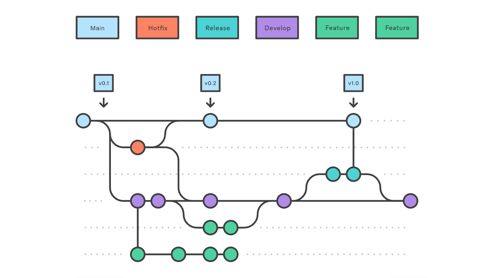

This document presents the Aggkit [Software release lifecycle](https://simple.wikipedia.org/wiki/Software_release_life_cycle). The Aggkit team has adopted a process grounded in industry-standard best practices to avoid reinventing the wheel and, more importantly, to prevent confusion among new developers and users. By adhering to these widely recognized practices, we ensure that anyone in the industry can intuitively understand and follow our internal procedures with minimal explanation.

## Versioning

The versioning process follows the standard [Semantic Versioning](https://semver.org/) to tag new versions

Summary 

1. MAJOR version when you make incompatible API changes
2. MINOR version when you add functionality in a backward compatible manner
3. PATCH version when you make backward compatible bug fixes

At this time the project is in development phase so refer to the [FAQ](https://semver.org/#faq) for the current versioning criteria:

### How should I deal with revisions in the 0.y.z initial development phase?

The simplest thing to do is start your initial development release at 0.1.0 and then increment the minor version for each subsequent release.

### How do I know when to release 1.0.0?

If your software is being used in production, it should probably already be 1.0.0. If you have a stable API on which users have come to depend, you should be 1.0.0. If you’re worrying a lot about backward compatibility, you should probably already be 1.0.0.

## Pre-Releases

Refer to the [Software release lifecycle](https://simple.wikipedia.org/wiki/Software_release_life_cycle) Wikipedia article for a definition and criteria this project is following regarding pre-releases.

## Release process

The release process is based on the [Gitflow workflow](https://www.atlassian.com/git/tutorials/comparing-workflows/gitflow-workflow) for managing the source code repository.

For a quick reference you can check https://cheatography.com/mikesac/cheat-sheets/gitflow/

As a quick reference this is the diagram of the branching cycle:

## FAQ

### Should I cherry pick commits made to a release branch while it’s still unmerged?

As stated by the Gitflow workflow, release branches should be short-lived and merged back to `main` and `develop` branches, but it can happen from time to time that `develop` branch needs a commit from a release branch before it’s released.

In that case, a cherry-pick commit can be merged into `develop` containing the desired changes, as they would have end-up in `develop` at some point in the future anyway.

### How do we manage several developments in parallel?

Sometimes there's a necessity to release a new stable version of the previous branch with certain features while simultaneously working on the next version. In that case, we'll maintain two release branches like `release/4.0.0` and `release/5.0.0`. These branches will evolve in parallel, but most of the changes from the lower release will need to be cherry-picked onto the newest release. Additionally, if any critical fix is made to the newest release, it should be back-ported to the older release.

### How to create a hotfix for an older release?

When a release branch is merged into `main` and `develop`, it is removed, and only the tag is left. To create a hotfix release, a new release branch will be created from the tag so the necessary fixes can be applied. Then follow the normal release cycle: create a new beta for the release, test it in all environments, then create the final tag and release it.

The fixes may need to be cherry-picked into any open release branches.

### Why we should not squash merge when merging a release branch to `main` or `develop` ?

This is opinionated but in general there’s quite a lot of downsides when squash merging release branches, see this response for some of them https://stackoverflow.com/questions/41139783/gitflow-should-i-squash-commits-when-merging-from-a-release-branch-into-master/41298098#41298098

Another big downside is that `main` and `develop` branch will distance more and more in terms of commits as time passes, making them totally different after some time.

## Reference

Comparison of popular branching strategies https://docs.aws.amazon.com/prescriptive-guidance/latest/choosing-git-branch-approach/git-branching-strategies.html
