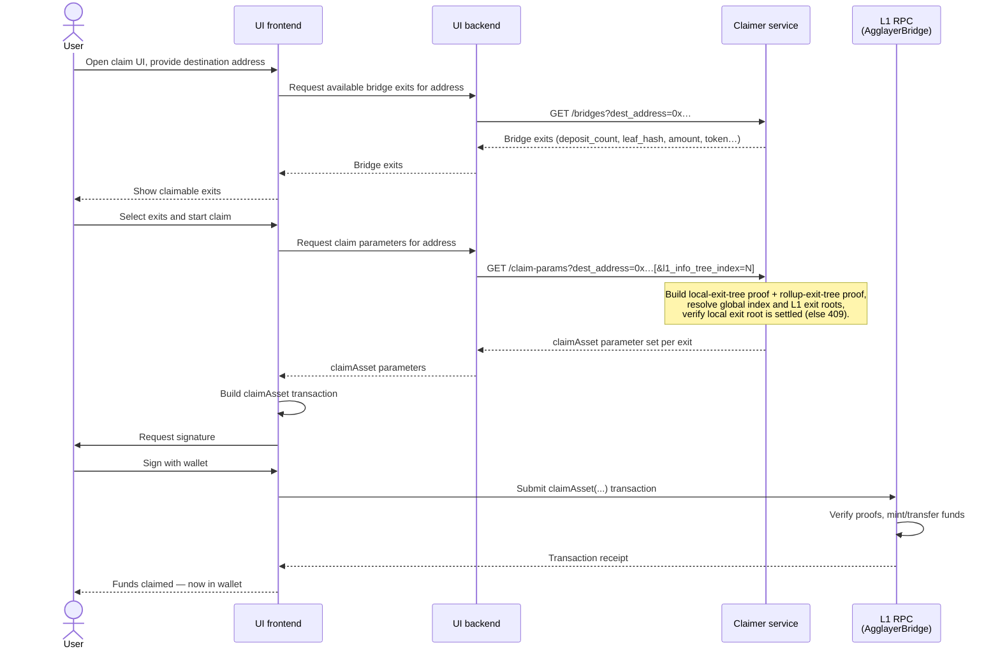

# Exit Certificate Claimer — Specification

## Purpose & Audience

This document specifies the end-to-end flow and the public contract of the
**exit certificate claimer**: the backend service that, given a destination address, returns the
bridge exits available for that address and the full set of parameters needed to call
[`AgglayerBridge.claimAsset`](https://github.com/agglayer/agglayer-contracts/blob/110bda5a03e70ee7331bc06407a8e79226d3e520/contracts/AgglayerBridge.sol#L537)
on L1.

Stakeholders:

- **The `@apps-team`** — implementing the UI (frontend/backend).
- **The `@team-agglayer-aggkit`** — implementing the exit certificate claimer, which acts as the
  kind of bridge service.

## Scenario

This tool exists to support **deprecating (shutting down) an L2 network** while ensuring its users
can still recover their funds.

1. **Move the funds from L2 to L1.** Before the network is shut down, we generate one **final exit
   certificate** for it and send it to *Agglayer*. This is done with the
   [`exit_certificate`](../exit_certificate) tool, which both generates the certificate and submits
   it to Agglayer.
2. **Wait for the certificate to be `Settled`.** Once the certificate reaches the `Settled` state on
   L1, the L2 network being closed is no longer needed and can be **stopped** — from this point on,
   all claim operations happen on L1.
3. **Expose the claim API.** With the network stopped, we launch the **exit certificate claimer**,
   which exposes an API that lets users recover the funds they held on the deprecated network.

The flow described in this document covers step 3: how a user goes from wanting to claim those funds
to having them in their wallet on L1.

## Scope

In scope:

- The claim flow from a user wanting to recover funds that were on the zkEVM until those funds land
  in their wallet on L1.
- The HTTP API the claimer service exposes and the data it returns.

Out of scope (handled by other actors):

- Generating and signing the exit certificate (done by the
  [`exit_certificate`](../exit_certificate) tool).
- Building, signing, and submitting the `claimAsset` transaction (done by the UI + the user's
  wallet). The claimer service is **read-only**: it never sends transactions.

## Actors

| Actor | Description |
| ----- | ----------- |
| **User** | The owner of the funds. Interacts with the UI and signs the L1 `claimAsset` transaction with their wallet. |
| **UI frontend** | Browser/app the user interacts with. Talks to the UI backend and to the user's wallet. |
| **UI backend** | The UI team's server. Orchestrates calls to the claimer service on behalf of the frontend. |
| **Claimer service** | This tool. Read-only HTTP service that lists bridge exits and assembles `claimAsset` parameters from the signed certificate and the exit-tree / L1 Info Tree databases. |
| **L1 RPC** | The L1 node endpoint. Hosts the `AgglayerBridge` contract where `claimAsset` is called, and is also the source the claimer uses to keep its L1 Info Tree DB in sync. |

## End-to-End Flow

From the user wanting to claim funds that were on the zkEVM until those funds are in their wallet
on L1.



## HTTP API

All endpoints are served under the base path **`/claimer/v1`** and respond with `application/json`.
The service is read-only: it never sends transactions.

Conventions:

- Addresses and hashes are `0x`-prefixed hex strings. Addresses are EIP-55 checksummed.
- Amounts and the global index are decimal strings (they can exceed 64-bit range).
- `metadata` is a `0x`-prefixed hex string (`"0x"` when empty).
- On error, the body is `{"error": "<message>"}` with the corresponding HTTP status code.

### `GET /health`

Liveness/readiness probe.

**Response — `200 OK`**

```json
{
  "status": "ok",
  "network_id": 1
}
```

| Field | Type | Description |
| ----- | ---- | ----------- |
| `status` | string | Service status. One of `ok` or `syncing` (see below). |
| `network_id` | number | The source network ID the claimer is serving. |

**`status` values:**

| Value | Meaning |
| ----- | ------- |
| `ok` | The service is fully ready to serve claim requests. |
| `syncing` | The service is still syncing the L1 Info Tree from L1; claim parameters may not yet be available. |

### `GET /bridges`

Lists the certificate bridge exits destined to a given address, each enriched with its
`deposit_count` (the exit-tree leaf index) and `leaf_hash`. Use this to show the user what is
claimable before fetching the heavier proof material.

**Query parameters:**

| Name | Required | Type | Description |
| ---- | -------- | ---- | ----------- |
| `dest_address` | yes | hex address | The destination address to list bridge exits for. |

**Response — `200 OK`**

```json
{
  "network_id": 1,
  "destination_address": "0xAbC0000000000000000000000000000000000001",
  "bridges": [
    {
      "leaf_type": 0,
      "origin_network": 1,
      "origin_token_address": "0x0000000000000000000000000000000000000000",
      "destination_network": 0,
      "destination_address": "0xAbC0000000000000000000000000000000000001",
      "amount": "1000000000000000000",
      "metadata": "0x",
      "deposit_count": 42
    }
  ]
}
```

| Field | Type | Description |
| ----- | ---- | ----------- |
| `network_id` | number | Source network ID. |
| `destination_address` | hex address | Echo of the requested address. |
| `bridges[]` | array | One entry per matching bridge exit. |
| `bridges[].leaf_type` | number | Always `0` (asset / Transfer). |
| `bridges[].origin_network` | number | Network the token originates from. |
| `bridges[].origin_token_address` | hex address | Origin token contract address. |
| `bridges[].destination_network` | number | Destination network ID. |
| `bridges[].destination_address` | hex address | Destination (recipient) address. |
| `bridges[].amount` | decimal string | Transferred amount. |
| `bridges[].metadata` | hex string | Bridge metadata (`"0x"` when empty). |
| `bridges[].deposit_count` | number | Exit-tree leaf index of this exit. |

### `GET /claim-params`

Returns the full `AgglayerBridge.claimAsset` argument set for the bridge exits destined to a given
address. This assembles the local-exit-tree proof, the rollup-exit-tree proof, the global index, and
the L1 exit roots, anchored to the latest L1 Info Tree leaf.

**Query parameters:**

| Name | Required | Type | Description |
| ---- | -------- | ---- | ----------- |
| `dest_address` | yes | hex address | The destination address to build claim parameters for. |
| `deposit_count` | no | number (uint32) | Select a single pending deposit by its exit-tree leaf index (an address may have more than one pending deposit). When omitted, all matching exits are returned. |

**Response — `200 OK`**

```json
{
  "network_id": 1,
  "destination_address": "0xAbC0000000000000000000000000000000000001",
  "claims": [
    {
      "smt_proof_local_exit_root": ["0x…", "… 32 sibling hashes …"],
      "smt_proof_rollup_exit_root": ["0x…", "… 32 sibling hashes …"],
      "global_index": "18446744073709551658",
      "mainnet_exit_root": "0xaaa…",
      "rollup_exit_root": "0xbbb…",
      "origin_network": 1,
      "origin_token_address": "0x0000000000000000000000000000000000000000",
      "destination_network": 0,
      "destination_address": "0xAbC0000000000000000000000000000000000001",
      "amount": "1000000000000000000",
      "metadata": "0x",
      "leaf_type": 0,
      "deposit_count": 42,
      "l1_info_tree_index": 7
    }
  ]
}
```

Each entry in `claims[]` maps directly to the `claimAsset` call. The first 11 fields are the
contract arguments; the last three are context useful for callers and debugging.

| Field | Type | `claimAsset` arg? | Description |
| ----- | ---- | ----------------- | ----------- |
| `smt_proof_local_exit_root` | string[32] | yes | Merkle proof of the leaf against `new_local_exit_root`. |
| `smt_proof_rollup_exit_root` | string[32] | yes | Merkle proof against the rollup exit root. |
| `global_index` | decimal string | yes | Global index for `(network_id, deposit_count)`. |
| `mainnet_exit_root` | hex hash | yes | Mainnet exit root of the latest L1 Info Tree leaf. |
| `rollup_exit_root` | hex hash | yes | Rollup exit root of the latest L1 Info Tree leaf. |
| `origin_network` | number | yes | Network the token originates from. |
| `origin_token_address` | hex address | yes | Origin token contract address. |
| `destination_network` | number | yes | Destination network ID. |
| `destination_address` | hex address | yes | Destination (recipient) address. |
| `amount` | decimal string | yes | Transferred amount. |
| `metadata` | hex string | yes | Bridge metadata (`"0x"` when empty). |
| `leaf_type` | number | no (context) | `0` = asset, `1` = message. |
| `deposit_count` | number | no (context) | Exit-tree leaf index. |
| `l1_info_tree_index` | number | no (context) | The latest L1 Info Tree leaf the proofs are anchored to. |

### Error responses

| Status | When |
| ------ | ---- |
| `400 Bad Request` | Missing or malformed `dest_address`, or malformed `deposit_count`. |
| `409 Conflict` | The certificate's local exit root is not yet settled in the latest L1 Info Tree leaf. |
| `500 Internal Server Error` | Unexpected failure assembling the response (DB read, proof generation, etc.). |

Error body:

```json
{ "error": "dest_address query parameter is required" }
```

## Open Points / TODO

*To be defined:*

- Error model and status codes beyond the current `400` / `409` / `500`.
- Transaction-status feedback loop (does the UI poll L1, or does the claimer help?).
- UI: how to know whether a bridge exit has already been claimed on L1.

