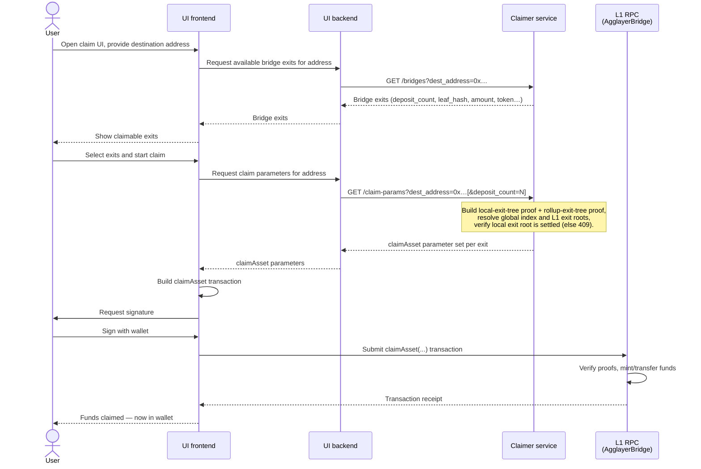

# Exit Certificate Claimer — Specification

## Purpose & Audience

This document specifies the end-to-end flow and the public contract of the
**exit certificate claimer**: the backend service that, given a destination address, returns the
bridge exits available for that address and the full set of parameters needed to call
[`AgglayerBridge.claimAsset`](https://github.com/agglayer/agglayer-contracts/blob/110bda5a03e70ee7331bc06407a8e79226d3e520/contracts/AgglayerBridge.sol#L537)
(or `AgglayerBridge.claimMessage`, for `Message` exits) on L1.

Stakeholders:

- **The `@apps-team`** — implementing the UI (frontend/backend).
- **The `@team-agglayer-aggkit`** — implementing the exit certificate claimer, which acts as the
  kind of bridge service.

## Scenario

This tool exists to support **deprecating (shutting down) an L2 network** while ensuring its users
can still recover their funds.

1. **Move the funds from L2 to L1.** Before the network is shut down, we generate one **final exit
   certificate** for it and send it to *Agglayer*. This is done with the
   [`exit_certificate`](../exit_certificate) tool, which both generates the certificate and submits
   it to Agglayer.
2. **Wait for the certificate to be `Settled`.** Once the certificate reaches the `Settled` state on
   L1, the L2 network being closed is no longer needed and can be **stopped** — from this point on,
   all claim operations happen on L1.
3. **Expose the claim API.** With the network stopped, we launch the **exit certificate claimer**,
   which exposes an API that lets users recover the funds they held on the deprecated network.

The flow described in this document covers step 3: how a user goes from wanting to claim those funds
to having them in their wallet on L1.

## Scope

In scope:

- The claim flow from a user wanting to recover funds that were on the zkEVM until those funds land
  in their wallet on L1.
- The HTTP API the claimer service exposes and the data it returns.

Out of scope (handled by other actors):

- Generating and signing the exit certificate (done by the
  [`exit_certificate`](../exit_certificate) tool).
- Building, signing, and submitting the `claimAsset` transaction (done by the UI + the user's
  wallet). The claimer service is **read-only**: it never sends transactions.

## Actors

| Actor | Description |
| ----- | ----------- |
| **User** | The owner of the funds. Interacts with the UI and signs the L1 `claimAsset` transaction with their wallet. |
| **UI frontend** | Browser/app the user interacts with. Talks to the UI backend and to the user's wallet. |
| **UI backend** | The UI team's server. Orchestrates calls to the claimer service on behalf of the frontend. |
| **Claimer service** | This tool. Read-only HTTP service that lists bridge exits and assembles `claimAsset` parameters from the signed certificate and the exit-tree / L1 Info Tree databases. |
| **L1 RPC** | The L1 node endpoint. Hosts the `AgglayerBridge` contract where `claimAsset` is called, and is also the source the claimer uses to keep its L1 Info Tree DB in sync. |

## End-to-End Flow

From the user wanting to claim funds that were on the zkEVM until those funds are in their wallet
on L1.


```mermaid
sequenceDiagram
    actor User
    participant FE as UI frontend
    participant BE as UI backend
    participant CL as Claimer service
    participant L1 as L1 RPC<br/>(AgglayerBridge)

    User->>FE: Open claim UI, provide destination address
    FE->>BE: Request available bridge exits for address
    BE->>CL: GET /bridges?dest_address=0x…
    CL-->>BE: Bridge exits (deposit_count, leaf_hash, amount, token…)
    BE-->>FE: Bridge exits
    FE-->>User: Show claimable exits

    User->>FE: Select exits and start claim
    FE->>BE: Request claim parameters for address
    BE->>CL: GET /claim-params?dest_address=0x…[&deposit_count=N]
    Note over CL: Build local-exit-tree proof + rollup-exit-tree proof,<br/>resolve global index and L1 exit roots,<br/>verify local exit root is settled (else 409).
    CL-->>BE: claimAsset parameter set per exit
    BE-->>FE: claimAsset parameters

    FE->>FE: Build claimAsset transaction
    FE->>User: Request signature
    User->>FE: Sign with wallet
    FE->>L1: Submit claimAsset(...) transaction
    L1->>L1: Verify proofs, mint/transfer funds
    L1-->>FE: Transaction receipt
    FE-->>User: Funds claimed — now in wallet
```

## HTTP API

The API is versioned in the path. This claimer serves two major versions side by side, both
responding with `application/json`:

| Base path | Serves | Lookup |
| --------- | ------ | ------ |
| **`/claimer/v1`** | `Transfer` exits only (`claimAsset`) | `dest_address`: the exit's destination address |
| **`/claimer/v2`** | `Transfer` and `Message` exits (`claimAsset` / `claimMessage`) | `address`: the exit's destination address or, for a `Message` exit of a configured message route, its beneficiary |

The service is read-only: it never sends transactions.

### API versioning

- The major version is the `v<N>` of the base path. **A new major version is only added for a breaking
  change**: removing or renaming a field, a parameter or an endpoint, changing the type or meaning of
  a field, or returning entries an existing client cannot handle (which is why `Message` exits, that
  need `claimMessage`, are only in v2).
- Within a major version, changes are **additive only**: new optional query parameters, new fields in
  a response, new endpoints. Clients must ignore fields they do not know.
- When a new major version is added, **the previous one keeps being served for at least one release**
  of the claimer, so clients and claimers can be upgraded independently. Removing a version is
  announced in the release notes of the release before.
- Discovery:
  - `GET /claimer/v1/health` returns `api_versions`, the list of major versions the claimer serves
    (e.g. `[1, 2]`). A claimer older than this policy does not return the field: treat its absence as
    `[1]`.
  - Every v2 response, errors included, carries `api_version: 2`.
- The responses of both versions are pinned by golden files
  ([`service/testdata/api/`](service/testdata/api), checked by `TestAPIGolden`); `requests.json` there
  maps each file to its request and HTTP status. API clients can use them as contract fixtures.

The sections below describe **v1** first, then [**v2**](#api-v2).

## API v1 (`/claimer/v1`)

Conventions:

- Addresses and hashes are `0x`-prefixed hex strings. Addresses are EIP-55 checksummed.
- Amounts and the global index are decimal strings (they can exceed 64-bit range).
- `metadata` is a `0x`-prefixed hex string (`"0x"` when empty).
- On error, the body is `{"error": "<message>"}` with the corresponding HTTP status code.

### `GET /health`

Liveness/readiness probe.

**Response — `200 OK`**

```json
{
  "status": "ok",
  "network_id": 1,
  "version": {
    "version": "v0.1.0",
    "git_rev": "abc1234",
    "git_branch": "feature/exit-certificate-tool",
    "build_date": "Mon, 30 Jun 2026 10:00:00 +0200",
    "go_version": "go1.22.0",
    "os": "linux",
    "arch": "amd64"
  },
  "api_versions": [1, 2]
}
```

| Field | Type | Description |
| ----- | ---- | ----------- |
| `status` | string | Always `ok`. The HTTP server only starts after the L1 Info Tree has been synced up to the certificate's settlement GER, so a reachable endpoint is always ready to serve claim requests. |
| `network_id` | number | The source network ID the claimer is serving. |
| `version` | object | Build/version info (same fields the exit_certificate tool prints in its startup banner): `version`, `git_rev`, `git_branch`, `build_date`, `go_version`, `os`, `arch`. Populated at build time via ldflags. |
| `api_versions` | number[] | Major API versions this claimer serves (see [API versioning](#api-versioning)). Absent in claimers that only serve v1. |

### `GET /bridges`

Lists the certificate's `Transfer` bridge exits destined to a given address, each enriched with its
`deposit_count` (the exit-tree leaf index). `Message` exits are never returned by v1. Use this to show the user what is
claimable before fetching the heavier proof material.

**Query parameters:**

| Name | Required | Type | Description |
| ---- | -------- | ---- | ----------- |
| `dest_address` | yes | hex address | The destination address to list bridge exits for. |

**Response — `200 OK`**

```json
{
  "network_id": 1,
  "destination_address": "0xAbC0000000000000000000000000000000000001",
  "bridges": [
    {
      "leaf_type": 0,
      "origin_network": 1,
      "origin_token_address": "0x0000000000000000000000000000000000000000",
      "destination_network": 0,
      "destination_address": "0xAbC0000000000000000000000000000000000001",
      "amount": "1000000000000000000",
      "metadata": "0x",
      "deposit_count": 42
    }
  ]
}
```

| Field | Type | Description |
| ----- | ---- | ----------- |
| `network_id` | number | Source network ID. |
| `destination_address` | hex address | Echo of the requested address. |
| `bridges[]` | array | One entry per matching bridge exit. |
| `bridges[].leaf_type` | number | Always `0` (asset / Transfer): v1 never returns `Message` exits. |
| `bridges[].origin_network` | number | Network the token originates from. |
| `bridges[].origin_token_address` | hex address | Origin token contract address. |
| `bridges[].destination_network` | number | Destination network ID. |
| `bridges[].destination_address` | hex address | Destination (recipient) address. |
| `bridges[].amount` | decimal string | Transferred amount. |
| `bridges[].metadata` | hex string | For a certificate exit, the **keccak256 hash** of the bridge metadata (what the certificate carries); for a pending pre-certificate bridge, the raw bridge metadata. The raw metadata a claim needs is always in `/claim-params`. |
| `bridges[].deposit_count` | number | Exit-tree leaf index of this exit. |

When the claimer is given the exit_certificate PENDING_CLAIMS step output (`pendingBridgesPath`), `bridges`
also includes, after the certificate's exits, the L2→L1 assets emitted before the certificate that were
unclaimed on L1 when that step ran. Their `metadata` is the raw bridge metadata.

### `GET /claim-params`

Returns the full `AgglayerBridge.claimAsset` argument set for the `Transfer` bridge exits destined to a
given address. This assembles the local-exit-tree proof, the rollup-exit-tree proof, the global index, and
the L1 exit roots, anchored to the latest L1 Info Tree leaf.

**Query parameters:**

| Name | Required | Type | Description |
| ---- | -------- | ---- | ----------- |
| `dest_address` | yes | hex address | The destination address to build claim parameters for. |
| `deposit_count` | no | number (uint32) | Select a single pending deposit by its exit-tree leaf index (an address may have more than one pending deposit). When omitted, all matching exits are returned. |

**Response — `200 OK`**

```json
{
  "network_id": 1,
  "destination_address": "0xAbC0000000000000000000000000000000000001",
  "claims": [
    {
      "smt_proof_local_exit_root": ["0x…", "… 32 sibling hashes …"],
      "smt_proof_rollup_exit_root": ["0x…", "… 32 sibling hashes …"],
      "global_index": "18446744073709551658",
      "mainnet_exit_root": "0xaaa…",
      "rollup_exit_root": "0xbbb…",
      "origin_network": 1,
      "origin_token_address": "0x0000000000000000000000000000000000000000",
      "destination_network": 0,
      "destination_address": "0xAbC0000000000000000000000000000000000001",
      "amount": "1000000000000000000",
      "metadata": "0x",
      "leaf_type": 0,
      "deposit_count": 42,
      "l1_info_tree_index": 7
    }
  ]
}
```

Each entry in `claims[]` maps directly to the `claimAsset` call. The first 11 fields are the
contract arguments; the last three are context useful for callers and debugging.

| Field | Type | `claimAsset` arg? | Description |
| ----- | ---- | ----------------- | ----------- |
| `smt_proof_local_exit_root` | string[32] | yes | Merkle proof of the leaf against `new_local_exit_root`. |
| `smt_proof_rollup_exit_root` | string[32] | yes | Merkle proof against the rollup exit root. |
| `global_index` | decimal string | yes | Global index for `(network_id, deposit_count)`. |
| `mainnet_exit_root` | hex hash | yes | Mainnet exit root of the latest L1 Info Tree leaf. |
| `rollup_exit_root` | hex hash | yes | Rollup exit root of the latest L1 Info Tree leaf. |
| `origin_network` | number | yes | Network the token originates from. |
| `origin_token_address` | hex address | yes | Origin token contract address. |
| `destination_network` | number | yes | Destination network ID. |
| `destination_address` | hex address | yes | Destination (recipient) address. |
| `amount` | decimal string | yes | Transferred amount. |
| `metadata` | hex string | yes | Bridge metadata (`"0x"` when empty). |
| `leaf_type` | number | no (context) | Always `0` (asset) in v1. |
| `deposit_count` | number | no (context) | Exit-tree leaf index. |
| `l1_info_tree_index` | number | no (context) | The L1 Info Tree leaf the proofs are anchored to. |

The same pending pre-certificate bridges are returned in `claims[]` (after the certificate's exits),
with proofs against the certificate's `new_local_exit_root` and the `global_index` of their own
`deposit_count`; `deposit_count` selects one of them as for any other exit.

### v1 error responses

| Status | When |
| ------ | ---- |
| `400 Bad Request` | Missing or malformed `dest_address`, or malformed `deposit_count`. |
| `409 Conflict` | The certificate's local exit root is not yet settled in the latest L1 Info Tree leaf. |
| `500 Internal Server Error` | Unexpected failure assembling the response (DB read, proof generation, etc.). |

Error body:

```json
{ "error": "dest_address query parameter is required" }
```

## API v2

Base path **`/claimer/v2`**. Same conventions as v1, plus:

- Every response, errors included, carries `"api_version": 2`.
- The lookup parameter is **`address`** (v1: `dest_address`) and the responses echo it as `address`
  (v1: `destination_address`).
- `Message` exits (`leaf_type` 1, created by `bridgeMessage`) are returned along with `Transfer` exits,
  and every entry says how to claim it (`claim_method`).
- `metadata` is **always the raw bridge metadata**, in `/bridges` and in `/claim-params`, for certificate
  exits and pending bridges alike, and every entry carries `metadata_hash`, its keccak256 hash. (In v1
  `/bridges`, `metadata` is the hash for a certificate exit and the raw bytes for a pending bridge.)

### Which exits belong to an address

An exit matches `address` when:

1. `address` is its `destination_address` (any exit), **or**
2. it is a `Message` exit of a configured **message route** and `address` is the **beneficiary** decoded
   from its metadata.

A `Message` exit is addressed to the contract that receives the message, not to the holder it pays.
A message route (claimer config `messageRoutes`, see the [README](README.md#message-routes)) names the
origin `(network, address)` and the destination `(network, address)` of a kind of message and the layout
of its metadata — for now only `address,uint256`, i.e. `abi.encode(address beneficiary, uint256 amount)`
— plus the token the destination contract pays with. For such an exit the response adds `beneficiary`,
`decoded_amount` and `display_token`, so a client needs no knowledge of the contracts involved.

A message whose route is not configured, or whose metadata is not exactly that layout, is matched by
rule 1 only and carries none of those three fields.

Example (Circle USDC recovery on zkEVM): `ZkMinterBurner` (network 1) sends a message to `L1Escrow`
(network 0) with `metadata = abi.encode(holder, amount)`. `GET /claimer/v2/bridges?address=<holder>`
returns it with `claim_method: "claimMessage"`, `beneficiary: <holder>`, `decoded_amount` in USDC base
units and `display_token` = L1 USDC. Calling `claimMessage` with the parameters of `/claim-params`
makes `L1Escrow` pay the holder. Anyone can send that transaction.

### `GET /claimer/v2/health`

Same as v1, plus `api_version`.

```json
{
  "api_version": 2,
  "status": "ok",
  "network_id": 1,
  "version": { "version": "v0.1.0", "git_rev": "abc1234", "git_branch": "…", "build_date": "…", "go_version": "…", "os": "linux", "arch": "amd64" },
  "api_versions": [1, 2]
}
```

### `GET /claimer/v2/bridges`

**Query parameters:**

| Name | Required | Type | Description |
| ---- | -------- | ---- | ----------- |
| `address` | yes | hex address | The address to list bridge exits for (see [Which exits belong to an address](#which-exits-belong-to-an-address)). |

**Response — `200 OK`**

```json
{
  "api_version": 2,
  "network_id": 1,
  "address": "0xAbC0000000000000000000000000000000000001",
  "bridges": [
    {
      "leaf_type": 0,
      "origin_network": 0,
      "origin_token_address": "0x0000000000000000000000000000000000000000",
      "destination_network": 0,
      "destination_address": "0xAbC0000000000000000000000000000000000001",
      "amount": "2000000000000000000",
      "metadata": "0x",
      "deposit_count": 42,
      "metadata_hash": "0xc5d2460186f7233c927e7db2dcc703c0e500b653ca82273b7bfad8045d85a470",
      "claim_method": "claimAsset"
    },
    {
      "leaf_type": 1,
      "origin_network": 1,
      "origin_token_address": "0xBDa0B27f93B2FD3f076725b89cf02e48609bC189",
      "destination_network": 0,
      "destination_address": "0x70E70e58ed7B1Cec0D8ef7464072ED8A52d755eB",
      "amount": "0",
      "metadata": "0x000000000000000000000000abc0000000000000000000000000000000000001000000000000000000000000000000000000000000000000000000004995e400",
      "deposit_count": 43,
      "metadata_hash": "0x…",
      "claim_method": "claimMessage",
      "beneficiary": "0xAbC0000000000000000000000000000000000001",
      "decoded_amount": "1234560000",
      "display_token": {
        "address": "0xA0b86991c6218b36c1d19D4a2e9Eb0cE3606eB48",
        "symbol": "USDC",
        "decimals": 6
      }
    }
  ]
}
```

| Field | Type | Description |
| ----- | ---- | ----------- |
| `api_version` | number | Always `2`. |
| `network_id` | number | Source network ID. |
| `address` | hex address | Echo of the requested address. |
| `bridges[]` | array | One entry per matching exit: the certificate's exits first, in certificate order, then the pending pre-certificate bridges. Empty array when there is none. |
| `bridges[].leaf_type` | number | `0` = asset (`Transfer`), `1` = message (`Message`). |
| `bridges[].origin_network`, `bridges[].origin_token_address` | number, hex address | For an asset, the token's origin network and address. For a message, the network and address of the contract that sent it. |
| `bridges[].destination_network`, `bridges[].destination_address` | number, hex address | Destination of the exit. For a message it is the contract that receives it, **not** the beneficiary. |
| `bridges[].amount` | decimal string | The leaf's amount: the tokens transferred for an asset; the ETH value attached to a message (usually `"0"`). For what a decoded message pays, see `decoded_amount`. |
| `bridges[].metadata` | hex string | The **raw** bridge metadata of the leaf (`"0x"` when empty), for certificate exits and pending bridges alike. For an ERC-20 asset it is `abi.encode(name, symbol, decimals)`; for a message, its payload. Differs from v1, where a certificate exit shows the hash here. |
| `bridges[].metadata_hash` | hex hash | keccak256 of `metadata`: the metadata slot of the exit-tree leaf, and what the certificate carries as the exit's metadata. Always present (the hash of the empty string for empty metadata). |
| `bridges[].deposit_count` | number | Exit-tree leaf index of this exit. Unique per exit: use it to select the exit in `/claim-params`. |
| `bridges[].claim_method` | string | `claimAsset` or `claimMessage`: the `AgglayerBridge` function that claims this exit. |
| `bridges[].beneficiary` | hex address | Only for a decoded message: the address the destination contract pays. |
| `bridges[].decoded_amount` | decimal string | Only for a decoded message: the amount paid to the beneficiary, in base units of `display_token`. |
| `bridges[].display_token` | object | Only for a decoded message: `address`, `symbol` and `decimals` of the token the beneficiary is paid in, as configured in the message route (not read on-chain). |

`beneficiary`, `decoded_amount` and `display_token` are present together or not at all.

### `GET /claimer/v2/claim-params`

**Query parameters:**

| Name | Required | Type | Description |
| ---- | -------- | ---- | ----------- |
| `address` | yes | hex address | Same selection as `/bridges`. |
| `deposit_count` | no | number (uint32) | Select a single exit by its exit-tree leaf index. When omitted, all the exits of the address are returned. An exit that does not belong to `address` is not returned (empty `claims`). |

**Response — `200 OK`**

```json
{
  "api_version": 2,
  "network_id": 1,
  "address": "0xAbC0000000000000000000000000000000000001",
  "claims": [
    {
      "smt_proof_local_exit_root": ["0x…", "… 32 sibling hashes …"],
      "smt_proof_rollup_exit_root": ["0x…", "… 32 sibling hashes …"],
      "global_index": "43",
      "mainnet_exit_root": "0xaaa…",
      "rollup_exit_root": "0xbbb…",
      "origin_network": 1,
      "origin_token_address": "0xBDa0B27f93B2FD3f076725b89cf02e48609bC189",
      "destination_network": 0,
      "destination_address": "0x70E70e58ed7B1Cec0D8ef7464072ED8A52d755eB",
      "amount": "0",
      "metadata": "0x000000000000000000000000abc0000000000000000000000000000000000001000000000000000000000000000000000000000000000000000000004995e400",
      "leaf_type": 1,
      "deposit_count": 43,
      "l1_info_tree_index": 7,
      "metadata_hash": "0x…",
      "claim_method": "claimMessage"
    }
  ]
}
```

Each entry has the same fields as in v1 plus `metadata_hash` and `claim_method`:

| Field | Type | Claim arg? | Description |
| ----- | ---- | ---------- | ----------- |
| the 11 claim arguments, `leaf_type`, `deposit_count`, `l1_info_tree_index` | | | As in v1 `/claim-params`. `metadata` is the raw bridge metadata (as it already was in v1): pass it unchanged to the contract. |
| `metadata_hash` | hex hash | no (context) | keccak256 of `metadata`; same value as in `/bridges` for the same exit. Not a contract argument. |
| `claim_method` | string | no | `claimAsset` or `claimMessage`: the function to call. |

`claimAsset` and `claimMessage` take the **same 11 arguments in the same order** — the first 11 fields
of the entry:

```solidity
function claimAsset  (bytes32[32] smtProofLocalExitRoot, bytes32[32] smtProofRollupExitRoot, uint256 globalIndex,
                      bytes32 mainnetExitRoot, bytes32 rollupExitRoot, uint32 originNetwork, address originTokenAddress,
                      uint32 destinationNetwork, address destinationAddress, uint256 amount, bytes metadata)
function claimMessage(bytes32[32] smtProofLocalExitRoot, bytes32[32] smtProofRollupExitRoot, uint256 globalIndex,
                      bytes32 mainnetExitRoot, bytes32 rollupExitRoot, uint32 originNetwork, address originAddress,
                      uint32 destinationNetwork, address destinationAddress, uint256 amount, bytes metadata)
```

so a client calls the function named by `claim_method` with them, unchanged. For a message,
`origin_token_address` is the sender contract (`originAddress`), `destination_address` is the receiving
contract, and `metadata` is the raw message payload. The proofs of a `Message` exit are built and
checked exactly as for an asset (against the certificate's `new_local_exit_root`, anchored to the
settlement L1 Info Tree leaf), and the `409` behaviour is the same.

### v2 error responses

Same statuses as v1, with `api_version` in the body:

| Status | When |
| ------ | ---- |
| `400 Bad Request` | Missing or malformed `address`, or malformed `deposit_count`. |
| `409 Conflict` | The certificate's local exit root is not yet settled in the L1 Info Tree leaf of its settlement. |
| `500 Internal Server Error` | Unexpected failure assembling the response (DB read, proof generation, etc.). |

```json
{ "api_version": 2, "error": "address query parameter is required" }
```

An address without exits, or a `deposit_count` that is not one of its exits, is not an error: `200`
with an empty `bridges` / `claims` array.

### Migrating a client from v1 to v2

1. Read `api_versions` from `GET /claimer/v1/health`; use v2 when it contains `2` (absent → v1 only).
2. Replace the `dest_address` parameter with `address`, and read `address` instead of
   `destination_address` at the top level of the responses.
3. Do not filter by `leaf_type`: call the function named by `claim_method` with the 11 arguments.
4. To show what a `Message` exit is worth, use `decoded_amount` + `display_token` when present; an
   undecoded message has no amount to show (its `amount` is the ETH value of the message).
5. Do not assume `destination_address == address`: for a decoded message it is the paying contract.
6. `bridges[].metadata` changes meaning for certificate exits: in v1 it is the keccak256 hash of the
   metadata, in v2 the raw metadata. A client that used the v1 value as a hash must read
   `metadata_hash` in v2. Pending bridges and `/claim-params` already carried the raw metadata in v1.

## Open Points / TODO

*To be defined:*

- Error model and status codes beyond the current `400` / `409` / `500`.
- Transaction-status feedback loop (does the UI poll L1, or does the claimer help?).
- UI: how to know whether a bridge exit has already been claimed on L1.

