# force_ger_update

Standalone CLI tool that guarantees the L1 Global Exit Root (GER) is updated at least every `X`
amount of time. It watches the L1 bridge/GER-manager contracts for `UpdateL1InfoTree` events and,
if none has happened organically within the configured window, sends a `bridgeMessage` transaction
with `forceUpdateGlobalExitRoot = true` to force one.

## 1. Why this tool exists

For aggchains running **OP-FEP**, there is a direct relation between *when the last L1 info root
was updated* and *what can be proven*.

Every GER update on L1 appends a leaf to the L1 info tree, and that leaf includes an **L1 block
hash**. The aggchain proof uses the block hash contained in the L1 info root to assert things that
happened on L1 — **including data availability (DA)**. Consequently, anything posted on L1 *after*
the last L1 info root update is not covered by any block hash inside an L1 info root and **cannot
be proven** until a new update lands.

If DA is posted after the last L1 info root update, the aggchain proof cannot attest to it, and
certificate progress stalls until an organic GER update happens. GER updates on L1 are otherwise
driven by unrelated activity (bridge traffic, other rollups' updates, etc.), so there is no bound
on how long that stall can last.

This tool removes that unbounded wait: it watches the last `UpdateL1InfoTree` event on L1 and, if
no update happens organically within a configured window `X`, it sends a `bridgeMessage`
transaction with `forceUpdateGlobalExitRoot = true`, forcing a new L1 info root that covers
everything (DA included) posted up to that point.

```mermaid
sequenceDiagram
    participant DA as DA layer / L1
    participant GER as L1 GER (info root)
    participant Proof as Aggchain proof

    Note over GER: last organic UpdateL1InfoTree
    DA->>DA: DA posted (block N)
    Note over Proof: no L1 info root covers block N yet
    Proof--xProof: cannot prove block N (unprovable window)
    rect rgb(80,30,30)
    Note over Proof: certificate progress stalled
    end
    Note over GER: elapsed since last update >= X
    GER->>GER: forced UpdateL1InfoTree (bridgeMessage, forceUpdateGlobalExitRoot=true)
    Note over Proof: new L1 info root covers block N
    Proof->>Proof: block N now provable
```



ASCII timeline of the same sequence:

```text
 t0                    t1                              t0+X                    t2
 |----------------------|-------------------------------|------------------------|
 last organic       DA posted on L1              max wait X elapsed      forced update lands
 GER update          (block N)                    with no organic         -> new L1 info root
                                                    GER update             covers block N
                     |<------ unprovable window ------->|<-- provable ---------->
```

## 2. Configuration reference

The tool reads a standalone TOML file (passed via `--cfg`) with a single `[ForceGERUpdate]` root
section, following the same config-render pipeline (viper + mapstructure + `CDK_`-prefixed env var
overrides) as the rest of aggkit. See [`example-config.toml`](./example-config.toml) for a complete,
runnable example.

### `[ForceGERUpdate]`

| Field | Type | Required / Default | Meaning |
| --- | --- | --- | --- |
| `L1URL` | string | **Required** | L1 HTTP RPC endpoint. |
| `L1WSURL` | string | Optional, default `""` | Optional L1 websocket RPC endpoint. When set, the monitor watches `UpdateL1InfoTree` via a live subscription (`WatchUpdateL1InfoTree`), with automatic re-subscribe on error. When unset (default), the monitor polls via `FilterLogs` every `EventPollInterval`. |
| `GlobalExitRootManagerAddr` | address | **Required**, must not be the zero address | L1 `PolygonZkEVMGlobalExitRootV2` (`agglayerger` binding) address. This is the contract the monitor scans/watches for `UpdateL1InfoTree` events. |
| `BridgeAddr` | address | **Required**, must not be the zero address | L1 `PolygonZkEVMBridgeV2` (`agglayerbridge` binding) address. This is the contract the forced `bridgeMessage` transaction is sent to. |
| `MaxTimeWithoutGERUpdate` | duration | **Required**, must be `> 0` (this is `X`) | Max time allowed to elapse since the last GER update before a forced update is sent. Compared against the tool's wall clock using the last GER update's L1 block timestamp. Example: `"1h"`. |
| `CheckInterval` | duration | **Required**, must be `> 0` (example `"10s"`) | How often the timer loop evaluates the elapsed time since the last GER update against `MaxTimeWithoutGERUpdate`. |
| `EventPollInterval` | duration | **Required in polling mode** (`L1WSURL` unset), must be `> 0`; ignored in watch mode (example `"15s"`) | Polling-mode only: how often to `FilterLogs` for new `UpdateL1InfoTree` events. |
| `InitialLookbackBlocks` | uint64 | Example `50000` | Bounds how far back (in `FilterLogsChunkSize`-sized chunks) the boot scan for the last `UpdateL1InfoTree` event looks. If no event is found within this window, the GER is treated as stale and the tool forces an update on the first tick. |
| `FilterLogsChunkSize` | uint64 | **Required**, must be `> 0` (example `10000`) | Block range used per `FilterLogs` call, both at boot and (in polling mode) for the watch loop. |
| `DestinationNetwork` | uint32 | **Required**, must not be `0` | `bridgeMessage` `destinationNetwork`. Must not be `0` (L1 itself) — the point of the message is to be a cross-network message that forces the GER update as a side effect. |
| `DestinationAddress` | address | Optional, default zero address | `bridgeMessage` `destinationAddress`. When left as the zero address, defaults to the sender address (the ethtxmanager `From()` address) at send time. |
| `DryRun` | bool | Default `false` | When `true`, logs the calldata that would be sent instead of actually sending the transaction. Useful for verifying wiring (RPC connectivity, boot-derived last-GER age) without spending gas. |
| `EthTxManager` | table | **Required** | Standard `zkevm-ethtx-manager` configuration used to send and track the forced-update transaction. See below. |

### `[ForceGERUpdate.EthTxManager]`

Same shape as every other `EthTxManager` section in aggkit (e.g. `AggOracle.EVMSender.EthTxManager`
in `config/default.go`).

| Field | Type | Meaning | Example/Default |
| --- | --- | --- | --- |
| `FrequencyToMonitorTxs` | duration | Frequency to monitor pending transactions. | `"1s"` |
| `WaitTxToBeMined` | duration | Wait time before retrying mining confirmation. | `"2s"` |
| `GetReceiptMaxTime` | duration | Max wait time for getting a transaction receipt. | `"250ms"` |
| `GetReceiptWaitInterval` | duration | Interval between retries for fetching the receipt. | `"1s"` |
| `PrivateKeys` | array of `SignerConfig` | List of signer configurations used to sign the forced-update transaction. See [signer examples](#signer-examples) below. | `[{Method="local", Path="/app/keystore/force_ger_update.keystore", Password="testonly"}]` |
| `ForcedGas` | uint64 | Fixed gas value override (`0` = no override). | `0` |
| `GasPriceMarginFactor` | float64 | Gas price multiplier margin. | `1` |
| `MaxGasPriceLimit` | uint64 | Maximum gas price allowed for sending. | `0` |
| `StoragePath` | string | Path to ethtxmanager's local sqlite database. | `"/tmp/aggkit/ethtxmanager-force_ger_update.sqlite"` |
| `ReadPendingL1Txs` | bool | Whether to read pending L1 transactions on start. | `false` |
| `SafeStatusL1NumberOfBlocks` | uint64 | Number of blocks to consider a transaction safe. | `5` |
| `FinalizedStatusL1NumberOfBlocks` | uint64 | Number of blocks to consider a transaction finalized. | `10` |
| `EstimateGasMaxRetries` | uint64 | Max retries for gas estimation. | `1` |

### `[ForceGERUpdate.EthTxManager.Etherman]`

| Field | Type | Meaning | Example/Default |
| --- | --- | --- | --- |
| `URL` | string | JSON-RPC URL used by ethtxmanager to send/track the transaction. Typically the same as `L1URL`. | `"http://localhost:8545"` |
| `MultiGasProvider` | bool | Use multiple gas providers if `true`. | `false` |
| `L1ChainID` | uint64 | Chain ID of the network transactions are sent to. If `0`, it is resolved automatically at runtime. | `1337` |
| `HTTPHeaders` | array | Custom HTTP headers to add to RPC calls. | `[]` |

### Signer examples

`PrivateKeys` entries use `signertypes.SignerConfig` from
[`go_signer`](https://github.com/agglayer/go_signer) — the same signer type used across aggkit
(e.g. aggsender's `AggsenderPrivateKey`). Set `Method` to select the backend:

**Local keystore:**

```toml
PrivateKeys = [
    { Method = "local", Path = "/app/keystore/force_ger_update.keystore", Password = "testonly" },
]
```

**Google Cloud KMS (GCP):**

```toml
PrivateKeys = [
    { Method = "GCP", KeyName = "projects/your-prj-name/locations/your_location/keyRings/name_of_your_keyring/cryptoKeys/key-name/cryptoKeyVersions/version" },
]
```

**Amazon Web Services KMS (AWS):** the key type must be `ECC_SECG_P256K1`.

```toml
PrivateKeys = [
    { Method = "AWS", KeyName = "a47c263b-6575-4835-8721-af0bbb97XXXX" },
]
```

See [`docs/common_config.md`](../../docs/common_config.md) for the full `SignerConfig` reference
(all fields, all supported methods).

## 3. How to run

Build from the repo root:

```bash
make build-force_ger_update
```

This writes the binary to `target/force_ger_update`.

Run it against a config file:

```bash
./target/force_ger_update --cfg tools/force_ger_update/example-config.toml
```

Copy [`example-config.toml`](./example-config.toml) and fill in your own `L1URL`,
`GlobalExitRootManagerAddr`, `BridgeAddr`, `DestinationNetwork`, and `PrivateKeys` before running
against a real network.

### Dry-run mode

Set `DryRun = true` in `[ForceGERUpdate]` to log the calldata that would be sent instead of
actually broadcasting the transaction. This is useful to verify RPC connectivity and see the
boot-derived age of the last GER update before wiring in real funded keys.

### Docker image

The binary is shipped inside the main aggkit Docker image at `/usr/local/bin/force_ger_update`
(see the `COPY --from=builder` line in the repo's `Dockerfile`). The image's `ENTRYPOINT` is the
`aggkit` binary, so run the tool by overriding the entrypoint:

```bash
docker run --rm -v /path/to/config:/app/config --entrypoint force_ger_update aggkit:local \
    --cfg /app/config/force_ger_update.toml
```

## 4. How to test

**Tier 1 — simulated backend (unit + integration on `go-ethereum`'s simulated chain):**

```bash
go test -race -run TestForceGERUpdate ./tools/force_ger_update/...
```

**Tier 2 — real-network end-to-end (docker-compose environment), isolated:**

```bash
make test-e2e-force_ger_update
```

which is equivalent to:

```bash
RUN_FORCE_GER_UPDATE_E2E=true E2E_SKIP_POSTTEST_BRIDGE_CHECK=true \
    go test -v -timeout 30m -run TestForceGERUpdateE2E ./test/e2e/...
```

The Tier-2 test exercises the built binary against a live docker-compose environment and proves
the tool actually forces a GER update on a real network end to end.

**Why it's gated behind two env vars, and why it runs on its own CI job:** forcing a GER update is,
by design, disruptive to the shared `op-pp` e2e environment's state. `test/e2e/testmain_test.go`'s
`TestMain` runs a post-test L1<->L2 bridge health check after the whole `./test/e2e/...` suite
finishes, and a GER-manipulating test can leave the L2->L1 settlement flow unable to complete —
failing that shared check even though `TestForceGERUpdateE2E`'s own assertions passed (the same
reason `test/e2e/removeger_test.go`'s remove-GER scenarios are skipped by default). To let this
test actually run in CI without either being permanently skipped or breaking the main e2e suite,
it is gated behind two env vars:

- `RUN_FORCE_GER_UPDATE_E2E=true` — opts `TestForceGERUpdateE2E` itself into running. Without it
  (e.g. the normal `make test-e2e` run, and therefore the main `test-go-e2e` CI job), the test is
  skipped, so it never interferes with the shared suite.
- `E2E_SKIP_POSTTEST_BRIDGE_CHECK=true` — opts `TestMain` out of running its post-test bridge
  health check for that run, since the isolated job owns its own environment and doesn't need that
  cross-test health signal. Left unset (the default everywhere else), `TestMain`'s behavior is
  unchanged.

`make test-e2e-force_ger_update` sets both. CI runs this on a **dedicated job**
(`test-go-e2e-force-ger-update` in `.github/workflows/test-go-e2e.yml`), on its own runner with its
own environment bring-up, alongside — but independent from — the main `test-go-e2e` job.
